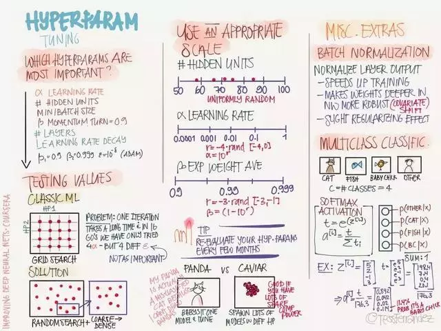
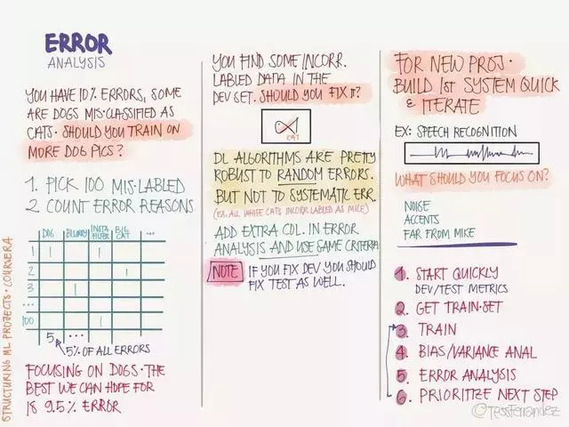
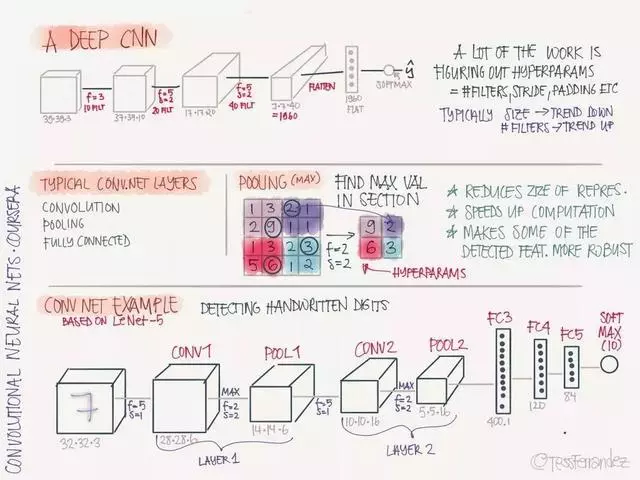
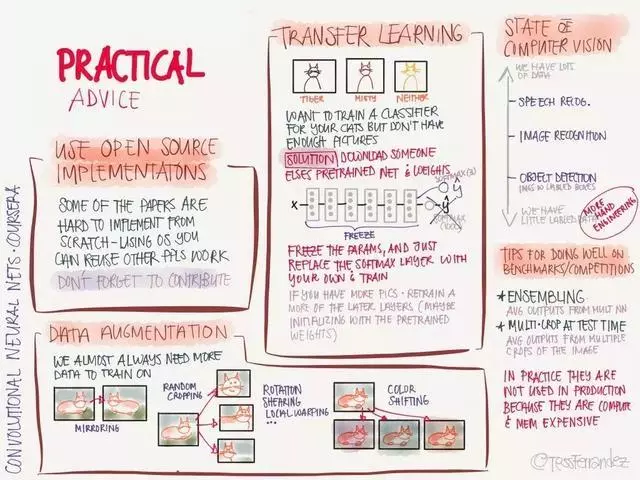
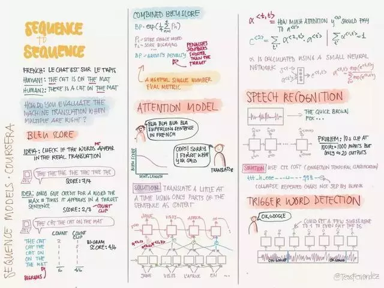

# 吴恩达deeplearning.ai课程笔记总结

在吴恩达机器学习系列课程完结后不久，一位名叫[Tess Ferrandez](https://www.slideshare.net/TessFerrandez?utm_campaign=profiletracking&utm_medium=sssite&utm_source=ssslideview "Tess Ferrandez小姐姐的主页")的小姐姐在推特上分享了一套自己的课程笔记，瞬间收获了3k+赞和1k+转发。

不同于满屏公式代码的黑白笔记，这套信息图不仅知识点满满，且行文构图都像插画一样颜值颇高。吴恩达自己也在推特上转发称赞了这一位有诚意的学习者，毕竟他一直倡导学习是一件简单快乐的事情。

Link: [笔记源地址](https://www.slideshare.net/TessFerrandez/notes-from-coursera-deep-learning-courses-by-andrew-ng "笔记源地址")

<!--more-->

## 深度学习介绍

## 逻辑回归

## 浅层神经网络

## 深层神经网络

##  机器学习应用程序设置

## 正则化——防止过拟合

## 优化训练

## 优化算法

## 超参数调试

## 机器学习项目构建

##  错误分析

## 训练 vs 验证/测试 失配

## 扩展学习

## 卷积基础

## Padding

## 深层 CNN

## 典型的 CNN 模型

## ResNet

## 实用建议

## 检测算法

## 人脸识别

## 神经风格迁移

## 循环神经网络

## 更多 RNN 模型

## NLP-词嵌入

## 词嵌入详解

## 序列到序列基本模型

## 序列到序列
