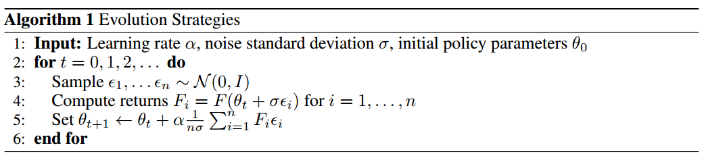
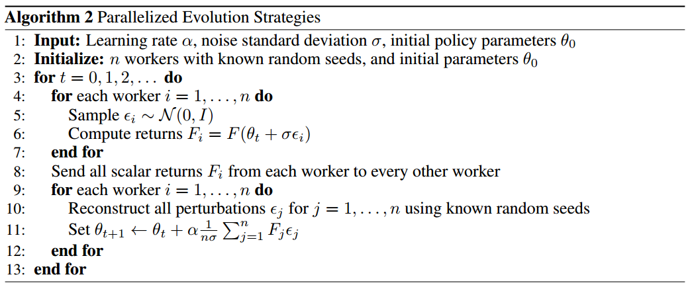
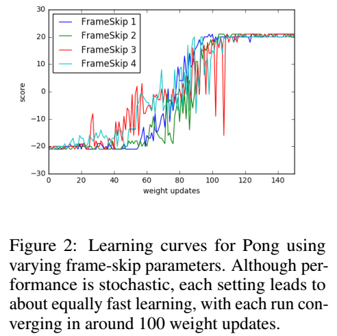

这一篇论文讲了强化学习算法的替代可解方案：进化策略。主要思想是对参数空间添加噪音而不是动作空间。

不推荐这篇论文：

- 公式没有详细推理，非常难懂
- 文中进化策略其实跟强化学习并没有特别大的关系
- 很多关于进化策略的性质、优势非常难懂，基本上都是文字解释，没有举例
- 文中措辞不难，但想要理解其本质非常难

<!--more-->

# 简介

进化策略ES是一组/一类算法，而不是一个算法，它属于黑盒优化方法，它由自然进化中的启发式搜索过程而得来：每一代中都有突变的基因，环境对基因突变的效果给出适应性的判断，重组好的突变基因产生下一代，直到最优。

进化策略算法的划分主要有三个依据：基因如何表示（神经网络参数）、突变如何产生（参数优化过程）、基因如何重组（参数重组）。

进化策略ES这种方法通常分为[直接策略搜索](https://pdfs.semanticscholar.org/dd17/8d3f30d801922c98cec9c2d90db05395f244.pdf?_ga=2.257341323.183297583.1558416128-1251761365.1555224483)和[神经进化](https://ieeexplore.ieee.org/stamp/stamp.jsp?tp=&arnumber=7307180&tag=1)，黑盒优化方法有很多很好的特性：

1. 不关心奖励分布，奖励密集或稀疏都无所谓
2. 不需要反向传播梯度
3. tolerance of potentially arbitrarily long time horizons. 翻译为可以适应长期视野/回报，在长动作序列上有优势

但是，进化策略ES往往不能解决像Q-Learning和PG这样可应用的难的强化学习问题，这篇论文旨在使进化策略可以解决DRL算法可解决的更难的问题。

# 正文精要

> A large source of difficulty in RL stems from the lack of informative gradients of policy performance: such gradients may not exist due to non-smoothness of the environment or policy, or may only be available as high-variance estimates because the environment usually can only be accessed via sampling.  

指出强化学习的难题在于缺乏策略性能的有效梯度：梯度可能由于环境不光滑而不存在、可能由于只能采样环境而存在高方差。

> For MDP-based reinforcement learning algorithms, on the other hand, it is well known that frameskip is a crucial parameter to get right for the optimization to succeed.

对于基于MDP的强化学习算法，**跳帧**是算法优化的关键参数。

> It is common practice in RL to have the agent decide on its actions in a lower frequency than is used in the simulator that runs the environment.

RL通常使智能体在模拟环境中决策频率高于在实际环境中。

---

文中设定一个策略的期望奖励为：
$$
\mathbb{E}_{\epsilon \sim N(0,I)}F(\theta+\sigma\epsilon)
$$
关于网络参数$\theta$的导数为：
$$
\nabla_{\theta}\mathbb{E}_{\epsilon \sim N(0,I)}F(\theta+\sigma\epsilon)=\frac{1}{\sigma}\mathbb{E}_{\epsilon \sim N(0,I)} \{F(\theta+\sigma\epsilon)\epsilon \}
$$
其中，$\theta$为网络参数，也可以认为是多变量高斯分布的均值，$\sigma$为固定方差，$\epsilon$为扰动向量，由各向同性、方差均为1的多变量高斯分布采样得到。**文中没有对该导数推导过程有介绍，好像是使用了Reinforce Trick的方法，但是却不知道具体如何推导出这个形式**。

文中提到的算法1是对一个策略进行多次扰动，每扰动一次就与环境交互得到一个episode，最后只用各个扰动向量$\epsilon_{i}$与对应的回报$F(\theta)$相乘，根据该期望进行参数更新。

算法2是对算法1的并行化处理，设置相同的随机种子，假设n个worker：

1. 各个worker共用一个策略$\pi$
2. 每个worker根据高斯分布采样得到扰动向量$\epsilon$
3. 各个worker根据扰动后的策略参数采样一个episode
4. 互相分发各自的回报
5. **再采样n个扰动向量$\epsilon$**，使用梯度上升更新参数，然后分发策略

文中后边提到，其实不必每次都从高斯分布中采样出扰动向量$\epsilon$，可以在开始训练前直接采样得到m个扰动向量，每次需要扰动向量时直接根据m的值生成一个随机数，取出以该随机数为下标的扰动向量即可。这么做可以减少更新时的时长消耗。

---

> Experiments on Atari and MuJoCo show that it is a viable option with some attractive features: it is invariant to action frequency and delayed rewards, and it does not need temporal discounting or value function approximation. Most importantly, ES is highly parallelizable, which allows us to make up for a decreased data efficiency by scaling to more parallel workers. 

文中使用的进化策略ES的优点：

- 与决策间隔无关，也就是对于跳帧间隔的设置鲁棒性很高
- 不关心延迟奖励
- 不需要折扣计算回报
- 不需要值函数近似
- 可以高度并行化使，我们能够通过扩展到更多并行训练节点来弥补数据效率的下降。

# 实验发现

1. 使用[Virtual Batch Normalization](https://arxiv.org/pdf/1606.03498.pdf)和神经网络策略重参数（文中没有提到重参数的内容，只提到网络参数的影响）可以极大提升进化策略ES的可靠性。实验中，不使用这两种方法算法很“脆弱”，也就是不稳定。
2. 进化策略ES可以高度并行化。通过引入一个基于通用随机数的新颖通讯策略，即是是1000个子节点也可以达到运行时间的线性加速。
3. 进化策略ES的数据效率出奇的好。尽管相比A3C算法需要3-10倍的数据量，但是由于具有不需反向传播、没有值函数等特点，这些轻微的数据效率劣势可以被弥补。实验表明，相同计算量下，1小时ES与1天A3C的效果基本相同。
4. 进化策略ES相比PG类算法的探索性更强。
5. 进化策略ES的鲁棒性很好。多种不同训练环境可以使用同一组超参数。

# 实验结果

## MuJoCo

与**高度优化**的TRPO算法相比，ES在离散动作更有优势，因为连续动作在参数扰动方面可能过于平滑并且可能妨碍探索。

ES和TRPO的网络结构都是：输入层→64，tanh→64，tanh→输出层。

复杂环境如Hopper和Walker2d中，ES样本复杂性相比TRPO高不到10倍；简单场景中，相比低3倍。

TRPO训练500W步，ES训练至TRPO训练过程中各阶段效果所需步长的比例如表所示：

虽然文中说是简单场景低三倍，其实根本就没有明确的低三倍，而且我对文中所提的简单场景复杂场景的划分也持怀疑态度。

## Atari

预处理、网络架构与Atari那篇论文的一模一样，用A3C使用3.2亿帧训练1天的结果与使用ES训练10亿帧的结果相同（保持计算量相同，因为ES不需要反向传播和值函数评估）。使用720块cpu，训练一个游戏只需1小时。

最终，纯图像输入下，与A3C相比，23个游戏ES胜，28个游戏A3C胜。

## 并行化 Parallelization

ES特别适合并行化，因为其通讯低带宽特性（只需各个worker的回报和随机种子）。

测试环境：3D Humanoid walking task

结果：单机18核需11小时，与最先进的强化学习算法性能相当，80台机器1440个CPU核心只需10分钟。

随着核心数增加，训练性能线性加速。

## “跳帧”测试

将强化学习在模拟环境中训练出的模型用于实际环境中式，通常需要降低其决策频率，也就是加大决策间隔。

如果跳帧设置过大，智能体所做的动作往往不够好，如果跳帧设置过小，会导致每个episode的步数过长，加大计算量，恶化训练过程（其实文中这么说并不严谨）。

ES的一个优势是梯度计算与回合长度无关，这间接增加了对跳帧间隔的鲁棒性。在Atari游戏Pong中使用四个不同跳帧间隔{1，2，3，4}的学习曲线如下：

由曲线可以看出，不同的跳帧间隔，训练效果差不多。**但，我对该鲁棒性测试在复杂环境中的效果表示怀疑。我觉得前沿强化学习算法在该训练场景中使用不同的跳帧间隔也可以得到相同结果。**