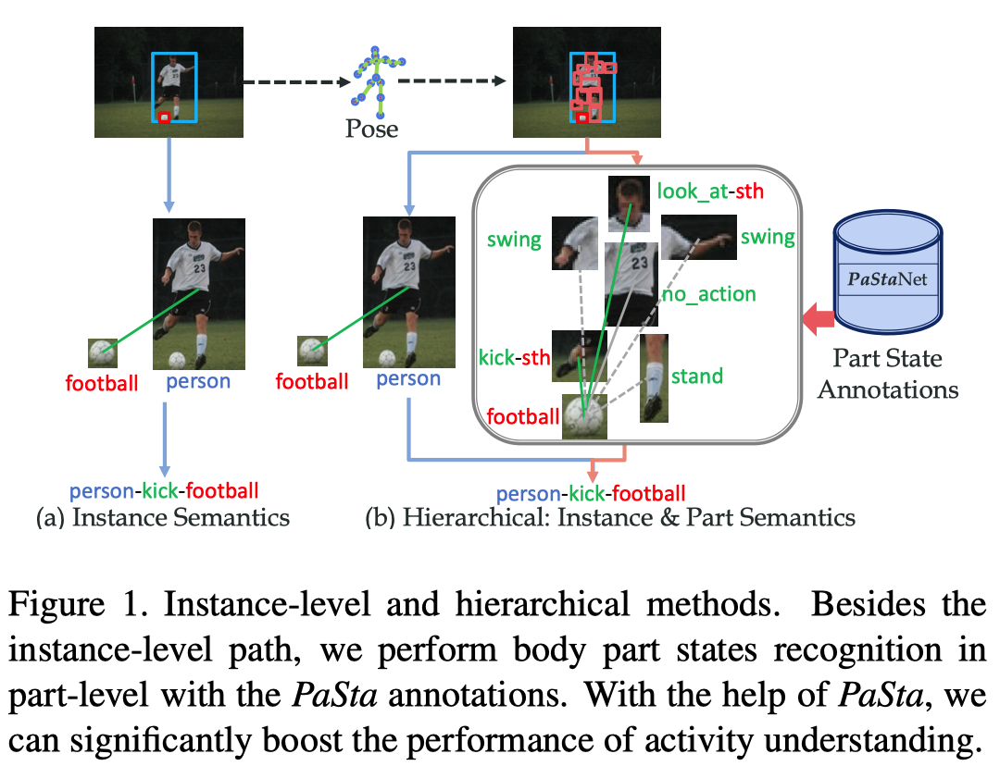
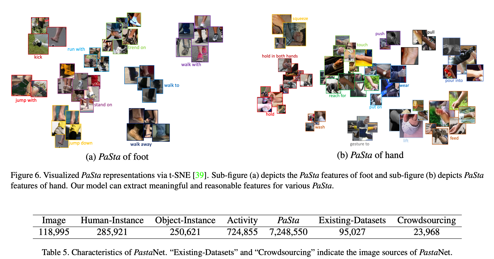
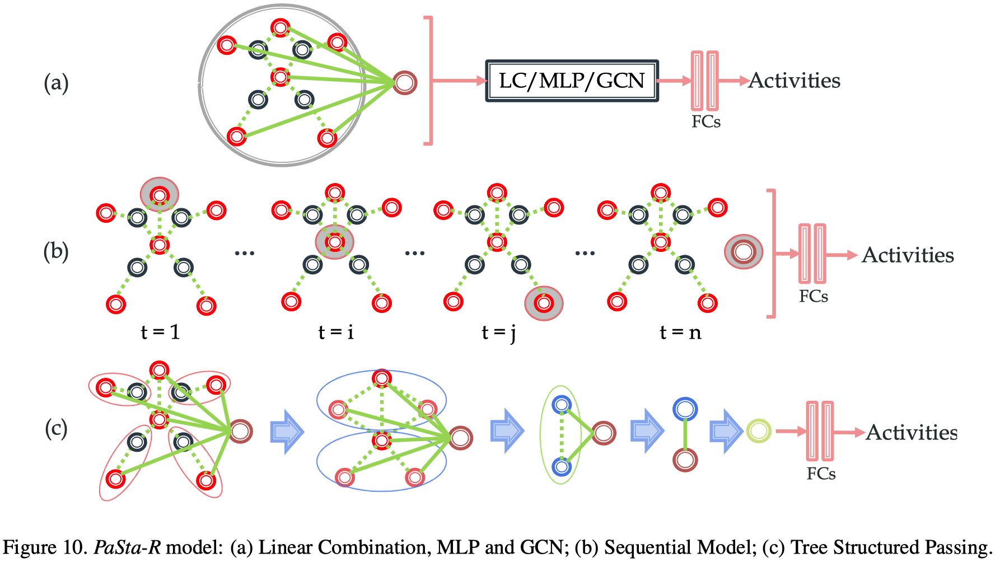
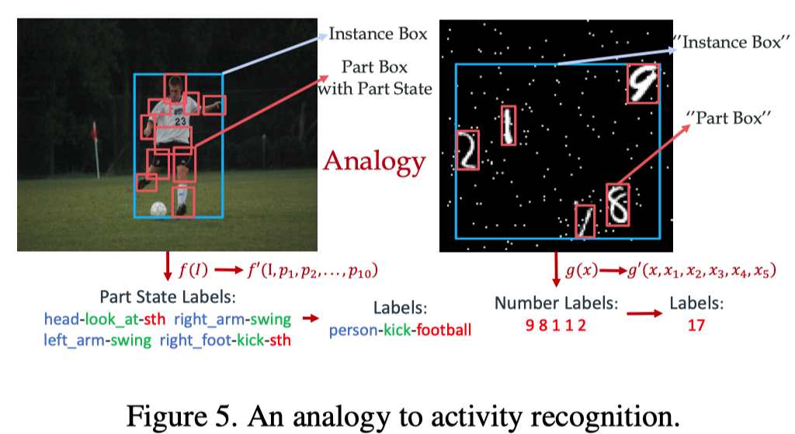
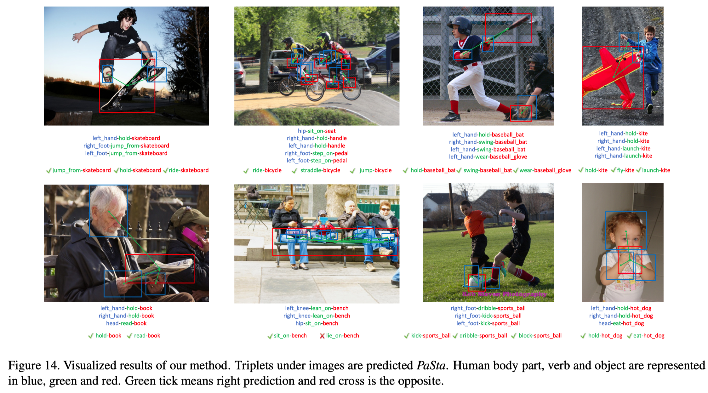

这篇论文是上海交大[卢策吾](http://mvig.sjtu.edu.cn/)老师团队下[李永露](https://dirtyharrylyl.github.io/)博士在2020CVPR会议三连中中的其中一篇。方向为HOIs方向，即人物交互。

<!--more-->

# 简介

论文地址：[http://arxiv.org/abs/2004.00945](http://arxiv.org/abs/2004.00945)

作者开源的代码和数据集：[http://hake-mvig.cn/](http://hake-mvig.cn/)

PaSta是Part State的缩写，它是**细粒度动作语义标记**(fine-grained action semantic tokens)，是人类活动/行为的更精细的表达，比如一个人类的行为是开汽车，那么这个行为的part state就包括手握方向盘、脚踩油门等等，这种part state用三元组形式表示，比如：&#60;hand, hold, something&#62;。

这篇论文主要有两个比较大的贡献：

1. 建立了一个大型知识库PaStaNet（其实是HAKE数据集），目前标注了700w+局部状态。
2. 设计了一个分层的动作识别模型（为什么分层呢？因为作者提到现有的基于图像的动作识别理解方法主要采取直接映射/端到端的方式，可能会遇到性能瓶颈。）
   1. 第一层是Activity2Vec模型，用来从原始图片中提取PaSta特征，PaSta是组成多种人类行为的通用表示，比如一个PaSta是hold，那么开汽车时有hold方向盘，吃苹果时有hold苹果，两种不同的行为共享同样的PaSta；
   2. 第二层使用了PaSta-based Reasoning（PaSta-R，基于局部状态的推理）方法，用这种方法从第一层中识别的PaSta来推测图片中的人类行为活动。

下文中以下概念术语等同：

- PaStaNet——数据集
- 人类行为理解——动作识别
- PaSta——局部状态

# 文中精要

在大规模的基准中，基于**实例层次的语义（instance-level semantics）**使用one-stage从像素理解人类行为存在性能瓶颈，主要有以下几个原因：

1. long-tail data distribution，长尾数据分布（少数类别有大部分数据，而多数类别只有小部分数据）

   

2. complex visual patterns，复杂的视觉模式

作者认为(argue that)在人类局部的语义层次上进行感知是一个非常有前景的方向，这种方式之前被忽略了。

**作者的核心思想是：人类动作由细粒度的原子主体部分状态（PaSta）组成。**

> Our core idea is that human instance actions are composed of fine-grained atomic body part states.

先识别PaSta再推理行为有什么好处呢？

1. 与简化理论(reductionism)有强烈的直接关系

   > This lies in strong relationships with reductionism.

2. 可以帮助我们选择有区别的部分，忽略不相关的部分

   > the part-level path can help us to pick up discriminative parts and disregard irrelevant ones.

3. 从人体局部编码知识是实现人类活动知识引擎的关键步骤

   > encoding knowledge from human parts is a crucial step toward human activity knowledge engine.

4. Reusability and Transferability——可重用性和可转移性，多个行为的局部状态存在共享，比如一个PaSta是hold，那么开汽车时有hold方向盘，吃苹果时有hold苹果，两种不同的行为共享同样的PaSta。因此，我们可以用更少的PaSta来描述和区分大量的行为。对于few-shot学习，可重用性可以极大地缓解其学习困难。

   > PaSta are basic components of actions, their relationship can be in analogy with the amino acid and protein, letter and word, etc. Hence, PaSta are reusable, e.g., 〈 hand, hold, something 〉 is shared by various actions like “hold horse” and “eat apple”. Therefore, we get the capacity to describe and differentiate plenty of activities with a much smaller set of PaSta, i.e. one-time labeling and transferability. For fewshot learning, reusability can greatly alleviate its learning difficulty. Thus our approach shows significant improvements, e.g. we boost 13.9 mAP on one-shot sets of HICO

5. Interpretability——可解释性，当模型预测一个人在做什么时，我们很容易知道原因:它的身体的各个部分在做什么。

   > we obtain not only more powerful activity representations, but also better interpretation. When the model predicts what a person is doing, we can easily know the reasons: what the body parts are doing.

## PaStaNet数据集

该数据集目前已经标注了11.8w张图片，包括28.5w个人物，25w个交互的实体对象（比如球之类的），72.4万个行为，以及700w个人类局部状态。

该数据集目前有156个行为分类，76个PaSta分类。

广泛的分析证明，一般来说，PaStaNet可以覆盖大部分的局部级知识，可以很好的概括大部分情况。

下图为数据集中的行为和交互物体类别。

下图为数据集中的局部状态PaSta类别。

### PaSta的定义

将人体解耦成十个部分：head, two upper arms, two hands, hip, two thighs, two feet，即

1. 头
2. 左臂
3. 右臂
4. 左手
5. 右手
6. 臀部
7. 左腿
8. 右腿
9. 左脚
10. 右脚

每一个PaSta表示目标局部部分的表示，比如hand可以是hold something, push something；head可以是watch something, eat something。注意，当一个人同时有多个行为动作，他的某个局部身体部位可以有多个PaSta。

### 数据收集

两种方式：

1. 通过众包收集以人为中心的行为图像(3万张图片，具有粗糙的活动标签)；
2. 现有的设计良好的数据集(18.5万张)。

其中的数据围绕丰富的语义本体论(semantic ontology)、多样性和行为的可变性构建。最终，收集了超过20万张的不同行为类别的图片。

### 行为标签

根据人类最常见的日常活动，与人和物的互动。从11.8万张图片中选择了156种行为，包括人与物体的互动和身体动作（包含bounding boxes）。

### 身体局部的盒子

> Estimation errors are addressed manually to ensure high-quality annotation. Each part box is centered with a joint, and the box size is pre-defined by scaling the distance between the joints of the neck and pelvis. A joint with confidence higher than 0.7 will be seen as visible. When not all joints can be detected, we use body knowledge-based rules. That is, if the neck or pelvis is invisible, we configure the part boxes according to other visible joint groups (head, main body, arms, legs), e.g., if only the upper body is visible, we set the size of the hand box to twice the pupil distance.

### 局部状态PaSta标注

通过众包方式进行标注，共收到224159条标注上传。

过程如下：

1. 基于156种行为的动词，从WordNet选取200个PaSta动词。如果某个局部部位没有可以的状态，则描述为"no_action"；
2. 为了找到最通用的PaSta（可以作为可转移的行为知识），邀请了来自不同背景的150名注释者来标注156个行为的1w张图片；
3. 基于它们的注释，使用规范化的**点对点互信息(Normalized Point-wise Mutual Information，NPMI，*Kenneth Ward Church and Patrick Hanks. Word association norms, mutual information, and lexicography. In Computational linguistics, 1990.*)**来计算行为和PaSta之间的共生/共现关系，最后选择76个具有最高NPMI值的候选局部状态为PaSta集合；
4. 以之前的1w张打了标签的图片为种子，自动生成其余图片的初始PaSta标签，然后另外210名注释者仅需要去检查这些标注即可；
5. 考虑到一个人可能有多个动作，对于每个动作，分别标注其对应的10个PaSta。然后把所有动作的PaSta组合在一起；
6. 为了确保质量，每幅图像都将被标注两次，并由自动程序和主管进行检查。

**疑问：为什么ride bicycle与head look at的共现如此之低呢？**

### 行为解析树

为了说明PaSta和行为之间的关系，作者使用它们的统计相关性来构建一个图：行为是根节点，PaSta是子节点，边是共现。

> To illustrate the relationships between PaSta and activities, we use their statistical correlations to construct a graph (Fig. 2): activities are root nodes, PaSta are son nodes and edges are co-occurrence.

PaStaNet可以为实例级和局部级提供丰富的行为知识，并帮助构建大型行为解析树。

> PaStaNet can provide abundant activity knowledge for both instance and part levels and help construct a large-scale activity parsing tree

作者将解析树表示为行为和PaSta的共现矩阵(看起来极其稀疏)。

## 分层行为理解模型

这一部分数学符号很多，而且似乎故意把符号设计的复杂，导致阅读理解起来有些不顺畅。

对于行为的识别，有两种模型：

1. 传统模式，采用直接映射。
   $$
   \mathcal{S}_{i n s t}=\mathcal{F}_{i n s t}\left(I, b_{h}, \mathcal{B}_{o}\right)
   $$
   其中，$I$表示图像输入，$b_h$是人的box，$\mathcal{B}_{o}=\left\{b_{o}^{i}\right\}_{i=1}^{m}$是与人交互的物体的box，假设有$m$个物体。$\mathcal{S}_{i n s t}$代表实体级别的动作评分（评估结果）。

2. 作者提出的PaStaNet模式，利用通用的局部知识，分成两步：

   1. PaSta局部状态识别和特征提取（其实是识别层之前的隐特征）
      $$
      f_{P a S t a}=\mathcal{R}_{A 2 V}\left(I, \mathcal{B}_{p}, b_{o}\right) = \left\{f_{P a S t a}^{(i)}\right\}_{i=1}^{10}
      $$
      其中，$\mathcal{B}_{p}=\left\{b_{p}^{(i)}\right\}_{i}^{10}$是人的局部部位的box，使用*Pairwise body-part attention for recognizing human-object interactions. In ECCV, 2018*自动生成。$\mathcal{R}_{A 2 V}(\cdot)$表示Activity2Vec模型，用于提取PaSta的特征表示，

   2. PaSta-Based推理（PaSta-R），从局部状态推理行为语义
      $$
      \mathcal{S}_{p a r t}=\mathcal{F}_{P a S t a-R}\left(f_{P a S t a}, f_{o}\right)
      $$
      其中，$\mathcal{F}_{P a S t a-R}(\cdot)$代表PaSta-R方法，$f_{o}$是物体的特征表示，$\mathcal{S}_{p a r t}$是局部状态层面的动作评分。*注意，如果场景中人没有与物进行交互，比如”跳舞“这个动作，那么使用图像的ROI池化特征来表示$f_o$。如果场景中存在多个交互物体，则依次处理human-object pair$\left(f_{P a S t a}, f_{o}^{(i)}\right)$，并且声称各自独立的Activity2Vec Embedding*。

上图为PaSta的识别与特征表示部分的框架图。

识别部分主要为红色线条部分，特征表示部分主要为蓝色线条部分。

### 局部状态PaSta识别

这部分的输入为$I, \mathcal{B}_{p}, b_{o}$，输出为局部状态的视觉特征$f_{PaSta}^{V}$和识别结果$P_{PaSta}$。

对于输入，$\mathcal{B}_{p}, b_{o}$都是使用在COCO数据集上预训练的Faster R-CNN做特征提取：

- 对于物体$b_o$，$b_o\rightarrow Faster R-CNN \rightarrow f_o$，如果图片内不存在与物体进行交互，则使用图像的特征，即$I\rightarrow Faster R-CNN \rightarrow f_c \rightarrow f_o$
- 对于人的身体的每一个部位（共10个）$b_{p}^{(i)}$，$b_{p}^{(i)} \rightarrow Faster R-CNN \rightarrow f_{p}^{(i)}$

得到特征表示后，首先输入到一个被称为Part Relevance Predictor的结构中，去计算每一个部位的attention，这个PRP结构由全连接组成，最后激活为softmax函数，给每一个局部部位特征输出一个注意力权重：
$$
a_{i}=\mathcal{P}_{p a}\left(f_{p}^{(i)}, f_{o}\right)
$$
其中$\mathcal{P}_{p a}(\cdot)$即是局部注意力预测器。**在这里，我感觉这个注意力权重应该指的是某个身体部位与物体的相关性，比如，手跟茶杯很相关，而脚和苹果则不太相关。**然后，将注意力权重与原始局部特征表示进行加权：
$$
f_{p}^{(i) \star}=f_{p}^{(i)} \times a_{i}
$$
接下来进行局部状态PaSta的分类/识别，此时将$f_{p}^{(i) \star}$与$f_o$进行concat操作之后，传入max池化层，以及两层512的全连接，最终获得PaSta的分类结果$\mathcal{S}_{P a S t a}^{(i)}$。**这里的$\mathcal{S}$应该是logits，而$P_{PaSta}$表示概率。**

*注意，这里存在一个身体部位有多种状态的可能，比如头部可以同时进行"吃"和"看"的动作，因此是一个多标签分类任务。*

识别部分的交叉熵损失函数如下：
$$
\mathcal{L}_{P a S t a}=\sum_{i}^{10}\left(\mathcal{L}_{P a S t a}^{(i)}+\mathcal{L}_{a t t}^{(i)}\right)
$$

### Activity2Vec

这一部分的输入为局部状态的视觉特征$f_{PaSta}^{V}$、识别结果$P_{PaSta}$和PaSta的语言特征$f_{B e r t}^{(i, k)}$，输出为PaSta的最终特征表示$f_{PaSta}$。

> With PaStaNet, we convert a human instance into a vector consisting of PaSta representations. Activity2Vec extracts part-level semantic representation via PaSta recognition and combines its language representation. Since PaSta encodes common knowledge of activities, Activity2Vec works as a general feature extractor for both seen and unseen activities.

Activity2Vec将一个人类实例转换为一个由PaSta表示组成的向量。通过局部状态识别提取局部层次的语义表示，并且与该局部状态的语言表示相结合。

在这一环节的主要任务是将局部状态PaSta的语义知识嵌入到它的特征向量表示中去，那么，如何结合呢？

对于图像特征，在上一部分已经获得，提取PaSta的分类结果前一层的隐状态即可，$\color{red}{f_{\text {PaSta}}^{V(i)} \in \mathbb{R}^{512}}$。

对于语言特征，作者使用**BERT-Base预训练模型**先将数据集中的token预转换为$\color{red}{f_{B e r t}^{(i, k)} \in \mathbb{R}^{2304}}$，并且在整个过程中保持不变。token指的是三元组&#60;part, verb, object&#62;，object来自目标检测。所有的token即$\left\{t_{p}^{(i, k)}, t_{v}^{(i, k)}, t_{o}^{(i, k)}\right\}_{k=1}^{n}$，$i$代表身体部位的数量，这里为10，$n$代表每一个部位具有的PaSta数量，其中的每个$t$都是768的向量长度。
$$
f_{B e r t}^{(i, k)}=\mathcal{R}_{B e r t}\left(t_{p}^{(i, k)}, t_{v}^{(i, k)}, t_{o}^{(i, k)}\right)
$$

$$
f_{B e r t}^{(i)} \in \mathbb{R}^{2304 * n}
$$

将部分的BERT表示与该部分的分类结果相乘，即PaSta的语言特征表示：
$$
f_{P a S t a}^{L(i)}=f_{B e r t}^{(i)} \times P_{P a S t a}^{(i)}, \text { where } P_{P a S t a}^{(i)}=\operatorname{Sigmoid}\left(\mathcal{S}_{P a S t a}^{(i)}\right) \in \mathbb{R}^{n}
$$

$$
P_{P a S t a}=\left\{P_{P a S t a}^{(i)}\right\}_{i=1}^{10}
$$

$$
f_{P a S t a}^{L(i)} \in \mathbb{R}^{2304 * n}
$$

**最后**，池化、resize语言特征$f_{P a S t a}^{L(i)}$后再与图像特征$f_{PaSta}^{V}$concat即获得最终的PaSta特征表示$f_{P a S t a}^{(i)} \in \mathbb{R}^{m}$。输出的$f_{\text {PaSta}}=\left\{f_{\text {PaSta}}^{(i)}\right\}_{i=1}^{10}$是局部级别的行为特征表示，可用于下游任务，像行为检测，标题生成等等。

### PaSta-R

这一部分主要是从局部状态的特征表示推断出图片中人的行为。其输入为特征表示$f_{PaSta}$，输出为动作评分$\mathcal{S}$。

> A Part State Based Reasoning method (PaSta-R) is further presented. We construct a Hierarchical Activity Graph consisting of human instance and part semantic representations, and infer the activities by combining both instance and part level sub-graph states.

作者构造了一个由人类实例和局部语义表示组成的层次行为图（Hierarchical Activity Graph），并结合实例和局部层次子图状态来推断行为。

HAG如上图中间所示，节点为局部的状态特征或者物体的特征，边分两种，第一种是body part与object的边，表示为$e_{p o}=\left(v_{p}^{i}, v_{o}\right) \in \mathcal{V}_{p} \times \mathcal{V}_{o}$，第二种是body part与body part的边，表示为$e_{p p}^{i j}=\left(v_{p}^{i}, v_{p}^{j}\right) \in \mathcal{V}_{p} \times \mathcal{V}_{p}$。***说实话，边究竟是如何表示的，完全没有看懂-.-***。

作者的目标是解析HAG，然后推理出图像中的行为。即
$$
\mathcal{S}_{p a r t}=\mathcal{F}_{P a S t a-R}\left(f_{P a S t a}, f_{o}\right)
$$
作者提出了三种结构和三种方式，如下图所示：

三种结构：

1. Linear Combination，说白了就是一层全连接，激活为softmax；
2. MLP，说白了就是两层1024单元全连接（使用非线性激活函数），最后一层激活为softmax；
3. Graph Convolution Network，GCN提取全局图特征，然后接MLP输出分类结果。

三种方式：

1. 上图(a)所示，将$f_{P a S t a}, f_{o}$直接concat然后输入后续网络；
2. 上图(b)所示，按身体部位逐步输入到LSTM网络，改造成序列模型。有两种输入方式，1乱序，2固定顺序（比如从头到脚），作者说固定顺序更好；
3. 上图(c)所示，将部位特征分层组合，例如：
   1. 在第一层将左手左上臂特征合并为左臂，左脚左大腿特征合并为左腿，……，然后传入全连接进一步提取特征；
   2. 将头、胳膊等合并为上肢，臀、腿等合并为下肢，……，然后传入全连接进行进一步特征提取；
   3. 上下肢合并为整体，然后传入全连接，再接后续网络。

如何得到最后的分类结果呢？作者提出两种方式：

1. early fusion——前融合，将实例层次的语义特征表示$f_{inst}$与PaSta特征表示、物体特征表示结合后再做PaSta-R推理；
2. late fusion——后融合，融合实例层次的分类结果和局部层次的分类结果，即$\mathcal{S}=\mathcal{S}_{i n s t}+\mathcal{S}_{p a r t}$。作者说，实验下来，这种方式效果更好。

最终，整个框架的交叉熵损失函数为：
$$
\mathcal{L}_{\text {total}}=\mathcal{L}_{\text {PaSta}}+\mathcal{L}_{\text {cls}}^{\text {PaSta}}+\mathcal{L}_{\text {cls}}^{\text {inst}}
$$

# 实验

监督学习中，PaStaNet在HICO完整数据集上提升了6.4(16%)mAP，在HICO one-shot数据集上提升了13.9mAP。

迁移学习中，PaStanet在V-COCO数据集上提升了3.2mAP，在基于图像的AVA数据集上提升了4.2mAP，在HICO-DET数据集上提升了3.2mAP。

## 类比实验

从MNIST数据集中采集0-9数字（28X28X1），组成（128X128X1）的图片，每个图片包含3-5个数字。将数字类比为身体的局部部位，将行为设置为图片中最大的两个数字之和。图片中所有数字的union box代表一个人。为了模仿任务的移动特征，数字随机分布在图像中，而且给图像加入了高斯噪声。

最终实验结果（准确率）：

- 端到端，10.0%
- 前融合：43.7%
- 后融合：**44.2%**
- 不融合：41.4%

## Image-based Activity Recognition

## Instance-based Activity Detection

## Transfer Learning with Activity2Vec

## 可视化结果

图中蓝、绿、红分别指示身体部位、局部行为、交互物体。作者发现他们的模型能够检测各种行为，包括与各种对象的交互。

# mAP

mAP：mean Average Precision，平均的平均精度（两个平均）。先是类内求平均精确度，再是对所有类别再求平均精确度。

目标检测任务中将目标的分类结果分成四类（正即是真，负即是假）：

1. TP——True Positive，正识别为正；
2. FP——False Positive，负识别为正；
3. TN——True Negative，负识别为负；
4. FN——False Negative，负识别为正

准确率Precision——**识别为正**的数据中，真实为正的：
$$
P=\frac{T P}{T P+F P}=\frac{T P}{N_{\text {detection}}}
$$

召回率Recall——**原始为正**的数据中，识别为正的：
$$
R=\frac{T P}{T P+F N}=\frac{T P}{N_{g t}}
$$
平均精度AP即是在一组召回率阈值[0, 1]中，根据召回率计算相应准确率，然后准确率取平均。比如设置11个等间隔召回率阈值[0, 0.2, ..., 1]，那么AP的计算公式如下：
$$
\begin{aligned}
A P=& \frac{1}{11} \sum_{r \in\{0,0.1, \ldots, 1.0\}} \rho_{\text {interp}}(r) \\
& \rho_{\text {interp}}(r)=\max _{\hat{r}: \hat{r} \geqslant r}(\hat{r})
\end{aligned}
$$
实际上就是对于每个Recall值下的Precision，取所有比当前值大的Recall对应的Precision的最大值作为当前Recall值下的Precision。

mAP是多个AP值的均值，AP衡量的是学出来的模型在每个类别上的好坏，mAP衡量的是学出的模型在所有类别上的好坏。

# 结论

> In this paper, to make a step toward human activity knowledge engine, we construct PaStaNet to provide novel body part-level activity representation (PaSta). Meanwhile, a knowledge transformer Activity2Vec and a part-based reasoning method PaSta-R are proposed. PaStaNet brings in interpretability and new possibility for activity understanding. It can effectively bridge the semantic gap between pixels and activities. With PaStaNet, we significantly boost the performance in supervised and transfer learning tasks, especially under few-shot circumstances. In the future, we plan to enrich our PaStaNet with spatio-temporal PaSta.

# 引用

1. [目标检测测评指标——mAP](https://blog.csdn.net/xiezongsheng1990/article/details/89608923?depth_1-utm_source=distribute.pc_relevant.none-task-blog-BlogCommendFromBaidu-1&utm_source=distribute.pc_relevant.none-task-blog-BlogCommendFromBaidu-1)

2. [多标签图像分类任务的评价方法-mAP](http://blog.sina.com.cn/s/blog_9db078090102whzw.html)

