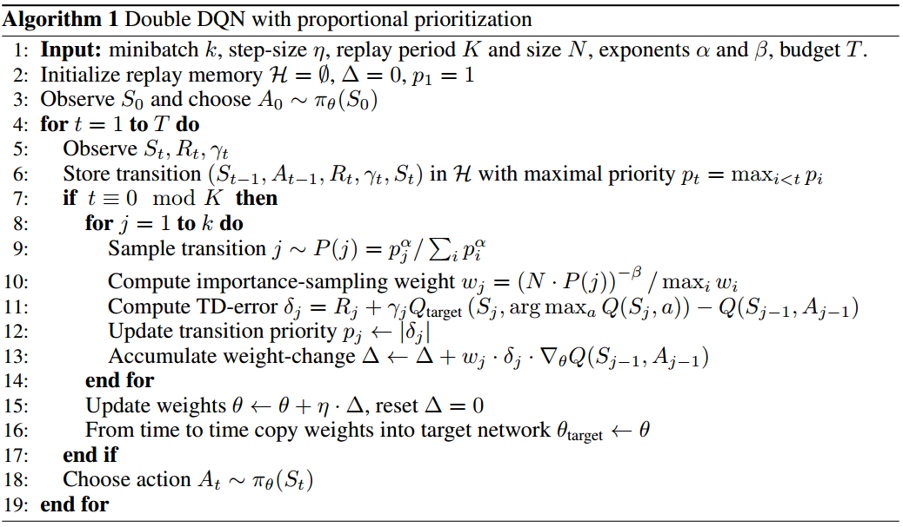
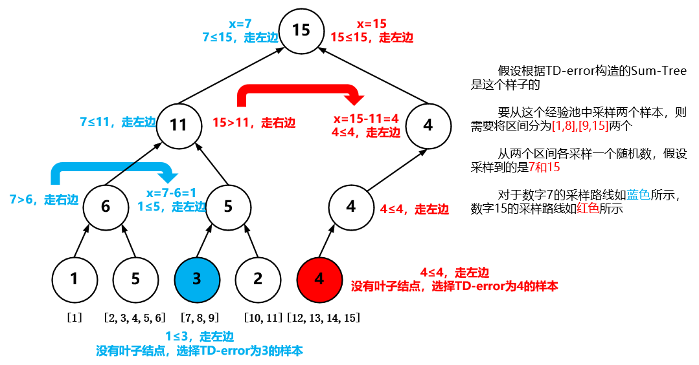
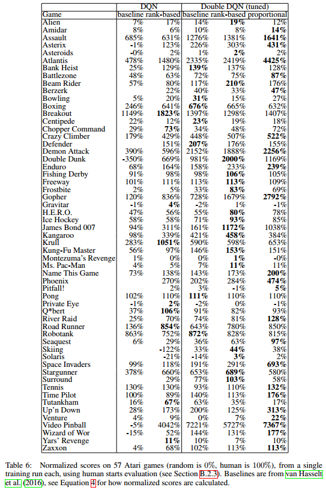

这篇论文介绍了优先经验回放机制，它可以使学习过程更高效。

推荐：

- 实用技巧
- 通俗易懂

<!--more-->

# 简介

论文地址：[https://arxiv.org/pdf/1511.05952.pdf](https://arxiv.org/pdf/1511.05952.pdf)

之前重用经验（experience，transition转换五元组$\lt s,a,r,s',done \ or \ \gamma\gt$都是从经验池中**均匀采样**，忽略了经验的重要程度，文中提到的优先经验回放框架按经验重要性增大其被采样到的概率，希望越重要的经验使用次数越多，从而增加学习效率。

文中应用算法：DQN

效果：相比传统经验池机制，Atari 49游戏中41胜，8负

# 文中精要

> Online reinforcement learning (RL) agents incrementally update their parameters (of the policy, value function or model) while they observe a stream of experience. In their simplest form, they discard incoming data immediately, after a single update. Two issues with this are (a) strongly correlated updates that break the i.i.d. assumption of many popular stochastic gradient-based algorithms, and (b) the rapid forgetting of possibly rare experiences that would be useful later on. 
>Experience replay  addresses both of these issues: with experience stored in a replay memory, it becomes possible to break the temporal correlations by mixing more and less recent experience for the updates, and rare experience will be used for more than just a single update.

指出On-policy一般使用一个episode的数据进行参数更新，且数据用完即丢，这样做有两个缺点：

- 数据（状态）相互关联，数据不具有独立同分布($i.i.d$)的性质，但许多流行的随机梯度算法往往有关于数据独立同分布的假设
- 对罕见的（稀疏的）经验快速遗忘，忽略了这些罕见经验可能多次更新更有用的作用

**经验池机制解决了上述两个问题**，通过混合近期经验打破它们关于时间的关联性，并从经验池中采样经验学习多次。

经验池机制的优势：

- 稳定了DQN值函数的训练
- 一般情况下，经验回放可以减少训练所需的经验数量，但是需要加大计算量，消耗更多的内存，但是这往往比智能体与环境进行交互来得更方便、容易

>In particular, we propose to more frequently replay transitions with high expected learning progress, s measured by the magnitude of their temporal-difference (TD) error. This prioritization can lead o a loss of diversity, which we alleviate with stochastic prioritization, and introduce bias, which e correct with importance sampling. 

文中根据TD-error设置优先经验回放的频率，这可能会引起两个问题：

- 丢失样本多样性
- 引入偏差

分别解决方案：

- 随机优先级 stochastic prioritization
- 重要性采样

>The central component of prioritized replay is the criterion by which the importance of each transition is measured. One idealised criterion would be the amount the RL agent can learn from a transition in its current state (expected learning progress). While this measure is not directly accessible,  reasonable proxy is the magnitude of a transition’s TD error $\delta$ indicates how ‘surprising’  or unexpected the transition is: specifically, how far the value is from its next-step bootstrap estimate.

优先经验回放的核心部分是如何衡量样本的重要性，并根据其重要性进行回放。

最直观的衡量标准是从经验样本中可以学习的量，但是这个量不可知、不可得，于是使用TD-error $\delta$作为这个量的替代品以衡量样本重要性。 

>New transitions arrive without a known TD-error, so we put them at maximal priority in order to guarantee that all experience is seen at least once.  

新的经验被存入经验池时不需计算TD-error，直接将其设置为当前经验池中最大的TD-error，保证其至少被抽中一次。

---

既然使用TD-error作为衡量可学习的度量，那么完全可以用贪婪的方式，选取TD-error最大的几个进行学习，但这会有几个问题：

1. 由于只有在经验被重放**之后**，这个经验的TD-error才被更新，导致初始TD-error比较小的经验长时间不被使用，甚至永远不被使用。
2. 贪婪策略聚焦于一小部分TD-error比较高的经验，当使用值函数近似时，这些经验的TD-error减小速度很慢，导致这些经验被高频重复使用，致使样本缺乏多样性而过拟合。

文中提到使用**随机采样方法 stochastic sampling method**在贪婪策略与均匀采样之间“差值”来解决上述问题，其实它是一个在样本使用上的trade-off，由超参数$\alpha$控制

使用优先经验回放还有一个问题是改变了状态的分布，我们知道DQN中引入经验池是为了解决数据相关性，使数据（尽量）独立同分布的问题。但是使用优先经验回放又改变了状态的分布，这样势必会引入偏差bias，对此，文中使用**偏差退火——重要性采样结合退火因子**，来消除引入的偏差。

## 随机采样方法

$$
P(i)=\frac{p^{\alpha}_{i}}{\sum_{k}p^{\alpha}_{k}}
$$

$\alpha$超参数控制采样在uniform和greedy的偏好，是一个trade-off因子：

- $\alpha=0$，均匀采样
- $\alpha=1$，贪婪策略采样
- $\alpha \in [0,1]$，文中没有明说$\alpha$的取值范围
- 引入$\alpha$不改变优先级的单调性，只是适当调整高、低TD-error经验的优先级

根据优先级$p_{i}$的设定可以将优先经验池的设计分为两种：

- 直接的，基于比例的，proportional prioritization
- 间接的，基于排名的，rank-based prioritization

### Proportional Prioritization

$$
p_{i}=\left | \delta_{i} \right | + \epsilon
$$

- $\delta$表示TD-error
- $\epsilon$是一个小的正常数，防止TD-error为0的经验永远不被重放。

### Rank-based Prioritization

$$
p_{i}=\frac{1}{rank(i)}
$$

- $rank(i)$是经验根据$\left | \delta_{i} \right |$大小排序的排名
- $P$为指数$\alpha$的幂律分布power-law distribution
- 这种方式更具鲁棒性，因为其对异常点不敏感，主要是因为异常点的TD-error过大或过小对rank值没有太大影响

优点：

- 其重尾性、厚尾性、heavy-tail property保证采样多样性
- 分层采样使mini-batch的梯度稳定

缺点：

- 当在稀疏奖励场景想要使用TD-error分布结构时，会造成性能下降

### 比较

根据文中实验，两种方式效果基本相同，但不同场景可能一个效果很好，一个效果一般般。作者**猜想**效果相同的原因可能是因为对奖励和TD-error大量使用clip操作，消除了异常值，作者本以为Rank-based更具鲁棒性的。

> Overhead is similar to rank-based prioritization.

两者开销相同。

## 偏差退火 Annealing The Bias

我觉得应该译为消除偏差。

引入重要性采样、引入退火因子$\beta$消除偏差。将$w_{i}$除以$max_{i}w_{i}$向下缩放（减小）梯度更新幅度，稳定算法
$$
w_{i}=\left ( \frac{1}{N} \cdot \frac{1}{P(i)} \right )^{\beta}
$$

- $\beta=0$，完全不用重要性采样
- $\beta=1$，常规重要性采样
- **在训练接近尾声时，使$\beta \rightarrow 1$ **
- $\beta \in [0,1]$，文中并没有明说$\beta$的取值范围
- $\beta$的选择与$\alpha$有关，但文中并没有说明这两个参数如何选择的关系

作用：

- 消除偏差

> We therefore exploit the flexibility of annealing the amount of importance-sampling correction over time, by defining a schedule on the exponent β that reaches 1 only at the end of learning.

应用退火重要性采样校正量的灵活性，使在学习快结束时，将$\beta \rightarrow 1$

# 伪代码



**解析**：

- step-size $\eta$可以看做是学习率，文中并没有说它具体的定义，只是说它可以调节参数更新幅度（不就是学习率嘛）
- $K$代表采样与更新之间的步数差，也就是，先采样K次经验并存入经验池，再取mini-batch更新。
- 采样方式：
  - 
  - 采样与更新TD-error的时间复杂度为$O(log_{2}N)$
- 学习完之后对学习使用的经验更新其TD-error
- 重要性权重$w_{j}=\left ( N \cdot P(j)\right )^{-\beta}/max_{i}w_{i}$，由$max_{i}w_{i}=max_{i}\left ( N \cdot P(i)\right )^{-\beta}=\left ( min_{i}N \cdot P(i)\right )^{-\beta}=\left ( N \cdot P_{min}\right )^{-\beta}$,可以将其化简为$w_{j}=\left ( \frac{p_{min}}{p_{i}} \right )^{\beta}$
- 第12行，赋值其实是$(\left | \delta_{i} \right |+ \epsilon)^{\alpha}$，如果是rank-based，则为$rank(i)^{-\alpha}$
- 第6行，对于新采样到的经验，不必计算其TD-error，直接将其设置为最大即可，当使用该经验学习之后再计算其TD-error
- $\Delta$其实就是误差函数$\delta^{2}$对$\theta$的导数，只不过对于mini-batch中的各个经验使用重要性比率进行了加权求和。

**注意**：

> Our final  solution was to store transitions in a priority queue implemented with an array-based binary heap. The heap array was then directly used as an approximation of a sorted array, which is infrequently sorted once every $10^{6}$ steps to prevent the heap becoming too unbalanced. 

如果使用rank-based方法，则使用的不是sum-tree结构，而是二进制堆，由于我不了解这个结构，故目前不做阐述。

# Sum Tree

```python
import numpy as np


class Sum_Tree(object):
    def __init__(self, capacity):
        """
        capacity = 5，设置经验池大小
        tree = [0,1,2,3,4,5,6,7,8,9,10,11,12] 8-12存放叶子结点p值，1-7存放父节点、根节点p值的和，0存放树节点的数量
        data = [0,1,2,3,4,5] 1-5存放数据， 0存放capacity
        Tree structure and array storage:
        Tree index:
                    1         -> storing priority sum
              /          \ 
             2            3
            / \          / \
          4     5       6   7
         / \   / \     / \  / \
        8   9 10   11 12                   -> storing priority for transitions
        """
        assert capacity != 1
        self.now = 0
        self.parent_node_count = self.get_parent_node_count(capacity)
        print(self.parent_node_count)
        self.tree = np.zeros(self.parent_node_count + capacity + 1)
        self.tree[0] = len(self.tree) - 1
        self.data = np.zeros(capacity + 1, dtype=object)
        self.data[0] = capacity

    def add(self, p, data):
        """
        p : 优先级
        data : 数据元组
        """
        tree_index = self.now + self.parent_node_count + 1
        self.data[self.now + 1] = data
        self._updatetree(tree_index, p)
        self.now += 1
        if self.now > self.data[0]:
            self.now = 0

    def _updatetree(self, tree_index, p):
        diff = p - self.tree[tree_index]
        self._propagate(tree_index, diff)
        self.tree[tree_index] = p

    def _propagate(self, tree_index, diff):
        parent = tree_index // 2
        self.tree[parent] += diff
        if parent != 1:
            self._propagate(parent, diff)
    @property
    def total(self):
        return self.tree[1]

    def get(self, seg_p_total):
        """
        seg_p_total : 要采样的p的值
        """
        tree_index = self._retrieve(1, seg_p_total)
        data_index = tree_index - self.parent_node_count
        return (tree_index, data_index, self.tree[tree_index], self.data[data_index])

    def _retrieve(self, tree_index, seg_p_total):
        left = 2 * tree_index
        right = left + 1
#         left = 2 * tree_index + 1
#         right = 2 * (tree_index + 1)
        if left >= self.tree[0]:
            return tree_index
        return self._retrieve(left, seg_p_total) if seg_p_total <= self.tree[left] else self._retrieve(right, seg_p_total - self.tree[left])

    def pp(self):
        print(self.tree, self.data)

    def get_parent_node_count(self, capacity):
        i = 0
        while True:
            if pow(2, i) < capacity <= pow(2, i + 1):
                return pow(2, i + 1) - 1
            i += 1


tree = Sum_Tree(5)
tree.add(1, 3)
tree.add(2, 4)
tree.add(3, 5)
tree.add(4, 6)
tree.add(6, 11)
tree.pp()
print(tree.get(4))
```


# 优先经验回放的特点

1. 新的transition被采样到时，需要将其TD-error设置为最大，以保证最近的经验更容易被采样到。
2. 只有在从经验池中抽取到某个经验并进行学习后，才对其TD-error进行计算更新。

# 实验结果

算法：

- DQN
- 优化后的Double DQN
- 为了算法稳定的原因，将reward和TD-error clip到[-1,1]

优先经验池：

- 经验池大小$10^{6}$

- batch-size为32

- K=4，即每采样4次学习一次

- Rank-based：$\alpha=0.7，\beta_{0}=0.5$，Proportional：$\alpha=0.6，\beta_{0}=0.4$

- > These choices are trading off aggressiveness with robustness, but it is easy to revert to a behavior closer to the baseline by reducing $\alpha$ and/or increasing $\beta$. 

## 效果

### 学习速度


- 黑色代表不使用优先经验回放的DDQN
- 蓝色代表使用Proportional Prioritization的DDQN
- 红色代表使用Rank-based Prioritization的DDQN

- 绿色的虚线为人类水平

### 归一化得分

这些度量不重要，重要的是使用了优先经验回放机制的确提升了2倍左右的性能。




# PER的代码

```
import numpy as np
from abc import ABC, abstractmethod


class Buffer(ABC):
    @abstractmethod
    def sample(self) -> list:
        pass

class Sum_Tree(object):
    def __init__(self, capacity):
        """
        capacity = 5，设置经验池大小
        tree = [0,1,2,3,4,5,6,7,8,9,10,11,12] 8-12存放叶子结点p值，1-7存放父节点、根节点p值的和，0存放树节点的数量
        data = [0,1,2,3,4,5] 1-5存放数据， 0存放capacity
        Tree structure and array storage:
        Tree index:
                    1         -> storing priority sum
              /          \ 
             2            3
            / \          / \
          4     5       6   7
         / \   / \     / \  / \
        8   9 10   11 12                   -> storing priority for transitions
        """
        assert capacity > 0
        self.now = 0
        self.parent_node_count = self.get_parent_node_count(capacity)
        print(self.parent_node_count)
        self.tree = np.zeros(self.parent_node_count + capacity + 1)
        self.tree[0] = len(self.tree) - 1
        self.data = np.zeros(capacity + 1, dtype=object)
        self.data[0] = capacity

    def add(self, p, data):
        """
        p : property
        data : [s, a, r, s_, done]
        """
        tree_index = self.now + self.parent_node_count + 1
        self.data[self.now + 1] = data
        self._updatetree(tree_index, p)
        self.now += 1
        if self.now > self.data[0]:
            self.now = 0

    def _updatetree(self, tree_index, p):
        diff = p - self.tree[tree_index]
        self._propagate(tree_index, diff)
        self.tree[tree_index] = p

    def _propagate(self, tree_index, diff):
        parent = tree_index // 2
        self.tree[parent] += diff
        if parent != 1:
            self._propagate(parent, diff)

    @property
    def total(self):
        return self.tree[1]

    def get(self, seg_p_total):
        """
        seg_p_total : The value of priority to sample
        """
        tree_index = self._retrieve(1, seg_p_total)
        data_index = tree_index - self.parent_node_count
        return (tree_index, data_index, self.tree[tree_index], self.data[data_index])

    def _retrieve(self, tree_index, seg_p_total):
        left = 2 * tree_index
        right = left + 1
#         left = 2 * tree_index + 1
#         right = 2 * (tree_index + 1)
        if left >= self.tree[0]:
            return tree_index
        return self._retrieve(left, seg_p_total) if seg_p_total <= self.tree[left] else self._retrieve(right, seg_p_total - self.tree[left])

    def pp(self):
        print(self.tree, self.data)

    def get_parent_node_count(self, capacity):
        i = 0
        while True:
            if pow(2, i) < capacity <= pow(2, i + 1):
                return pow(2, i + 1) - 1
            i += 1


class PrioritizedReplayBuffer(Buffer):
    def __init__(self, batch_size, capacity, alpha, beta, epsilon):
        self.batch_size = batch_size
        self.capacity = capacity
        self._size = 0
        self.alpha = alpha
        self.beta = beta
        self.tree = Sum_Tree(capacity)
        self.epsilon = epsilon
        self.min_p = np.inf

    def add(self, p, *args):
        '''
        input: priorities, [ss, as, rs, _ss, dones]
        '''
        p = np.power(np.abs(p) + self.epsilon, self.alpha)
        min_p = p.min()
        if min_p < self.min_p:
            self.min_p = min_p
        if hasattr(args[0], '__len__'):
            for i in range(len(args[0])):
                self.tree.add(p[i], tuple(arg[i] for arg in args))
                if self._size < self.capacity:
                    self._size += 1
        else:
            self.tree.add(p, args)
            if self._size < self.capacity:
                self._size += 1

    def sample(self):
        '''
        output: weights, [ss, as, rs, _ss, dones]
        '''
        n_sample = self.batch_size if self.is_lg_batch_size else self._size
        interval = self.tree.total / n_sample
        segment = [self.tree.total - i * interval for i in range(n_sample + 1)]
        t = [self.tree.get(np.random.uniform(segment[i], segment[i + 1], 1)) for i in range(n_sample)]
        t = [np.array(e) for e in zip(*t)]
        self.last_indexs = t[0]
        return np.power(self.min_p / t[-2], self.beta), t[-1]

    @property
    def is_lg_batch_size(self):
        return self._size > self.batch_size

    def update_priority(self, priority):
        '''
        input: priorities
        '''
        assert hasattr(priority, '__len__')
        assert len(priority) == len(self.last_indexs)
        for i in range(len(priority)):
            self.tree._updatetree(self.last_indexs[i], priority[i])
```

