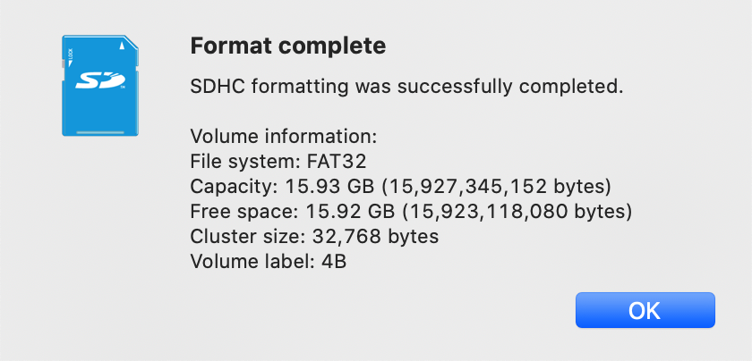

此篇博文用于记录在MacOS系统上为TF卡烧录树莓派操作系统。

<!--more-->

# 下载镜像

网址：[https://www.raspberrypi.org/downloads/](https://www.raspberrypi.org/downloads/)


我试验下来，上图中的`Raspberry Pi Imager for macOS`并不好用。因此，我们点左下角的Raspbian图片下载镜像。


这边目前有三种版本：

1. 系统+桌面+推荐软件
2. 系统+桌面
3. 系统

我选择了最简洁的Raspbian Buster Lite，下载`.zip`并解压出其中的`.img`文件。

# TF卡格式化

首先需要下载格式化工具，我这边使用的是`SD Memory Card Formatter`，这个软件在`windows`和`macos`上都可以用。这里是`macos`下的下载链接：[https://www.sdcard.org/downloads/formatter/eula_mac/index.html](https://www.sdcard.org/downloads/formatter/eula_mac/index.html)


## 格式化

1. 插入`TF`卡
2. 打开`SD Memory Card Formatter`


注意不要格式化错了卡，假如你插入了多个TF卡。上图中的`Volume label`是格式化后磁盘的命名。



# 开始烧录

## 查看驱动器列表

在控制台输入命令：`diskutil list`


这里，我们获取到TF卡的磁盘路径为`/dev/disk2`

## 取消TF卡的挂载

在控制台输入命令：`diskutil unmountDisk + SD卡设备路径`


## 开始烧录

在控制台输入命令：`sudo dd if=镜像路径 of=SD卡设备的路径 bs=1m;sync`，并输入管理员密码。

注意：文件路径不要出现中文。可以将`bs=1m`改为`bs=4m`加快烧录的速度。

这个时间有点长，需要耐心等待，400M的镜像大概耗时2分钟左右。


## 编写树莓派的ssh配置与wifi配置文件

新建两个`.txt`文件，分别命名为：

- ssh
- wpa_supplicant.conf

注意，取消`.txt`后缀。

ssh文件为空即可，wpa_supplicant.conf文件中写入：

```
country=CN
ctrl_interface=DIR=/var/run/wpa_supplicant Group=netdev
update_config=1

network={
	ssid="Wifi1的名字"
	psk="密码"
	priority=优先级，越大越优先
}

network={
	ssid="Wifi2的名字"
	psk="密码"
	priority=优先级
}
```

**然后将这两个文件移动至烧录系统镜像后TF卡的根目录。**

这里有两个坑点：

1. SSID名字中不能有符号`.`
2. 优先级范围为1-10

## 推出TF卡

`diskutil eject SD卡设备路径`

# 参考

1. [MacOS下树莓派烧录img/iso文件到SD卡](https://www.jianshu.com/p/e95c406badaa)
2. [mac下烧写树莓派系统](https://www.jianshu.com/p/4c5b7c1ad2a3)
3. [树莓派raspbian系统自动连接WIFI开启ssh](http://relyn.cn/share/38)

