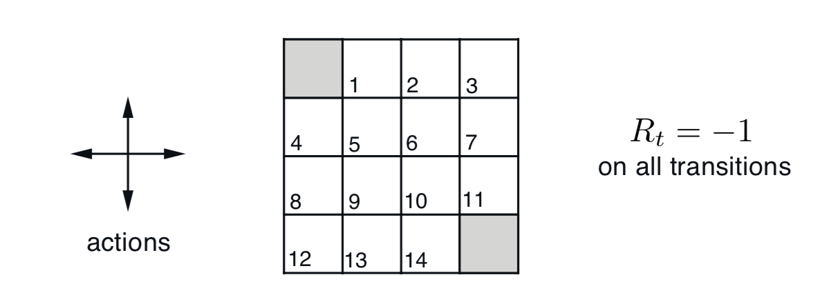
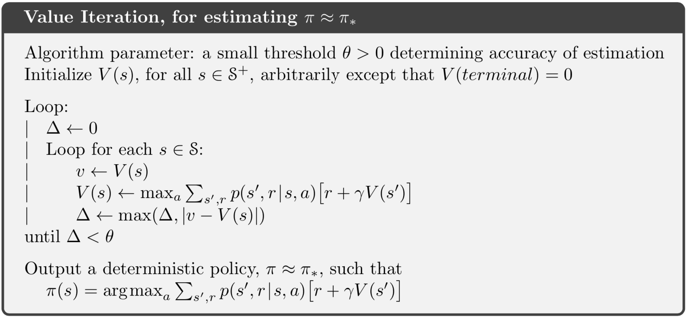
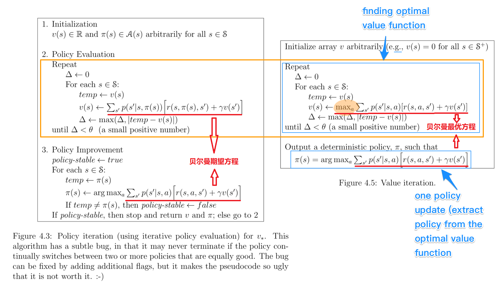

本文介绍了强化学习问题中最简单基本的算法——动态规划（Dynamic Programming），介绍了贝尔曼方程在该算法中的应用。

<!--more-->

# DP的基本概念

> 动态规划(dynamic programming)是运筹学的一个分支，是求解决策过程(decision process)最优化的数学方法。20世纪50年代初美国数学家R.E.Bellman等人在研究多阶段决策过程(multistep decision process)的优化问题时，提出了著名的最优化原理(principle of optimality)，把多阶段过程转化为一系列单阶段问题，利用各阶段之间的关系，逐个求解，创立了解决这类过程优化问题的新方法——动态规划。1957年出版了他的名著《Dynamic Programming》，这是该领域的第一本著作。——[百度百科]([https://baike.baidu.com/item/%E5%8A%A8%E6%80%81%E8%A7%84%E5%88%92/529408?fr=aladdin](https://baike.baidu.com/item/动态规划/529408?fr=aladdin))

动态规划-DP算法指的不是单一一个算法，而是**一系列可以在给定满足MDP的完全可知环境模型中计算出最优策略的算法**。

DP的特点：

- Model-Based
- Value-Based
- Off-Policy(这个比较牵强，因为DP不涉及采样、预测，完全靠planning)

DP具有很重要的理论基础作用，但是在现在的强化学习问题中，DP并不常使用，主要原因有二：

- 需要完全可知的模型，状态空间、动作空间离散，状态转移、奖励函数可知且确定
- 计算量很大(每次更新都需要完全规划所有可能性)

在一些表格型的问题中，如完全可知的迷宫，可以使用DP，但是要解决人类现实世界极其复杂的问题、任务，DP可能就有些力不从心啦。

其实，所有的强化学习算法都可以被认为是在**不完全可知的环境**中使用**少量计算**得到如DP效果一样的策略（最优策略）。

# 算法

先回顾一下之前提到的贝尔曼方程。

贝尔曼期望方程：
$$
v_{\pi}(s) =\sum_{a}\pi(a\mid s)\sum_{s',r}p(s',r \mid s,a)\left[r+\gamma v_{\pi}(s')\right]
$$

$$
q_{\pi}(s,a) =\sum_{s',r}p(s',r \mid s,a)\left[r+\gamma v_{\pi}(s')\right]
$$

贝尔曼最优方程：
$$
v_{*}(s) =\max_{a}\sum_{s',r}p(s',r\mid s,a)\left[r+\gamma v_{*}(s')\right]
$$

$$
q_{*}(s,a) =\sum_{s',r}p(s',r\mid s,a)\left[r+\gamma v_{*}(s')\mid s,a\right]
$$

为什么要再次提到贝尔曼方程呢？因为动态规划算法中的策略迭代、值迭代就是将贝尔曼方程给结合了起来。

回顾一下在[价值与贝尔曼方差](./价值与贝尔曼方程.html)最后的例子中迭代计算$V(S)$和$Q(S,A)$，遍历所有$Q(S,A)$以计算$V(S)$，再遍历所有$V(S)$以计算$Q(S,A)$。在一个简单的场景下循环迭代至收敛就需要很大的计算量，如果在复杂场景中(还是完全可知的)迭代计算可想有多费时费力，动态规划DP下的Policy Iteration和Value Iteration减轻了计算的负担，同时又不影响收敛性。

引用《Reinfocement Learning : An Introduction》中的一个网格世界的例子：

在这个例子中，有1-14个非终态以及两个终态(左上角、右下角)，动作空间为上下左右四种，在边缘位置的状态，例如$S=1$，可选的动作只有左右下三种，且等概率选择每种动作，每进行一次移动，就给予-1的奖励值。智能体需要尽快的到达网格世界的出口-终态，以获得尽量少的负奖励(即累计奖励最大)。

如果按照**先遍历所有$Q(S,A)$以计算$V(S)$，再遍历所有$V(S)$以计算$Q(S,A)$**的方式计算，值函数的表格将会如下图所示：

左边展示的是进行$k$次迭代，使值函数表格可以收敛，右边表示在每次迭代中，取$a=argmax_{a}q(s,a)$的策略。

可以发现，这样迭代$V(S)$至收敛有两个浪费算力的地方：

1. 选择动作的概率完全按照环境设置，导致计算状态$s$的值函数时，最差的动作$a$所带来的影响也被计算在其中，但其实真正执行的时候，永远不会执行该动作。
2. $k=3$与$k=10$时的策略表示一样，也就意味着，不必等到$V(S)$迭代至完全收敛就有可能可以获得最优策略，那么后续迭代完全没有用处，造成了资源浪费。

策略迭代、值迭代的思想都是贪心策略，但策略迭代针对问题1通过**剪裁可选动作**的方式进行了优化，值迭代针对问题2通过**取最大动作值函数**的方式进行了优化。

## 策略迭代 Policy Iteration

动作是通过策略产生的，因此势必需要对初始策略（GridWorld中的完全随机策略）进行替换，以达到更改动作选取概率的目的。

既然要在不同的阶段更改动作选择的概率，那么要进行多次策略的更改，随之而来的问题就是：

1. 值函数迭代更新到什么情况下时，开始更新策略
2. 如何更新策略？

针对第一个问题，我们使用**策略评估Policy Evaluation**的方式来解决，针对第二个问题，我们使用**策略提升Policy Improvation**的方式来解决，最终当新策略与旧策略相同时，终止迭代，得到最优策略。
$$
\pi_{0} \xrightarrow{E} v_{\pi_{0}} \xrightarrow{I} \pi_{1} \xrightarrow{E} v_{\pi_{1}} \xrightarrow{I} \pi_{2} \xrightarrow{E} ... \xrightarrow{I} \pi_{\ast} \xrightarrow{E} v_{\pi_{\ast}}
$$

### 伪代码

### 策略评估 Policy Evaluation

问题：值函数迭代更新到什么情况下时，开始更新策略

答：设置更新幅度阈值$\theta$，当sweep(横扫)一遍状态空间计算$V(S)$时，与上次更新时的$V(S)$相比较，如果最大的更新幅度小于阈值$\theta$，即$\Delta \lt \theta$，则认为策略评估已经完成，开始进行策略更新

特点：使用了贝尔曼期望方程-$v_{\pi}(s)$

*注：策略评估指的不是评估一个策略的好坏，而是在当前策略下评估所有的状态值，使状态值表格近似收敛。*

### 策略提升 Policy Improvement

问题：如何更新策略？

答：根据策略评估步骤得到的值函数$V(S)$，计算$Q(S,A)$表格，选取每个状态下使动作值函数最大的动作作为新的动作集，每个动作的选择概率相同，接着进行策略评估。

特点：使用了贝尔曼期望方程-$q_{\pi}(s,a)$

## 值迭代 Value Iteration

策略迭代的一个缺点是在得到最优策略$\pi_{\ast}$之前，需要多次更新策略，每次更新策略都会引起可选取动作的改变，这会引起在更新完策略后的前几次策略评估中值函数偏差比较大，导致在策略评估过程中需要花费大量的迭代来减小更新幅度$\Delta$，因此需要多次sweep(横扫)$V(S)$来迭代计算。

值迭代的思想是：**能不能通过早停的方式，在不更改策略的情况下，直接一次得到最优策略？**

值迭代运用了策略评估、策略迭代的思想，并将它们融合在一起，即不更新策略，直接选择动作值函数$q(s,a)$最大的动作作为状态值$v(s)$，直接迭代出**近似最优**（早停，$\Delta \lt \theta$即可）状态价值函数$V_{\ast}(S)$，使用贪心策略进而得到最优策略$\pi_{\ast}$。

特点：使用了贝尔曼最优方程-$v_{\ast}(s)，q_{\ast}(s,a)$。

### 伪代码

## PI与VI的比较

相同点：

- 在$0 \leq \gamma \lt 1$，有限MDPs环境中，两种方式都可以收敛到最优策略$\pi_{\ast}$
- 都使用了贝尔曼方程进行状态值函数的迭代

不同点：

1. 收敛方式
   - 策略迭代PI包括策略评估Policy Evaluation和策略提升Policy Improvement，这两部循环迭代至策略收敛
   - 值迭代VI包括找到最优状态值函数和一步提取策略，这两步不需要循环迭代，而是根据最优值函数直接得到最优策略
2. 动作改变方式
   - 策略迭代PI获得新策略$\pi_{new}$后，**更改每个状态的可选动作集**，多次横扫（遍历）$V(S)$
   - 值迭代VI过程中不产生策略，不更改每个状态的可选动作集，但是**只取每个状态下动作值函数最大的动作作为状态值**，一次横扫（遍历）$V(S)$。（这里需要解释一下，虽然循环是多次遍历，但是因为max操作，每次遍历每个状态所选取的动作不一定一样，虽然策略一直是随机策略，没有产生新策略，但是计算过程没有遍历到所有动作，可以隐含的看作是一个新策略，因此每次遍历时这个“隐策略”都会改变，所以称为一次遍历。）
3. 计算方式
   - 策略迭代PI使用贝尔曼期望方程
   - 值迭代VI使用贝尔曼最优方程
4. Policy方式
   - 策略迭代PI是On-Policy
   - 值迭代VI是Off-Policy
5. 稳定性检查
   - 策略迭代PI中更新策略时进行了策略稳定性检查，判断是否收敛
   - 值迭代VI获得新策略$\pi$时没有进行策略稳定性检查

至于策略迭代PI与值迭代VI的收敛速度，**通常情况**下，PI的迭代次数更少，VI的运行时间更少。

> [What is the difference between value iteration and policy iteration?](https://stackoverflow.com/a/42493295/11483803)
>
> [《Reinforcement Learning : An Introduction 2nd Edition》p77](http://incompleteideas.net/book/RLbook2018.pdf)

