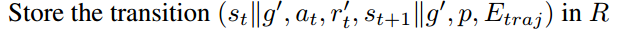
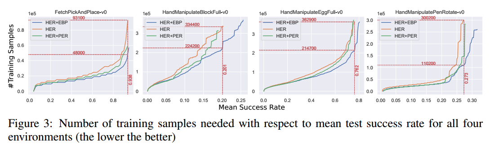

本文是对HER“事后”经验池机制的一个扩展，它结合了物理学的能量知识以及优先经验回放PER对HER进行提升。简称：EBP

推荐：

- 创新虽不多，但是基于能量的创意可以拓宽在机器人领域训练的视野
- 通俗易懂

<!--more-->

# 简介

论文地址：[https://arxiv.org/pdf/1810.01363.pdf](https://arxiv.org/pdf/1810.01363.pdf)

这篇论文由慕尼黑大学博三学生[赵瑞](https://ruizhaogit.github.io)和他的导师Volker Tresp发于2018年的CoRL会议。

**本文提出了一个简单高效的、基于能量的方法去优先回放“事后经验”。Energy+HER+PER**

在HER中，智能体从它可完成的“虚拟”目标中进行大量学习，虚拟目标就是我们使用“事后诸葛亮”方法所调整的经验中的目标。

本文针对原始HER提出了一个稍有不足的地方：经验回放是完全随机的，即没有优先级，没有考虑哪些episode哪些经验对学习更有价值，其实这个问题与PER相对于传统经验池机制也是一样的。

本文中使用的功能定理（work-energy principle）来计算能量。

# 文中精要

相比于传统的PER优先经验回放使用TD-error作为衡量优先级的度量，本文中使用“迹能量”作为其度量。

迹能量是这么定义的：

- > We define a trajectory energy function as the sum of the transition energy of the target object over the trajectory. 

- 迹能量是一个episode中transition energy（不知道怎么翻译合适，过渡能量？经验能量？转换能量？）的总和

接下来介绍一下能量在本文中是如何体现的。

## 经验能量差 Transition Energy

我就直接拿论文中实验场景所用到的能力来说明这个能量差。简言之，在本文的实验中主要是操作机械手臂移动物体的水平位置和垂直高度，所以物体的能量基本包含三种：

1. **势能 Potential Energy** $E_{p}(s_{t})$
2. **动能 Kinetic Energy** $E_{k}(s_{t})$
3. **转动能，也叫角动能 Rotational Energy** $E_{r}(s_{t})$

一个物体的能量由这三部分之和组成：
$$
E\left(s_{t}\right)=E_{p}\left(s_{t}\right)+E_{k}\left(s_{t}\right)+E_{r}\left(s_{t}\right)
$$
经验能量差指的就是相邻状态转移之间的能量差值，表示为：
$$
E_{t r a n}\left(s_{t-1}, s_{t}\right)=\operatorname{clip}\left(E\left(s_{t}\right)-E\left(s_{t-1}\right), 0, E_{t r a n}^{\max }\right)
$$
其中，

- 将差值clip到0是因为我们只对由机器人做功导致物体的能量增值感兴趣

- 将差值clip到$E_{t r a n}^{\max }$是想减缓某些特别大的能量差值的影响，使**训练更稳定**

*注：其实我觉得文中加这个clip操作完全是想多使用一个trick，让文章看起来更饱满一点，我个人认为不使用这个clip，或者只对下界进行clip，对算法性能是没有影响的。有待验证。*

### 势能 Potential Energy

物理学中学过，物体的重力势能公式为：$E=mgh$

本文中这样书写：
$$
E_{p}(s_{t})=mgz_{t}
$$

- $m$代表物体的质量
- $g$代表地球的重力系数，$g \approx 9.81 \mathrm{m} / \mathrm{s}^{2}$
- $z_{t}$代表物体在$t$时刻的高度$h$

### 动能 Kinetic Energy

物理学中学过，物体的动能公式为：
$$
E=\frac{1}{2} mv^{2}=\frac{1}{2} m\left [ \frac{\sqrt{v_{x}^{2}+v_{y}^{2}+v_{z}^{2}}}{\Delta t} \right ]^{2}
$$
本文中这样书写：
$$
E_{k}\left(s_{t}\right)=\frac{1}{2} m v_{x, t}^{2}+\frac{1}{2} m v_{y, t}^{2}+\frac{1}{2} m v_{z, t}^{2} \approx \frac{m\left(\left(x_{t}-x_{t-1}\right)^{2}+\left(y_{t}-y_{t-1}\right)^{2}+\left(z_{t}-z_{t-1}\right)^{2}\right)}{2 \Delta t^{2}}
$$

- $v_{x, t} \approx\left(x_{t}-x_{t-1}\right) / \Delta t$
- $v_{y, t} \approx\left(y_{t}-y_{t-1}\right) / \Delta t$
- $v_{z, t} \approx\left(z_{t}-z_{t-1}\right) / \Delta t$
- $\Delta t$表示相邻两个状态之间的时间间隔，假设我们在模拟器中，1秒60帧，即每帧16.67ms，我们如果每帧执行一次动作，那么$\Delta t=16.67ms$，如果每60帧执行一次动作，那么$\Delta t=1s$

### 转动能 Rotational Energy

物理学中学过，物体的转动能公式为：$K=\frac{1}{2} I \cdot \omega^{2}$，注意，中间的点代表点乘，$I$代表物体的惯性矩，$\omega$代表物体的角速度

本文中这样书写：
$$
\left[ \begin{array}{c}{\phi} \\ {\theta} \\ {\psi}\end{array}\right]=\left[ \begin{array}{c}{\arctan \frac{2(a b+c d)}{1-2\left(b^{2}+c^{2}\right)}} \\ {\arcsin (2(a c-d b))} \\ {\arcsin \frac{2(a d+b c)}{1-2\left(c^{2}+d^{2}\right)}}\end{array}\right]=\left[ \begin{array}{c}{\operatorname{atan} 2\left(2(a b+c d), 1-2\left(b^{2}+c^{2}\right)\right)} \\ {\operatorname{asin}(2(a c-d b))} \\ {\operatorname{atan} 2\left(2(a d+b c), 1-2\left(c^{2}+d^{2}\right)\right)}\end{array}\right]
$$

$$
E_{r}\left(s_{t}\right)=\frac{1}{2} I_{x} \omega_{x, t}^{2}+\frac{1}{2} I_{y} \omega_{y, t}^{2}+\frac{1}{2} I_{z} \omega_{z, t}^{2} \approx \frac{I_{x}\left(\phi_{t}-\phi_{t-1}\right)^{2}+I_{y}\left(\theta_{t}-\theta_{t-1}\right)^{2}+I_{z}\left(\psi_{t}-\psi_{t-1}\right)^{2}}{2 \Delta t^{2}}
$$

其中$a,b,c,d$为旋转四元组，其知识可以百度或google自行了解。

$$
q=a+b \imath+c \jmath+d k
$$

$\phi, \theta, \psi$代表$x,y,z$轴方向的旋转角度

- $\omega_{x, t} \approx\left(\phi_{t}-\phi_{t-1}\right) / \Delta_{t}$
- $\omega_{y, t} \approx\left(\theta_{t}-\theta_{t-1}\right) / \Delta_{t}$
- $\omega_{z, t} \approx\left(\psi_{t}-\psi_{t-1}\right) / \Delta_{t}$
- $\Delta t$与上文解释相同

**$m,I_{x},I_{y},I_{z}$可以设置为常量，本文实验中设置$m=I_{x}=I_{y}=I_{z}=1$**

## 迹能量 Trajectory Energy

给定一个回合中所有的经验能量差，迹能量可以表示为这个回合中所有经验能量差之和：
$$
E_{t r a j}(\mathcal{T})=E_{t r a j}\left(s_{0}, s_{1}, \ldots, s_{T}\right)=\sum_{t=1}^{T} E_{t r a n}\left(s_{t-1}, s_{t}\right)
$$

## 基于能量的优先级

首先计算迹能量，然后对迹能量高的迹（episode）优先进行回放。

根据迹能量计算迹的优先级为：
$$
p\left(\mathcal{T}_{i}\right)=\frac{E_{t r a j}\left(\mathcal{T}_{i}\right)}{\sum_{n=1}^{N} E_{t r a j}\left(\mathcal{T}_{n}\right)}
$$
$N$代表经验池中迹的总数量

## 伪代码

解析：

- 以本文实验为例，状态$s$由七元组$\left[x_{t}, y_{t}, z_{t}, a_{t}, b_{t}, c_{t}, d_{t}\right]$表示，其中前三个代表物体的位置，后三个代表物体旋转的四元组。
- 目标$g$与状态$s$的表示相同
- $||$操作符为连结的意思，即`tf.concat(a,b)`
- 向经验池中存入的不仅仅有$(s,a,r,s')$，还有优先级$p$与迹能量$E_{traj}$，**其实我感觉这样很多余，如果使用sum-tree结构的，存其一即可**
- 文中所使用的HER是**future模式**

**注意：**

我认为伪代码中有两行很有问题，即

我不明白为什么把原始经验$\left(s_{t}\left\|g, a_{t}, r_{t}, s_{t+1}\right\| g, p, E_{t r a j}\right)$存入经验池之后，需要根据优先级采样一个迹，再从采样到的迹中采样出一个经验$\left(s_{t}, a_{t}, s_{t+1}\right)$

起初我是这么认为的，它想对经验池中迹能量高的episode进行大概率抽取，并对其中的经验进行多次扩充，由此对迹能量小的episode更加忽视，突出迹能量高的episode

但是，看到下一行我有一个疑问：如果根据优先级采样出的迹$\mathcal{T}$与当前所操作的迹$\mathcal{T}_{current}$不同，那么，为什么还要为不同迹中的经验存入相同的优先级和迹能量呢？即$\left(s_{t}\left\|g^{\prime}, a_{t}, r_{t}^{\prime}, s_{t+1}\right\| g^{\prime}, p, E_{t r a j}\right)$

这样肯定是不行的，那么只有一个答案，采样迹这一步多余的，或者说，不应该出现在这里，而应该放在最后一个循环的开始，即

也就是说，应该把采样迹，从迹中采样经验的步骤放在minibatch之前，这样就合情合理了。

这是我自己的一个疑问，如果读者有其他见解，欢迎置评讨论。

## EBP的总结

EBP与PER的不同点：

- EBP使用物理学中的能量
- PER使用TD-error

相比于将HER与PER结合而使用TD-error作为衡量优先级的方法，使用迹能量较少了计算量，因为PER每次回放经验都必须重新计算使用经验的新的TD-error，并存回经验池。（其实，如果使用sum-tree来构建PER，这个劣势其实很小）

文中通过实验发现：比较PER与EBP的时间复杂性，显示EBP提升了算法的性能效果（performance）但是却不增加额外的计算量。PER则提升较少，计算量也增加了。

EBP的优点：

- 可结合任意off-policy算法
- 结合了物理知识，使其可以应用于现实世界的问题
- 提升采样效率进两倍
- 相比最先进的（state-of-the-art）算法，不增加计算时间的情况下，算法效果提升了4个百分点。（此条可以忽略，因为其未必做了充分的实验来进行对比）
- 适用于任何机器人操作任务
- 适用于多目标算法

# 实验部分

文中实验结果：[https://youtu.be/jtsF2tTeUGQ](https://youtu.be/jtsF2tTeUGQ)

代码地址：[https://github.com/ruizhaogit/EnergyBasedPrioritization](https://github.com/ruizhaogit/EnergyBasedPrioritization)

实验部分的完整细节请参考论文原文。

## 环境

- OpenAI Gym与MuJoCo物理引擎
- 一个7自由度的机械手臂，与HER中一样；一个24自由度的机器手
- 四项任务：pick & place，机器手操作方块、蛋、笔

- 使用稀疏奖励，二分奖励，完成容忍度内目标为0，否则为-1

## 算法

- 文中没有说明具体使用什么算法作对比，只有伪代码中提到了DPG、DDPG
- 文中亦没有对算法中的超参数设置、网络结构进行说明
- 19个CPU
- 器械臂场景$E_{t r a n}^{\max }=0.5$，机械手场景$E_{t r a n}^{\max }=2.5$
- 文中主要比较了HER、HER+PER、HER+EBP

## 实验结果

- 横坐标是训练的轮数，应该是指episode的意思
- 纵坐标是5个随机种子实验的平均成功率
- 蓝色代表HER+EBP，橘色代表HER，绿色代表HER+PER

结果：

- 从上图可以看出，四项任务中，HER+EBP比其他两种方法收敛速度都快，效果也更好一点
- 从上表可以看出，HER+EBP与HER的训练时间基本相同，而HER+PER要消耗10倍的时间

---

结果：

- 训练结束后，HER+EBP在四项任务中效果都最好
- HER+EBP比HER提高了1-5个百分点，平均提升了3.75个百分点

>We can see that EBP is a simple yet effective method, without increasing computational time, but still, improves current state-of-the-art methods. 

结果：

- 采样效率方面，总体来看，EBP+HER比HER提升了2倍

---

最后，作者比较了迹能量与TD-error的pearson相关系数

- 系数为1，即正线性相关
- 系数为-1，即负线性相关
- 系数为0，即不线性相关

结果：

- 四个实验中，迹能量与TD-error均成正相关
- 平均下来pearson系数为0.6，说明迹能量与TD-error呈正线性相关关系，也就是说迹能量可以像TD-error一样表示经验的可学习价值