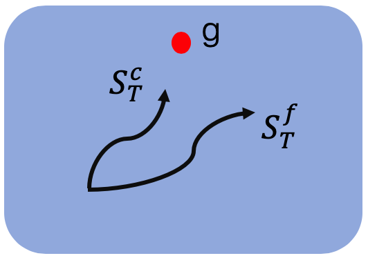
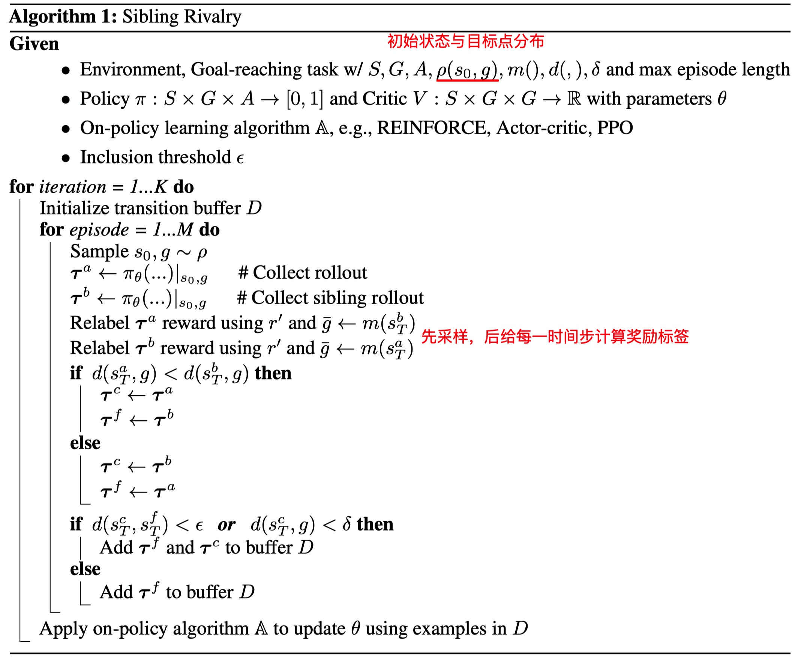
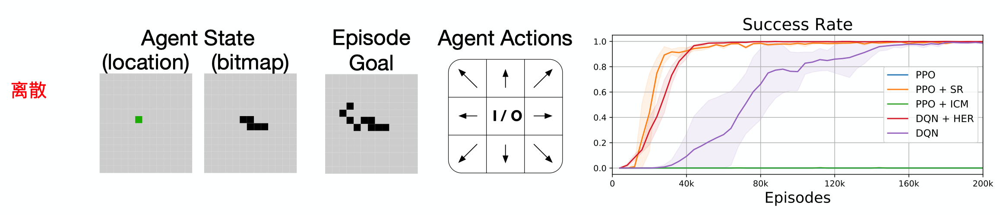

这篇论文介绍了一个简单有效的model-free方法——**Sibling Rivalry**(同胞对抗？)，用于解决稀疏奖励问题。该方法特定于“以达到某个目标状态(goal-oriented)”为任务的问题，并且从塑性的距离目标相关奖励(distance-to-goal rewards)中学习。

推荐：

- self-balancing 奖励机制
- 基于奖励函数的创新，比较有趣

<!--more-->

# 简介

论文地址：[http://arxiv.org/abs/1911.01417.pdf](http://arxiv.org/abs/1911.01417)

这篇文章解决的问题点是：

- 由朴素的距离目标相关的奖励(naive distance-to-goal reward shaping)引起的动态学习在局部最优点稳定的问题

这篇文章方法的优点是：

- 增强目标但不需额外奖励工程设计，也不需领域专家知识
- 可以收敛至原始的稀疏奖励目标

文章发表在NeurIPS 2019上。

这篇论文提出的Sibling Rivalry(SR)方法结合了塑性奖励的可学习性与稀疏奖励的通用性。它主要解决面向目标(goal-oriented)的任务，是对距离奖励函数的改进，实现了奖励函数的自平衡(self-balancing，自动退化至纯稀疏奖励形式)，它的特点是：

- model-free
- 应用在on-policy算法上
- 应用在***目标状态已知***，且***以距离为奖励函数导向***的任务中
- **动态**奖励塑性
- 保持稀疏奖励任务的原有最优策略
- 跳出局部最优解，寻找全局最优
- 可以与分层RL相结合（有实验佐证）

# 文中精要

文中shaped rewards一时不知道该如何做翻译，姑且就称之为“塑性奖励”好了，意为为解决某一特定问题而精心设计的奖励函数机制。

Reward shaping是一种修改奖励信号的技术，比如，它可以用于重新标注失败的经验序列，并从其中筛选出可促进任务完成的经验序列进行学习。然而，这种技术是否可以提升任务性能严重取决于塑性奖励的精心设计。这种塑性奖励有时可以解决稀疏奖励问题，但是具有两个显著特点：

1. 需要精心的工程设计，也可以理解为需要对环境或任务的先验知识

   > requires careful engineering

2. 往往只适用于特定任务，特定问题，比如同样的避障问题，载具类型不同，可能就不适用

   > is problem specific

对于现实世界的RL问题，需要手动设计一个与任务契合/对齐的奖励机制，一个好的奖励函数往往比算法的选择更加重要。但是现实世界问题非常复杂，细粒度的奖励函数也十分难以设计，往往会具有“捡了芝麻丢了西瓜”的特点。比如，在避障问题中，如果针对墙壁这种障碍物设置奖励函数，策略在学习过程中会对墙壁这种实体过拟合，导致当遇到一种新的障碍物时，策略无法适用，还不如简单的稀疏奖励（完成即获得奖励，反之则无），让智能体自己从环境中学习哪些具有障碍物共有或特有特性。

还有一个很严重的问题是，复杂的奖励机制容易使策略陷入局部最优，比如说达到状态A可以获得奖励+10，而达到状态B可以获得奖励+1，那么如果状态A十分难以到达，策略往往会收敛在状态B，或者其他相似的状态附近中去，造成策略在这些局部最优解附近稳定下来。

稀疏奖励往往不存在这种局部最优，或者考虑不周的问题。设计一个合适的稀疏奖励函数很简单，也很直接，但是从这种奖励函数中学习需要大量的时间，而且甚至学习不出来任何东西，**通常需要额外的启发式探索机制去帮助智能体发现这个稀疏的正奖励**。

# 方法

纯稀疏奖励的形式是这样的：
$$
r(s, g)=\left\{\begin{array}{ll}
1, & d(s, g) \leq \delta \\
0, & \text { otherwise }
\end{array}\right.
$$
其中，$s$代表当前状态，$g$代表目标状态。$d$是一个函数用来判断当前状态与目标状态的距离度量，例如$L_1$或$L_2$距离，这个距离可以用来表示任务的完成度，即距离越短，任务完成度越高。$\delta$代表目标点的半径，也就是说，状态不必完全等于目标状态，只需要距离度量小于一定范围$\delta$即可，这个是很常用的做法，比如Unity ML-Agents的示例环境——RollerBall，也是使用这样的设置。

这种纯稀疏奖励的设置很难解决，往往需要很大的探索才能获取到寥寥无几的正奖励样本轨迹，给智能体的学习带来了很大的困难。

其实可以对上述奖励进行修改，使得其可以按照距目标状态的距离给出不同的奖励，引导智能体朝向目标状态移动。它通常为下边这种形式：
$$
\begin{array}{ll}
\tilde{r}(s, g)= & \left\{\begin{array}{ll}
1, & d(s, g) \leq \delta \\
-d(s, g), & \text { otherwise }
\end{array}\right.
\end{array}
$$
这种奖励形式很直观，如果没有达到目标状态，则一直是负奖励，且距离越远则负奖励越大，这样将会引导智能体朝向目标状态移动。针对一些比较简单的稀疏奖励环境，这种形式的奖励设计可以带来算法性能的提升，而且往往可以解决稀疏奖励问题。但是，这种基于距离的塑性奖励（Distance-based shaped rewards）很容易陷入局部最优点，并且在局部最优点附近稳定下来，得不到进一步地策略提升。为什么这么说呢？就比如gym的MountainCar场景，智能体需要先倒退再前进才能达到目标点，也就是说要先经历负奖励的增大过程，再经历负奖励的减小过程，才能最终完成目标，从初始状态直接朝向目标点移动是不能把车子开到山顶上去的。使用这种形式的奖励将会使得智能体抵达半山腰，却永远都触及不到目标点。还有一些U-shape的路径问题，在U型的两端设置起始点与目标点，使用这种奖励机制将会使得智能体在直线朝向目标点移动时偏离轨道，永远学不会以U型的方式完成目标。

使用上述奖励形式的问题经验存在各种各样的局部最优点，而且这些局部最优点与状态空间结构（state space structure）、转移动态（transition dynamics）和环境的其他特性都有关系。

那么有没有一种对奖励进行塑性的方式可以避免局部最优点的影响呢？确实是有的，我们再对上述奖励函数做如下改进：
$$
r^{\prime}(s, g, \bar{g})=\left\{\begin{array}{ll}
1, & d(s, g) \leq \delta \\
\min [0,-d(s, g)+d(s, \bar{g})], & \text { otherwise }
\end{array}\right.
$$
与上式不同的是，这里多了一个符号——$\bar g$，它用来表示局部最优点的状态。论文中给出了这样一个例子：

最左边的图是一个简单的环境，智能体的目标是到达绿色的Goal点，如果使用前文提到的$\tilde{r}$，则会存在局部最优点，也就是图中的Local Optimum。为什么会存在这个局部最优点呢？可以设想一下，假设智能体从左下角出发，那么它在上方路径和下方路径各走一步时，明显下方路径的负奖励衰减的更快，所以智能体通常会选择走下方路径，最终收敛到与Goal隔岸相望的Local Optimum。$\tilde{r}$的奖励函数图像轮廓如上面中间图像红色线条所示，图中横坐标为坐标点，纵坐标为奖励值的高低。绿色光点为智能体在轨迹终态的分布，可以看出，使用$\tilde{r}$作为奖励函数时，在这个环境中奖励图像存在一个小的山峰，相比于全局最优点，智能体更易达到局部最优点，而且会在局部最优附近稳定下来，导致无法产生全局最优策略。

最右侧的图是使用了增强后的距离奖励函数$r^{\prime}$所描绘的奖励图像轮廓，可以看出，通过将局部最优点的山峰构造成低谷，即可抵消局部最优点的影响。绿色点的分布也彰显了增强奖励函数后，智能体可以收敛到全局最优策略。为什么像$r^{\prime}$一样构造奖励函数即可解决局部最优点的影响呢？可以想象一下，将三角形的原理应用上去，当智能体选择上方路径时，两距离相减值逐渐趋于正值，也就是奖励逐渐增大，而选择下方路径时， 两距离相减横为负奖励，这种特性引导着智能体向逐渐增大的正奖励的方向靠拢。

虽然像$r^{\prime}$这种增强距离奖励的形式可以解决稀疏奖励问题，并跳出局部最优点，但是其通常具有如下几个缺点：

1. 需要领域专家知识分析局部最优点；
2. 环境或任务复杂时，存在多种局部最优点，难以确定合适的奖励函数；
3. 一不小心便会弄巧成拙，还会引入新的局部最优点。

## 同胞对抗——Sibling Rivalry

作者十分中意这种跳出局部最优点的方式，所以，作者设想需要一个新的奖励机制，它应当满足：

1. 可以解决稀疏奖励问题
2. 不需要专家及领域知识对环境进行全面的分析与判断
3. 动态评估局部最优点，自适应调整奖励函数

这有点像静态图与动态图的区别，$r^{\prime}$就好像是静态图，需要专家先把图构好，再解决问题，而同胞对抗（Sibling Rivalry， SR）的思想就好像是动态图，一边执行一边应对潜在的局部最优点。

先来说一下SR的思想：

1. 每次采样两条轨迹，同样的起始点与目标点；

2. 距离目标近的为$\tau^c$，远的为$\tau^f$;

3. 互相认为对方的终态$s_T$为局部最优点（假想敌），构造奖励函数，计算轨迹每一时间步的奖励。

如下图所示，每次都roll out两条轨迹，这两条轨迹即称为同胞，然后互相指认对方的终态$S_T^c$和$S_T^f$为局部最优点，促使智能体不选择对方的路径，即为对抗。注意，这样的方式确实有可能使得策略在远离局部最优点的同时，也偏离潜在的正确路径，因为智能体并不真正了解什么样的路径是比较好或者比较坏的。

这种互相对抗的方式增加了智能体的探索能力，因为当智能体的策略不是最优时，它会趋向于选择各种不同的路径，以使得策略可以避开尽可能多的局部最优点。

基于两条同胞轨迹$\tau^{c}$和$\tau^{f}$，如何构造它们的奖励函数呢？其实也很简单，像$r^{\prime}$一样，将其中的局部最优点$\bar g$更换一下即可：
$$
r_{\tau^{f}}^{\prime}=r^{\prime}\left(s_{T}^{f}, g, s_{T}^{c}\right) \quad \& \quad r_{\tau^{c}}^{\prime}=r^{\prime}\left(s_{T}^{c}, g, s_{T}^{f}\right)
$$
作者将这种奖励机制称为**Self-balancing reward**，可以翻译为自平衡/自适应奖励。什么意思呢？可以想想一下，如果策略已经接近全局最优了，那么$g \approx s_{T}^{f} \approx s_{T}^{c}$，此时的奖励从$r^{\prime}_{\tau^{f}}$和$r^{\prime}_{\tau^{c}}$逐渐退化至纯稀疏奖励$r$。为什么呢？因为此时的$-d(s, g)+d(s, \bar{g})$几乎为0呀！

这样自动退化的奖励机制有什么好处呢？会**使得智能体最终的最优策略与使用纯稀疏奖励时一致**，大道至简，复杂的奖励函数未必可以引导智能体习得期望的行为，然而，纯稀疏奖励虽然难以学习，但是其产生的智能体行为往往是最直接最符合设计者的期望的。

有了轨迹经验，也根据各自的奖励函数生成了奖励，那么该如何进行优化呢？既然取得了两条同胞轨迹，两条轨迹都要拿来训练么？我们结合伪代码进行分析。

# 伪代码

解析：

- $\rho(s_0, g)$为一个分布，用于采样任务的初始状态和目标状态，论文中的实验都是将智能体的起止点和目标点固定在一个小范围内，至于SR是否可以用在大范围随机的起始、目标点场景中，还未可知；
- $m$是一个函数映射，用于将智能体状态空间$S$映射至目标状态空间$G$，$m(s): S \rightarrow G$；
- $d$是一个距离度量函数，通常为$L_1,L_2$度量；
- $\delta$是判定目标完成的容错半径；
- 注意，Critic网络V的输入不仅包括状态$s$，目标$g$，也包括局部最优点（同胞轨迹的终态）$\bar g$；
- 作者引入了一个“包容性阈值”$\epsilon$，这个值用来控制对使用距离目标点较近的轨迹$\tau^c$来训练的容忍度，也用来平衡探索与利用，当$\epsilon\uparrow$，利用增加，当$\epsilon\downarrow$，探索增加（学习远距离经验）；
- SR是先采样轨迹$s,a,s,a,...$再计算每一步的奖励的，采样时不包括$r$；
- 每次rollout两条轨迹——$\tau^a$和$\tau^b$，距离目标点$g$比较近的终态轨迹标记为$\tau^c$，远的标记为$\tau^{f}$；
- 优化模型时，何时用$\tau^f$？
  - 任何时候
  - 猜想：距离远的不太可能是局部最优点，因为距离越远，负奖励越大，算法不会稳定收敛在距离目标点很远的局部最优处，会想办法跳出来
- 优化模型时，何时用$\tau^c$?
  - 1，当两条同胞轨迹的终态距离小于$\epsilon$时；2，当$\tau^c$的终态已足以完成目标时
  - 猜想：当两条轨迹的终态距离小于一定阈值时，认为轨迹质量差不多，都可以用来更新
  - 距离目标点$g$近的轨迹已经足够近，是可以获得全局最优解的轨迹，要学习

# 实验分析

作者使用PPO算法在四种类型的任务场景中进行了实验：

1. 连续动作任务
2. 分层决策任务
3. 离散动作任务
4. 《我的世界》3D构造任务，这个任务主要用来测试SR的可扩展性

任务的细节设置以及实验结果详情请看原论文。

在这两个实验中，可以看出SR比ICM和HER的效果都要好，任务完成的成功率也必将高，且方差比较小。

在这个离散的任务中，从图像看出纯DQN即可以解决，但是却没有看到蓝色的纯PPO曲线，按道理来说PPO应该也能解决。

# 总结

> We introduce Sibling Rivalry, a simple and effective method for learning goal-reaching tasks from a generic class of distance-based shaped rewards. Sibling Rivalry makes use of sibling rollouts and self-balancing rewards to prevent the learning dynamics from stabilizing around local optima. By leveraging the distance metric used to define the underlying sparse reward, our technique enables robust learning from shaped rewards without relying on carefully-designed, problem-specific reward functions. We demonstrate the applicability of our method across a variety of goal-reaching tasks where naive distance-to-goal reward shaping consistently fails and techniques to learn from sparse rewards struggle to explore properly and/or generalize from failed rollouts. Our experiments show that Sibling Rivalry can be readily applied to both continuous and discrete domains, incorporated into hierarchical RL, and scaled to demanding environments.

