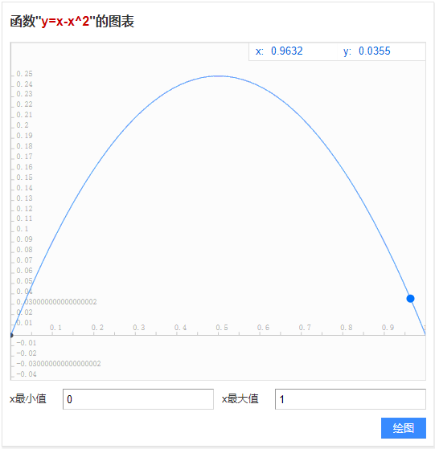
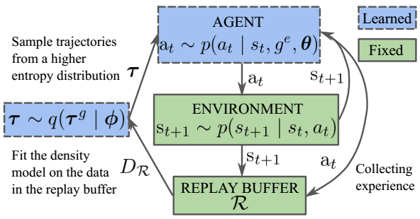

这篇论文将强化学习的目标与最大熵结合了起来，提出了简称为MEP的经验池机制。许多将熵与强化学习结合的方法都是考虑可选动作分布的熵，该篇论文很新颖的使用的是“迹”的熵。

推荐程度中等偏下：

- 有些地方解释的不是很清楚
- 熵的结合方式特殊，可以一看
- 有些公式推导过于复杂，难懂
- 有些参考文献标注不准，如A3C算法的论文并没有使用熵的概念，却在熵相关的语句进行了标注

<!--more-->

# 简介

论文地址：[https://arxiv.org/pdf/1905.08786.pdf](https://arxiv.org/pdf/1905.08786.pdf)

原作者代码地址：[https://github.com/ruizhaogit/mep.git](https://github.com/ruizhaogit/mep.git)

该文章发于2019年的ICML，与之前写过的《Energy-Based Hindsight Experience Prioritization》为同一作者。

本文主要做了三个贡献：

1. 修改了目标函数，提出了最大熵正则化多目标强化学习(Maximum Entropy-Regularized Multi-Goal RL)的想法
2. 推导出替代(surrogate)目标函数，是第1步目标函数的一个下界，可以使算法稳定优化
3. 提出了Maximum Entropy-based Prioritization(MEP)的经验池框架

# 文中精要

文中目标函数的构造主要受Guiasu于1971年提出的加权熵(Weighted Entropy)启发。加权熵表示为：
$$
\mathcal{H}_{p}^{w}=-\sum_{k=1}^{K} w_{k} p_{k} \log p_{k}
$$
$w_{k}$表示权重。

## 多目标强化学习的符号表示

用$p\left(\boldsymbol{\tau} | g^{e}, \boldsymbol{\theta}\right)$表示一个迹出现的概率：

- $\boldsymbol{\tau}=s_{1}, a_{1}, s_{2}, a_{2}, \ldots, s_{T-1}, a_{T-1}, s_{T}$代表迹
- $g^{e}$代表一个真实的目标，即不是“事后诸葛亮”假定的目标，$g^{e} \in \operatorname{Val}\left(G^{e}\right)$，后一项为目标空间，一般情况下，可以视为状态空间$\mathcal{S}$的子集
- $\theta$代表策略参数

展开来写，一个迹在策略$\theta$被采样到的概率为
$$
p\left(\boldsymbol{\tau} | g^{e}, \boldsymbol{\theta}\right)=p\left(s_{1}\right) \prod_{t=1}^{T-1} p\left(a_{t} | s_{t}, g^{e}, \boldsymbol{\theta}\right) p\left(s_{t+1} | s_{t}, a_{t}\right)
$$
由此定义策略$\theta$下的期望奖励回报，也就是目标函数，表示为
$$
\begin{aligned} \eta(\boldsymbol{\theta}) &=\mathbb{E}\left[\sum_{t=1}^{T} r\left(S_{t}, G^{e}\right) | \boldsymbol{\theta}\right] \\ &=\sum_{g^{e}} p\left(g^{e}\right) \sum_{\boldsymbol{\tau}} p\left(\boldsymbol{\tau} | g^{e}, \boldsymbol{\theta}\right) \sum_{t=1}^{T} r\left(s_{t}, g^{e}\right) \end{aligned}
$$
很容易理解，也就是在传统的目标函数前边加了一项关于每个目标求积分的步骤。

如果使用off-policy算法且用经验池机制来提升采样效率，那么目标函数为
$$
\eta^{\mathcal{R}}(\boldsymbol{\theta})=\sum_{\boldsymbol{\tau}, g^{e}} p_{\mathcal{R}}\left(\boldsymbol{\tau}, g^{e} | \boldsymbol{\theta}\right) \sum_{t=1}^{T} r\left(s_{t}, g^{e}\right)
$$
其中$\mathcal{R}$表示经验池。注意，$\eta^{\mathcal{R}}(\boldsymbol{\theta})$将$\eta(\boldsymbol{\theta})$的前两个积分项合在一起写了，所以是联合概率而不是条件概率。

## 最大熵正则化目标函数

将前文提到的$\eta(\boldsymbol{\theta})$与加权熵结合起来，就构造出了本文中新的目标函数，即
$$
\begin{aligned} \eta^{\mathcal{H}}(\boldsymbol{\theta}) &=\mathcal{H}_{p}^{w}\left(\mathcal{T}^{g}\right) \\ &=\mathbb{E}_{p}\left[\color{red} {\log \frac{1}{p\left(\boldsymbol{\tau}^{g}\right)}} \sum_{t=1}^{T} r\left(S_{t}, G^{e}\right) | \boldsymbol{\theta}\right] \end{aligned}
$$
$\color{red} {p\left(\boldsymbol{\tau}^{g}\right)}$代表$\sum_{g^{e}} p_{\mathcal{R}}\left(\tau^{g}, g^{e} | \boldsymbol{\theta} \right )$，期望右下角的$p$也是$p\left(\boldsymbol{\tau}^{g}\right)$的意思。

**与传统的结合方式不同的是，这种结合方式并没有将熵作为一个加和的项，而是相乘。**

仔细想一下，如果将这个式子视为加权熵，那么权重系数是累计奖励$\sum_{t=1}^{T} r\left(s_{t}, g^{e}\right)$，这样做的直观解释是：**对于各种各样的迹，给与累计回报大的以更多权重，使算法直到要朝哪个迹的方向优化。**

反而，如果将前一个对数项视为传统强化学习目标函数的权重系数，那么这样的直观解释是：**迹出现的概率越低，就越新颖，反而要使其权重增加，从而驱使算法向探索的方向优化。**

## 替代目标函数

文中指出，$\eta^{\mathcal{H}}(\boldsymbol{\theta}) $中的$\log \frac{1}{p\left(\boldsymbol{\tau}^{g}\right)}$这一项是无界的，即取值范围为$[0,+\infty]$，这会导致通用值函数近似的训练不稳定，因此提出了可靠地替代目标函数$\eta^{\mathcal{L}}(\boldsymbol{\theta})$，这个目标函数是原目标函数的一个下界。

> the weight, $\log \left(1 / p\left(\boldsymbol{\tau}^{g}\right)\right)$, is unbounded, which makes the training of the universal function approximator unstable. 

表示为
$$
\eta^{\mathcal{L}}(\boldsymbol{\theta})=Z \cdot \mathbb{E}_{\color{red}{q}}\left[\sum_{t=1}^{T} r\left(S_{t}, G^{e}\right) | \boldsymbol{\theta}\right]
$$
注意，期望积分的是迹分布函数$q$，而不是经验池中真实的迹分布函数$p$。

那么，新的迹分布函数$q\left(\boldsymbol{\tau}^{g}\right)$是怎么得来的？

首先，使用Latent Varibale Model(LVM)对$p\left(\boldsymbol{\tau}^{g}\right)$的潜在分布进行建模，因为LVM适合于对复杂的分布进行建模。

> We use a Latent Variable Model(LVM) (Murphy, 2012) to model the underlying distribution of $p\left(\boldsymbol{\tau}^{g}\right)$, since LVM is suitable for modeling complex distributions.

将分布用混合高斯模型MoG表示，
$$
p\left(\boldsymbol{\tau}^{g} | \boldsymbol{\phi}\right)=\frac{1}{Z} \sum_{i=k}^{K} c_{k} \mathcal{N}\left(\boldsymbol{\tau}^{g} | \boldsymbol{\mu}_{k}, \boldsymbol{\Sigma}_{k}\right)
$$
其中，

- $K$为隐变量的个数
- $\boldsymbol{\mu}_{k}, \boldsymbol{\Sigma}_{k}$分布为均值与协方差矩阵
- $c_{k}$为混合系数
- $Z$为配分函数（归一化系数）
- $\phi$为模型参数，包含所有的均值、协方差矩阵和混合系数

文中接着使用$p\left(\boldsymbol{\tau}^{g} | \boldsymbol{\phi}\right)$的补作为经验重放的优先级，即
$$
\overline{p}\left(\boldsymbol{\tau}^{g} | \boldsymbol{\phi}\right) \propto 1-p\left(\boldsymbol{\tau}^{g} | \boldsymbol{\phi}\right)
$$
补越大，就代表迹出现的概率越低，那么就对该迹赋予更大的优先级。作者想通过过采样这些迹来增大训练时迹分布的熵。直观的解释就是，概率分布不均匀，那么让概率大的出现次数少，概率小的出现次数多，这样就会使采样的分布朝着均匀分布的方向移动，从而使熵值增加。

文中由此引出了新的迹分布$q\left(\boldsymbol{\tau}^{g}\right)$，它表示为原始分布与其补的联合分布，
$$
\begin{aligned} q\left(\boldsymbol{\tau}^{g}\right) & \propto \overline{p}\left(\boldsymbol{\tau}^{g} | \boldsymbol{\phi}\right) p\left(\boldsymbol{\tau}^{g}\right) \\ & \propto\left(1-p\left(\boldsymbol{\tau}^{g} | \boldsymbol{\phi}\right)\right) p\left(\boldsymbol{\tau}^{g}\right) \\ & \approx p\left(\boldsymbol{\tau}^{g}\right)-p\left(\boldsymbol{\tau}^{g}\right)^{2} \end{aligned}
$$
文中将正比的比例设置为$\color{blue}{\frac{1}{Z}}$，即$q\left(\boldsymbol{\tau}^{g}\right)=\frac{1}{Z} p\left(\boldsymbol{\tau}^{g}\right)\left(1-p\left(\boldsymbol{\tau}^{g}\right)\right)$，接下来就可以证明$\eta^{\mathcal{L}}(\boldsymbol{\theta})$为$\eta^{\mathcal{H}}(\boldsymbol{\theta}) $的下界：
$$
\begin{aligned} 
\eta^{\mathcal{L}}(\boldsymbol{\theta}) &=Z \cdot \mathbb{E}_{q}\left[\sum_{t=1}^{T} r\left(S_{t}, G^{e}\right) | \boldsymbol{\theta}\right] \\ &=\sum_{\boldsymbol{\tau}^{g}} Z \cdot q\left(\boldsymbol{\tau}^{g}\right) \sum_{t=1}^{T} r\left(s_{t}, g^{e}\right) \\
&=\sum_{\tau^{g}} \frac{Z}{Z} p\left(\tau^{g}\right)\left(1-p\left(\tau^{g}\right)\right) \sum_{t=1}^{T} r\left(s_{t}, g^{e}\right) \\
&<\sum_{\tau^{g}}-p\left(\boldsymbol{\tau}^{g}\right) \log p\left(\boldsymbol{\tau}^{g}\right) \sum_{t=1}^{T} r\left(s_{t}, g^{e}\right) \\
&=\mathbb{E}_{p}\left[\log \frac{1}{p\left(\boldsymbol{\tau}^{g}\right)} \sum_{t=1}^{T} r\left(S_{t}, G^{e}\right) | \boldsymbol{\theta}\right] \\
&=\mathcal{H}_{p}^{w}\left(\mathcal{T}^{g}\right) \\
&=\eta^{\mathcal{H}}(\boldsymbol{\theta})
\end{aligned}
$$
在小于号不等式那一步，使用了函数的性质：$\log x<x-1$。很容易可以画出$f(x)=\ln{x}-x+1$在区间[0,1]上的图像：

文中进一步证明了$q$分布的熵比$p$分布的熵更大，因此，由$q$分布来进行采样可以使采样更均匀（= =！那么直接使用均匀分布采样不更好吗？），使学习的目标更多样化。证明过程篇幅过长，详见原论文附录，
$$
p\left(\boldsymbol{\tau}^{g}\right), \text { where } p\left(\boldsymbol{\tau}_{i}^{g}\right) \in(0,1) \text { and } \sum_{i=1}^{N} p\left(\boldsymbol{\tau}_{i}^{g}\right)=1
$$

$$
q\left(\boldsymbol{\tau}_{i}^{g}\right)=\frac{1}{Z} p\left(\boldsymbol{\tau}_{i}^{g}\right)\left(1-p\left(\boldsymbol{\tau}_{i}^{g}\right)\right), \text { where } \sum_{i=1}^{N} q\left(\boldsymbol{\tau}_{i}^{g}\right)=1
$$

$$
\mathcal{H}_{q}\left(\mathcal{T}^{g}\right)-\mathcal{H}_{p}\left(\mathcal{T}^{g}\right) \geq 0
$$

## 基于最大熵的优先级

文中说是基于最大熵的优先经验回放，但是除了使用$q\left(\boldsymbol{\tau}^{g}\right)$分布之外，在这一部分没有体现出熵的影子，优先级的设置为
$$
q\left(\boldsymbol{\tau}_{i}^{g}\right)=\frac{\operatorname{rank}\left(q\left(\boldsymbol{\tau}_{i}^{g}\right)\right)}{\sum_{n=1}^{N} \operatorname{rank}\left(q\left(\boldsymbol{\tau}_{n}^{g}\right)\right)}
$$
使用排序作为衡量优先级的标准是因为这种方式更具鲁棒性，对异常值不敏感。

之前文中说想要使出现概率低的迹以更高的概率被从经验池中采样到，如果是按照新的$q$分布来定义迹出现的概率，那么到这里是有些说不通的，因为，前文提到$q\left(\boldsymbol{\tau}^{g}\right) \approx p\left(\boldsymbol{\tau}^{g}\right)-p\left(\boldsymbol{\tau}^{g}\right)^{2} $，那么画出$f(x)=x-x^2$在区间[0，1]上的图像为：

由此可见，q值小的地方为p值小与p值大的地方，这就会导致出现概率最大、概率最小的迹被经验池重复的次数多，与前文所讲不同。

而如果考虑以真实的p分布来定义迹出现的概率，那么此处不应该使用$\operatorname{rank}\left(q\left(\tau_{i}^{g}\right)\right)$作为排序的标准，而应该是$\operatorname{rank}\overline{p}\left(\boldsymbol{\tau}^{g} | \boldsymbol{\phi}\right)$，或者$\operatorname{rank}p\left(\boldsymbol{\tau}^{g}\right)$。

总之，这里关于优先级的解释不是很清楚。

## 流程示意图

## 伪代码

解析：

- 每一次迭代，都重新构造优先采样分布$q\left(\tau^{g}\right)$

# 实验部分

## 环境

- 算法：DDPG
- 5个随机种子进行实验，取最好的结果
- 19个CPU
- 训练200个epoch

## 实验结果

- **以训练的epoch为标准**，使用了MEP的收敛速度更快

可以看到，结合MEP的效果最好，但是我觉得这种对比一点都不严谨，从数据上看，不使用MEP比使用MEP的训练时间更短，且效果也差不多，那么如果训练相同的时间，说不定使用MEP的效果并没有不使用的好。

固定成功率，在机器人实验中，提升了1.95倍采样效率，即使用更少的样本训练相同的效果。

# 疑问

前文提到原目标函数中的对数项会使训练值函数不稳定，为什么？

为什么构造新的迹分布$q\left(\boldsymbol{\tau}^{g}\right)$为那样的形式？

