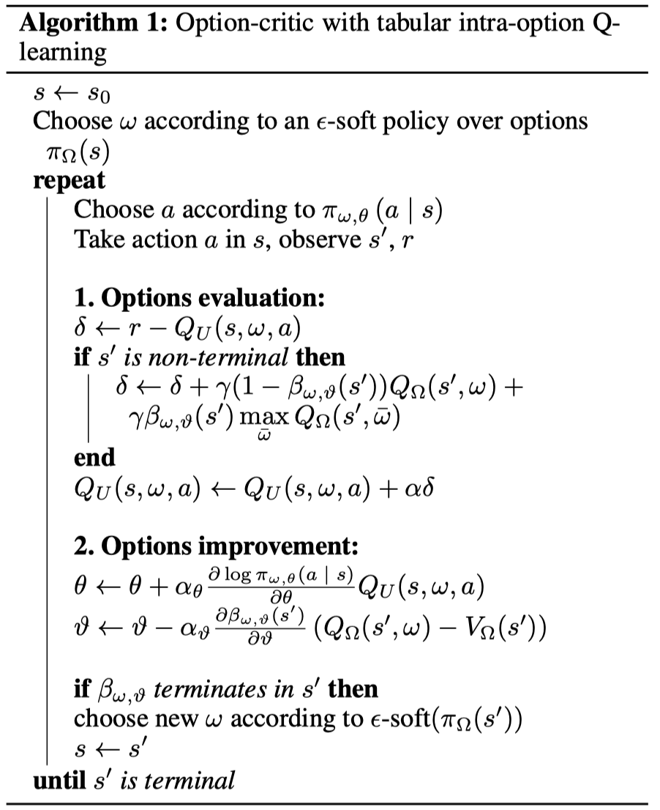

这篇论文将Option-Critic这种端对端的分层强化学习算法推导出随机策略梯度的更新方式。

<!--more-->

# 简介

论文地址：[http://arxiv.org/abs/1609.05140](http://arxiv.org/abs/1609.05140)

# 文中精要

$$
Q_{\Omega}(s, \omega)=\sum_{a} \pi_{\omega, \theta}(a | s) Q_{U}(s, \omega, a)
$$

$Q_{U}: \mathcal{S} \times \Omega \times \mathcal{A} \rightarrow \mathbb{R}$
$$
Q_{U}(s, \omega, a)=r(s, a)+\gamma \sum_{s^{\prime}} \mathrm{P}\left(s^{\prime} | s, a\right) U\left(\omega, s^{\prime}\right)
$$

$$
U\left(\omega, s^{\prime}\right)=\left(1-\beta_{\omega, \vartheta}\left(s^{\prime}\right)\right) Q_{\Omega}\left(s^{\prime}, \omega\right)+\beta_{\omega, \vartheta}\left(s^{\prime}\right) V_{\Omega}\left(s^{\prime}\right)
$$

$$
\mathrm{P}\left(s_{t+1}, \omega_{t+1} | s_{t}, \omega_{t}\right)=\sum_{a} \pi_{\omega_{t}, \theta}\left(a | s_{t}\right) \mathrm{P}\left(s_{t+1} | s_{t}, a\right) \left.\left(1-\beta_{\omega_{t}, \vartheta}\left(s_{t+1}\right)\right) \mathbf{1}_{\omega_{t}=\omega_{t+1}}+\beta_{\omega_{t}, \vartheta}\left(s_{t+1}\right) \pi_{\Omega}\left(\omega_{t+1} | s_{t+1}\right)\right)
$$

$$
\frac{\partial Q_{\Omega}(s, \omega)}{\partial \theta} =\left(\sum_{a} \frac{\partial \pi_{\omega, \theta}(a | s)}{\partial \theta} Q_{U}(s, \omega, a)\right) +\sum_{a} \pi_{\omega, \theta}(a | s) \sum_{s^{\prime}} \gamma \mathrm{P}\left(s^{\prime} | s, a\right) \frac{\partial U\left(\omega, s^{\prime}\right)}{\partial \theta}
$$

# 伪代码

