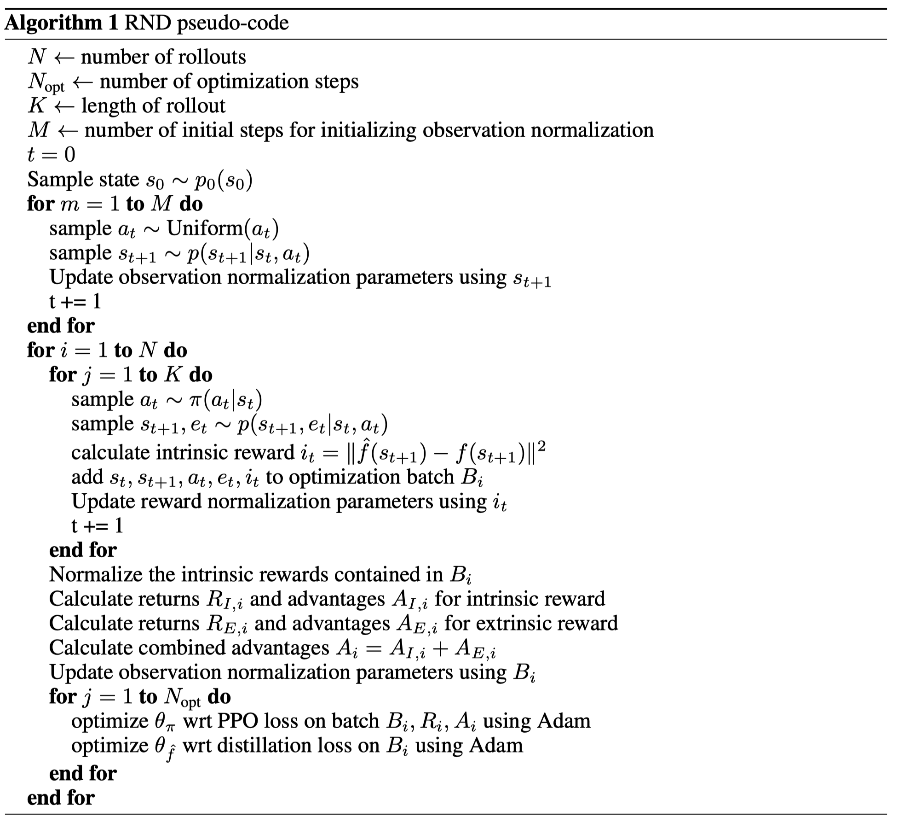

这篇论文提出了RND，是一种新奇的内在探索机制，主要原理是使预测网络的特征逼近随机网络的特征，以此使得预测网络对不熟悉的状态给出较大的预测误差，由此设定内在奖励。

推荐程度中等：

- 1个额外的固定、不训练的随机网络
- RND在强探索（hard exploration，奖励很稀疏）环境中表现不错

<!--more-->

# 简介

论文地址：[http://arxiv.org/abs/1810.12894](http://arxiv.org/abs/1810.12894)

代码地址：[https://github.com/openai/random-network-distillation](https://github.com/openai/random-network-distillation)

这篇论文的思想特别简单：**设定一个固定不训练的随机网络和一个训练的预测网络，将同一个图像特征分别放入两个网络计算出特征，两个特征的差异程度就为状态的“新奇”程度，由此设定内在奖励**。

这么做的意义在与：对于与环境交互时经常访问到的状态，其预测网络产生的特征与随机网络产生的特征相差无几，但是如果突然出现一个新的状态或者很少遇见的状态，那么预测网络与随机网络输出之间的差异性比较大，由此说明状态的新颖性，并根据新颖性计算出内在奖励值。**状态常见，则内在奖励小；状态罕见，则内在奖励大。**

这篇论文提出的RND方法在蒙特祖玛的复仇（Montezuma's Revenge）上刷新了历史新高，并且没有使用专家示例经验（如模仿学习），也没有使用额外的游戏状态信息。

# 方法

奖励包括内在与外在两部分：
$$
r_{t}=e_{t}+i_{t}
$$
其中，$e_t$为外部奖励，即环境给的，$i_t$为内部激励。

传统的内在奖励方法主要分为2类：

1. 计数

   1. 在tabular setting中，状态、动作都是可数的，可以用一张表格来维护每个状态-动作对的访问次数，并且使用形如以下的公式来定义内在奖励：
      $$
      i_t=\frac{1}{n_t(s)}
      $$

      $$
      i_t=\frac{1}{\sqrt {n_t(s)}}
      $$

   2. 在非tabular setting中，状态、动作不完全可数，则可使用伪计数法（pseudo-counts），主要是使用状态密度估计的变化程度来衡量。参考论文：《Unifying count-based exploration and intrinsic motivation》

2. 预测，主要是通过前向(s,a->s')/反向(s,s'->a)预测环境动态的误差来设计内在奖励

> This paper introduces a different approach where the prediction problem is randomly generated. This involves two neural networks: a fixed and randomly initialized target network which sets the prediction problem, and a predictor network trained on data collected by the agent.

RND引入两个网络：

1. 预测网络，是强化学习网络的一部分，可训练，预测观测值的隐特征，$\hat{f}: \mathcal{O} \rightarrow \mathbb{R}^{k}$；
2. 目标网络，额外引入的网络，不训练，固定参数，随机初始化，输出观测值的隐特征作为真值，$f: \mathcal{O} \rightarrow \mathbb{R}^{k}$。

目标函数即为最小二乘误差：$\|\hat{f}(\mathbf{x} ; \theta)-f(\mathbf{x})\|^{2}$，优化参数$\theta_{\hat{f}}$。这个过程将随机初始化的神经网络蒸馏到一个学习的预测网络中去。

**上边的最小二乘误差也为内在奖励$i_t$**，作者在使用这个内在奖励时还对其进行了归一化，因为任务不同，这个最小二乘的值偏好范围也不相同，所以作者对这个内在奖励进行了正态分布归一化的处理，主要是将最小二乘误差除以移动平均标准差估计。

作者说这个预测误差主要有以下几个影响因素：

1. 训练数据少。当样本中相似数据不多时，预测误差会大
2. 环境的动态随机。环境的随机转换是前向预测误差增大的原因。
3. 模型不适合。关键信息缺失（我也不明白是什么关键信息）或者预测的模型不足以拟合目标函数，会使得预测误差很大
4. 动态学习。学习到最后不能稳定地拟合目标函数。

作者还建议在使用内在奖励时，分开两个值函数估计，即一个值函数近似外部奖励，另一个值函数近似内部奖励。这是因为外部奖励稳定，内部奖励不稳定。

> Note that even where one is not trying to combine episodic and non-episodic reward streams, or reward streams with different discount factors, there may still be a benefit to having separate value functions since there is an additional supervisory signal to the value function. This may be especially important for exploration bonuses since the extrinsic reward function is stationary whereas the intrinsic reward function is non-stationary.

## 状态归一化

作者在训练时还对状态进行了归一化处理，主要是以下流程：

1. 在训练开始之前与环境随机交互取得经验初始化移动平均均值和标准差
2. 训练开始之后，状态减去移动平均均值
3. 再除以移动平均标准差
4. 将状态clip到[-5, 5]

作者对状态归一化的原因主要是不归一化的状态其特征的方差非常低，携带信息少（属实不明白）：

> Observation normalization is often important in deep learning but it is crucial when using a random neural network as a target, since the parameters are frozen and hence cannot adjust to the scale of different datasets. 
>
> Lack of normalization can result in the variance of the embedding being extremely low and carrying little information about the inputs.

这个状态归一化，作者用在随机目标网络和预测网络，但是没有用在策略网络中。

# 伪代码

# 评价

作者认为RND在局部探索中有用，在全局探索中作用不明显：

> We find that the RND exploration bonus is sufficient to deal with local exploration, i.e. exploring the consequences of short-term decisions, like whether to interact with a particular object, or avoid it. However global exploration that involves coordinated decisions over long time horizons is beyond the reach of our method.

