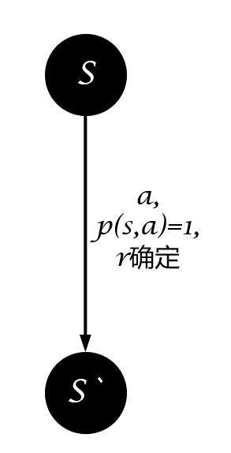

本文讲述了强化学习中各种算法、问题的分类规则。

<!--more-->

# Stationary or not

根据环境十分稳定、可以将强化学习问题分为stationary、non-stationary。

如果状态转移**和**奖励函数是确定的，即选择动作$a$后执行它的结果是确定的，那么这个环境就是stationary。

如果状态转移**或**奖励函数是不确定的，即选择动作$a$后执行它的结果是不确定的，那么这个环境就是non-stationary。

# Model Based-or-Free

一直对这个问题的认识不清晰，直到最近（2019年5月12日19:13:53）才有了清晰的认识。

需要注意的是，无论是Model-Based还是Model-Free都不是对强化学习问题的分类，而是对算法的分类。之前一直理解的是状态空间$\mathcal{S}$、动作空间$\mathcal{A}$的都是离散的，转移概率矩阵$\mathcal{P}$是确定的，这样即是Model-Based，如果状态空间$\mathcal{S}$、动作空间$\mathcal{A}$或转移概率矩阵$\mathcal{P}$是不确定的，则是Model-Free，其实这只是对Model的分类，并不是Model-Based与Model-Free的真实含义，Model-Based与Model-Free是对算法求解过程的分类，理解这个可以在阅读国外文献、实验环境时更清晰，提升自己对强化学习算法的理解深度。

Model-Based：

- 智能体Agent在已知模型（$\mathcal{S,A,R,P}$有限且确定）或者先学习一个模型（使用有监督对状态转移、奖励函数进行学习而得到），并在这个模型中使用**planning**（预测所有状态转移可能）方法来计算解决方案

> Now if we know what all those elements of an MDP are, we can just compute the solution before ever actually executing an action in the environment. In AI, we typically call computing the solution to a decision-making problem before executing an actual decision *planning*. Some classic planning algorithms for MDPs include Value Iteration, Policy Iteration, and whole lot more.

Model-Free:

- 智能体在模型（$\mathcal{S,A,R,P}$可能确定但没有使用planning方式解决，也可能不确定）中试错，并且使用**learning**（不预测全部可能性）方法来产生最佳策略

> But the RL problem isn’t so kind to us. What makes a problem an RL problem, rather than a planning problem, is the agent does *not* know all the elements of the MDP, precluding it from being able to plan a solution. Specifically, the agent does not know how the world will change in response to its actions (the transition function TT), nor what immediate reward it will receive for doing so (the reward function RR). The agent will simply have to try taking actions in the environment, observe what happens, and somehow, find a good policy from doing so.

根据Model-Based、Model-Free对算法、解决方法进行分类：

Model-Based：DP、Policy Iteration、Value Iteration……

Model-Free：SARSA、Q-Learning、PG……

---

> if you want a way to check if an RL algorithm is model-based or model-free, ask yourself this question: after learning, can the agent make predictions about what the next state and reward will be before it takes each action? If it can, then it’s a model-based RL algorithm. if it cannot, it’s a model-free algorithm.

**使用算法学成策略之后，智能体可以在执行动作前判断该动作的后果，即是Model-Based，反之则是Model-Free**

---

根据Model-Based和Model-Free可以将强化学习算法分类，图片摘自OpenAI Spinning Up，如图所示：

>[What is the difference between model-based and model-free reinforcement learning?](https://www.quora.com/What-is-the-difference-between-model-based-and-model-free-reinforcement-learning)
>
>[OpenAI Spinning Up : A Taxonomy of RL Algorithms](https://spinningup.openai.com/en/latest/spinningup/rl_intro2.html#a-taxonomy-of-rl-algorithms)

# Policy or Value

强化学习的目的是找到最优策略使得累积期望回报最大化，获得最优策略的方法有直接与间接之分。直接获取策略的图示为：

间接获得策略为从值函数中提取最优策略，图示为：

直接获取策略的方式即为Policy-Based，常见的算法有：

- Policy Gradient
- PPO
- SAC
- ……

间接获得策略的方式即为Value-Based，常见的算法有：

- SARSA
- Q-Learning
- DQN
- ……

# On-policy or Off-policy

在机器学习中，提到On跟Off这两个词我们最容易想到的是On-line Learning与Off-line Learning，那么强化学习与On-line、Off-line有什么关系呢？

---

网上对于On-line Learning与Off-line Learning有不同的解释，按热度排序为下面三种：

对于On-line Learning：

1. 单样本学习，样本用完即丢，样本连续不断输入，非数据集，而是数据流
2. 单样本的（SGD）
3. 单样本或批样本学习，样本连续不断输入，非数据集，而是数据流

相应对于Off-line Learning：

1. 批样本或全样本学习多次，静态样本集
2. 批样本学习
3. 全样本学习，静态数据集

对于这三种方式，强化学习可以怎样融入呢？

1. 对于第一种，强化学习不属于On-line Learning也不属于Off-line Learning，不属于Off-line Learning是因为样本非静态、非固定，不属于On-line Learning是因为对于Q-Learning、Sarsa、PG、PPO等算法样本用完即丢，对于DQN、TD3等算法样本重复利用。
2. 对于第二种，强化学习包括On-line Learning及On-line Learning
3. 低于第三种，强化学习属于On-line Learning

---

On-policy、Off-policy与On-line、Off-line之间有关系吗？

好像没有关系。虽然它们都是关于样本进行的划分，不过On-Off line learning针对的是样本的使用，而On-Off policy针对的是样本的生成。

---

学习On-policy、Off-policy之前首先需要理解什么是行为策略与目标策略。

行为策略$\mathcal{Behavior Policy}$：

- 采样时间序列$S_{0},A_{0},R_{0},S_{1},A_{1},R_{2},...,S_{n},A_{n},R_{n}$的策略
- 官话：指导个体产生与环境进行实际交互行为的策略
- 未必由一个模型表示

目标策略$\mathcal{TargetPolicy}$:

- 待优化的策略
- 官话：用来评价状态或行为价值的策略或者待优化的策略称为目标策略

同步策略学习$\mathcal{On-Policy}$:

- 简言之，边采样边学习
- 官话：如果个体在学习过程中优化的策略与自己的行为策略是同一个策略时，这种学习方式称为**同步策略学习（on-policy learning）**
- 行为策略与目标策略是同一个

异步策略学习$\mathcal{Off-Policy}$:

- 简言之，你采样我学习
- 官话：如果个体在学习过程中优化的策略与自己的行为策略是不同的策略时，这种学习方式称为**异步策略学习（off-policy learning）**
- 行为策略与目标策略不同，行为策略可能是目标策略的“分身”（双网络结构），或者完全是另一个采样的策略

两者的区别简而言之：如果需要估计一个值，用于估计的额外信息和当前信息出自同一策略则为on-policy，否则为off-policy。以SARSA和Q-Learning算法为例，对于Q值的估计，SARSA中$s_{t+1}$的动作由当前策略产生，故为on-policy算法，而Q-Learning中$s_{t+1}$的动作由贪心策略产生，故为off-policy。

例如：

|             | SARSA | Q-learning |
|:-----------:|:-----:|:----------:|
| Choosing A' |   π   |      π     |
| Updating Q  |   π   |      μ     |

> [一个以Q-Learning和Sarsa算法做比较的解释](https://stackoverflow.com/a/41420616)

# Stochastic or Deterministic