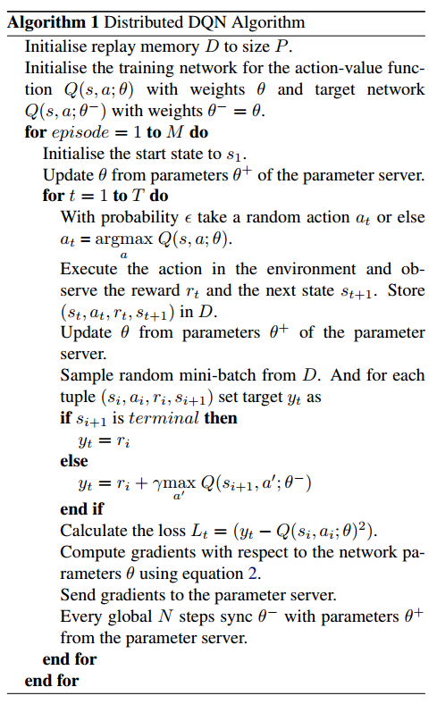

本文记录了一些粗读的强化学习相关的论文。

<!--more-->

<h1 align="center" style="color:blue" id="Gorila">[DeepMind]Massively Parallel Methods for Deep Reinforcement Learning[Gorila]</h1>

本文提出了一个分布式强化学习训练的架构：Gorila(General Reinforcement Learning Architecture)。2015年发于ICML，本文使用DQN算法进行分布式实现。

论文地址：[https://arxiv.org/pdf/1507.04296.pdf](https://arxiv.org/pdf/1507.04296.pdf)

## 模型示意图

解析：

- shard代表参数分片的意思，即模型过大、参数过多，需要将参数分片放置多台机器上
- Bundled Mode模式指的是Actor中的Q网络与Learner中的Q网络一样，但是Learner比Actor多了一个目标Q网络，用于计算梯度

## 特点

- 并行Actor采数据
- 并行Learner计算梯度，**不更新Learner中的模型**
- 中心参数服务器，用于维持最新的网络模型。如果模型太大、参数过多，可以分片将网络模型放置多个参数服务器，每个参数服务器中的参数独立不关联，根据learner传的梯度更新相应的变量
- 经验池机制，分为local与global两种
  - local，即每个actor节点一个经验池
  - global，将所有actor节点的经验存至一个分布式数据库中，这个**需要网络通信开销**

## 伪代码

解析：

- 伪代码中为一个actor节点的流程

- 注意伪代码中出现两次`Update θ from parameters θ+ of the parameter server `，这句话的意思为从中心参数服务器拉取模型到actor和learner，拉取的时间点为：

  - 每个episode开始前
  - 每次执行动作$a_{t}$后，但是在计算梯度并将梯度传递至参数服务器之前

- 伪代码中`equation 2`，代表$g_{i}=\left(r+\gamma \max _{a^{\prime}} Q\left(s^{\prime}, a^{\prime} ; \theta_{i}^{-}\right)-Q\left(s, a ; \theta_{i}\right)\right) \nabla_{\theta_{i}} Q(s, a ; \theta)$，这是DQN中的损失函数

- 注意，与传统DQN不同的是，**该分布式DQN中给Learner中的目标Q网络赋值时，是直接将更新N次的中心参数服务器中的模型进行拉取覆盖，而不是使用Learner中的Q网络**

- 中心参数服务器中的参数梯度更新需要累计多个learner传来的梯度后进行更新，使用异步SGD即ASGD方法进行梯度下降。

  - > The parameter server then applies the updates that are accumulated from many learners. 

- 因为每个actor都是阶段更新自己的模型，即从参数服务器中拉取。所以每个actor中的行为策略（采样策略）都不完全相同，事实上，每个actor节点可以采取不同的探索机制，这样可以更有效地探索环境

## 稳定性

为了应对节点退出、网速慢、节点机器运行慢等问题，该文章中指出使用了一个超参数用来控制actor和server之间最大延时。

- 过时的梯度（低于时间阈值）将会被丢弃

  - > All gradients older than the threshold are discarded by the parameter server. 

- 过高或过低的梯度也将被丢弃

  - > each actor/learner keeps a running average and standard deviation of the absolute DQN loss for the data it sees and discards gradients with absolute loss higher than the mean plus several standard deviations. 

- 使用AdaGrad更新规则

## 效果

采用于提出DQN的论文中一样的网络结构，具体请见论文中第5部分。

在Atari 2600 49个游戏中，41个明显优于单GPU DQN。

Gorila进一步实现了DRL的希望：一个可伸缩的架构，随着计算和内存的增加，它的性能会越来越好

<h1 align="center" style="color:blue" id="MB-MPO">[UCB/OpenAI]Model-Based Reinforcement Learning via Meta-Policy Optimization[MB-MPO]</h1>

论文地址：[https://arxiv.org/pdf/1809.05214.pdf](https://arxiv.org/pdf/1809.05214.pdf)

本文2018年发布与CoRL，提出了一个基于模型的元强化学习算法MB-MPO。相比于一般的元强化学习是从多个MDPs任务中学习一个通用模型加速以后特定任务的模型训练，该文中的方法是将一个model-free的任务学习多个不确定、不完全、不完美的动态模型，即一个模型集合，然后使用这个模型集合学习出该任务的通用模型。因为它有一个从model-free学习动态模型的过程，所以为model-based方法。

## 元强化学习

$$
\max _{\theta} \mathbb{E}_{\mathcal{M}_{k} \sim \rho(\mathcal{M}),\boldsymbol{s}_{t+1} \sim p_{k},\boldsymbol{a}_{t} \sim \pi_{\boldsymbol{\theta}^{\prime}}\left(\boldsymbol{a}_{t} | \boldsymbol{s}_{t}\right)}\left[\sum_{t=0}^{H-1} r_{k}\left(s_{t}, a_{t}\right)\right] \\ s.t.:\boldsymbol{\theta}^{\prime}=\boldsymbol{\theta}+\alpha\nabla_{\boldsymbol{\theta}} \mathbb{E}_{\boldsymbol{s}_{t+1} \sim p_{k},\boldsymbol{a}_{t} \sim \pi_{\boldsymbol{\theta}}\left(\boldsymbol{a}_{t} | \boldsymbol{s}_{t}\right)}\left[\sum_{t=0}^{H-1} r_{k}\left(s_{t}, a_{t}\right)\right]
$$

$\mathcal{M}$为一系列MDP，共享相同的状态空间$\mathcal{S}$与动作空间$\mathcal{A}$，但是奖励函数可以不同

## 学习环境动态模型

$$
\min _{\boldsymbol{\phi}_{k}} \frac{1}{\left|\mathcal{D}_{k}\right|} \sum_{\left(\boldsymbol{s}_{t}, \boldsymbol{a}_{t}, \boldsymbol{s}_{t+1}\right) \in \mathcal{D}_{k}}\left\|\boldsymbol{s}_{t+1}-\hat{f}_{\boldsymbol{\phi}_{k}}\left(\boldsymbol{s}_{t}, \boldsymbol{a}_{t}\right)\right\|_{2}^{2}
$$

解析：

- $\mathcal{D}_{k}$为第k个学习模型采样的“经验”

- $\phi$为用神经网络表示的环境模型的参数

- $\hat{f}_{\boldsymbol{\phi}_{k}}\left(\boldsymbol{s}_{t}, \boldsymbol{a}_{t}\right)$为第k个学习模型针对状态$s_{t}$执行动作$a_{t}$后转移状态的预测，其中，神经网络的输出不直接是预测的状态$\color{red}{s_{t+1}}$，而是$\color{red}{\Delta s=s_{t+1}-s_{t}}$，所以$\hat{f}_{\boldsymbol{\phi}_{k}}\left(\boldsymbol{s}_{t}, \boldsymbol{a}_{t}\right)=s_{t}+\Delta s$

  - > We follow the standard practice in model-based RL of training the neural network to predict the change in state $\Delta s=s_{t+1}-s_{t}$ (rather than the next state $s_{t+1}$) 

为了防止过拟合，文中使用了3个trick：

1. 早停
2. 归一化神经网络输入与输出
3. 权重归一化

## 基于环境动态模型的元强化学习

假设学到了K个近似模型$\left\{\hat{f}_{\phi_{1}}, \hat{f}_{\phi_{2}}, \ldots, \hat{f}_{\phi_{K}}\right\}$，把每个模型转换成一个MDP过程，即$\mathcal{M}_{k}=\left(S, A, \hat{f}_{\phi_{k}}, r, \gamma, p_{0}\right)$，其中，**奖励函数相同**

由此给每个学习到的动态模型分配的行为策略目标函数为：
$$
J_{k}(\boldsymbol{\theta})=\mathbb{E}_{\boldsymbol{a}_{t} \sim \pi_{\boldsymbol{\theta}}\left(\boldsymbol{a}_{t} | s_{t}\right)}\left[\sum_{t=0}^{H-1} r\left(\boldsymbol{s}_{t}, \boldsymbol{a}_{t}\right) | \boldsymbol{s}_{t+1}=\hat{f}_{\boldsymbol{\phi}_{k}}\left(\boldsymbol{s}_{t}, \boldsymbol{a}_{t}\right)\right]
$$
定义MB=MPO的最终目标函数为：
$$
\max _{\boldsymbol{\theta}} \frac{1}{K} \sum_{k=0}^{K} J_{k}\left(\boldsymbol{\theta}_{k}^{\prime}\right) \quad \text { s.t.: } \quad \boldsymbol{\theta}_{k}^{\prime}=\boldsymbol{\theta}+\alpha \nabla_{\boldsymbol{\theta}} J_{k}(\boldsymbol{\theta})
$$
小写k代表第k个学到的模型，大写K代表模型的总数。

注意看，这里公式后边使用的是$\color{red}{\theta'_{k}}$，而不是$\theta$。这里并没有写错，我起初以为写错了，具体请看后边的伪代码解释。

## 伪代码

解析：

- MB-MPO分为两部分更新，第一部分更新每个模型分配的行为策略，第二部分更新元策略。**注意：行为策略的更新是不连贯的，即不是自身迭代，而是不断使用元策略进行稍加修改然后替换，所以叫做adapted policy**
- 上一项提到的两次更新都是对元策略的参数$\theta$进行更新，区别是，第一次更新将更新后的参数赋值给了行为策略，未更改元策略本身，第二次更新直接更新元策略本身
- $\alpha, \beta$为两部分更新的学习率
- 行为策略使用VPG，即传统策略梯度算法进行优化，元策略使用TRPO算法进行优化
- 伪代码中的大致流程如下：
  1. 初始化策略$\pi_{\theta}$并将其复制K份$\pi_{\theta_{1}^{\prime}}, \dots, \pi_{\boldsymbol{\theta}_{K}^{\prime}}$
  2. 使用$\pi_{\theta_{1}^{\prime}}, \dots, \pi_{\boldsymbol{\theta}_{K}^{\prime}}$对**真实的环境模型进行采样（这一步是实际交互，即真实数据）**，将数据存入经验池
  3. 根据经验池训练K个环境模型，即使用`学习环境动态模型`部分的公式
  4. 对于每个更新后的环境模型，用元策略$\color{red}{\pi_{\theta}}$进行**虚拟采样（这一步是预测采样，即不实际进行交互）**，采样到$\mathcal{T}_{k}$以适应性修改行为策略$\boldsymbol{\theta}_{k}^{\prime}$。这里也是前边提到的行为策略更新是不连贯的原因。
  5. 再用适应性策略$\boldsymbol{\theta}_{k}^{\prime}$进行**虚拟采样**，采样到$\mathcal{T}_{k}^{\prime}$以更新元策略$\pi_{\theta}$
  6. 跳向第2步
- 伪代码中虽然没有明确指出，但是其实使用了baseline的trick用来减少方差

## 流程示意图

## 效果

1. 比之前的model-based方法效果好、收敛快
2. 可以达到model-free算法的渐进性能
3. 需要更少的经验，低采样复杂性。其实是使用了虚拟采样，提高了数据效率，减少了交互采样的代价。
4. 对于模型偏差（model-bias，即环境模型没学到位）的情况，之前的算法不能有效处理，该算法对不完美、不完全、不完整的模型具有很好地鲁棒性

