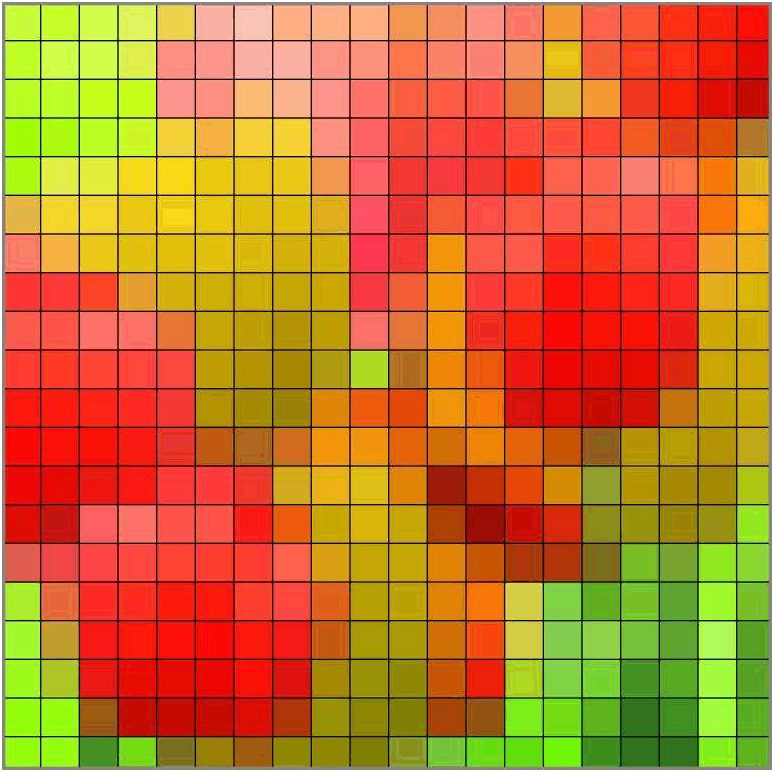
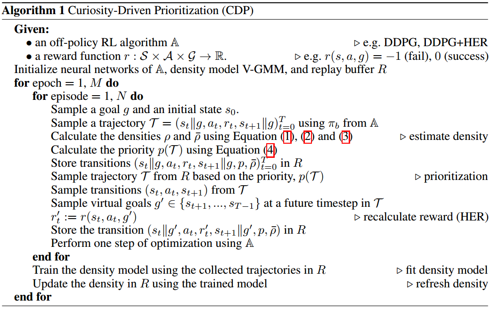

本文记录了一些粗读的强化学习相关的论文。

<!--more-->

<h1 align="center" style="color:blue" id="Gorila">[DeepMind]Massively Parallel Methods for Deep Reinforcement Learning[Gorila]</h1>

本文提出了一个分布式强化学习训练的架构：Gorila(General Reinforcement Learning Architecture)。2015年发于ICML，本文使用DQN算法进行分布式实现。

论文地址：[https://arxiv.org/pdf/1507.04296.pdf](https://arxiv.org/pdf/1507.04296.pdf)

## 模型示意图

解析：

- shard代表参数分片的意思，即模型过大、参数过多，需要将参数分片放置多台机器上
- Bundled Mode模式指的是Actor中的Q网络与Learner中的Q网络一样，但是Learner比Actor多了一个目标Q网络，用于计算梯度

## 特点

- 并行Actor采数据
- 并行Learner计算梯度，**不更新Learner中的模型**
- 中心参数服务器，用于维持最新的网络模型。如果模型太大、参数过多，可以分片将网络模型放置多个参数服务器，每个参数服务器中的参数独立不关联，根据learner传的梯度更新相应的变量
- 经验池机制，分为local与global两种
  - local，即每个actor节点一个经验池
  - global，将所有actor节点的经验存至一个分布式数据库中，这个**需要网络通信开销**

## 伪代码

解析：

- 伪代码中为一个actor节点的流程

- 注意伪代码中出现两次`Update θ from parameters θ+ of the parameter server `，这句话的意思为从中心参数服务器拉取模型到actor和learner，拉取的时间点为：

  - 每个episode开始前
  - 每次执行动作$a_{t}$后，但是在计算梯度并将梯度传递至参数服务器之前

- 伪代码中`equation 2`，代表$g_{i}=\left(r+\gamma \max _{a^{\prime}} Q\left(s^{\prime}, a^{\prime} ; \theta_{i}^{-}\right)-Q\left(s, a ; \theta_{i}\right)\right) \nabla_{\theta_{i}} Q(s, a ; \theta)$，这是DQN中的损失函数

- 注意，与传统DQN不同的是，**该分布式DQN中给Learner中的目标Q网络赋值时，是直接将更新N次的中心参数服务器中的模型进行拉取覆盖，而不是使用Learner中的Q网络**

- 中心参数服务器中的参数梯度更新需要累计多个learner传来的梯度后进行更新，使用异步SGD即ASGD方法进行梯度下降。

  - > The parameter server then applies the updates that are accumulated from many learners. 

- 因为每个actor都是阶段更新自己的模型，即从参数服务器中拉取。所以每个actor中的行为策略（采样策略）都不完全相同，事实上，每个actor节点可以采取不同的探索机制，这样可以更有效地探索环境

## 稳定性

为了应对节点退出、网速慢、节点机器运行慢等问题，该文章中指出使用了一个超参数用来控制actor和server之间最大延时。

- 过时的梯度（低于时间阈值）将会被丢弃

  - > All gradients older than the threshold are discarded by the parameter server. 

- 过高或过低的梯度也将被丢弃

  - > each actor/learner keeps a running average and standard deviation of the absolute DQN loss for the data it sees and discards gradients with absolute loss higher than the mean plus several standard deviations. 

- 使用AdaGrad更新规则

## 效果

采用于提出DQN的论文中一样的网络结构，具体请见论文中第5部分。

在Atari 2600 49个游戏中，41个明显优于单GPU DQN。

Gorila进一步实现了DRL的希望：一个可伸缩的架构，随着计算和内存的增加，它的性能会越来越好

<h1 align="center" style="color:blue" id="MB-MPO">[UCB/OpenAI]Model-Based Reinforcement Learning via Meta-Policy Optimization[MB-MPO]</h1>

论文地址：[https://arxiv.org/pdf/1809.05214.pdf](https://arxiv.org/pdf/1809.05214.pdf)

本文2018年发布于CoRL，提出了一个基于模型的元强化学习算法MB-MPO。相比于一般的元强化学习是从多个MDPs任务中学习一个通用模型加速以后特定任务的模型训练，该文中的方法是将一个model-free的任务学习多个不确定、不完全、不完美的动态模型，即一个模型集合，然后使用这个模型集合学习出该任务的通用模型。因为它有一个从model-free学习动态模型的过程，所以为model-based方法。

## 元强化学习

$$
\max _{\theta} \mathbb{E}_{\mathcal{M}_{k} \sim \rho(\mathcal{M}),\boldsymbol{s}_{t+1} \sim p_{k},\boldsymbol{a}_{t} \sim \pi_{\boldsymbol{\theta}^{\prime}}\left(\boldsymbol{a}_{t} | \boldsymbol{s}_{t}\right)}\left[\sum_{t=0}^{H-1} r_{k}\left(s_{t}, a_{t}\right)\right] \\ s.t.:\boldsymbol{\theta}^{\prime}=\boldsymbol{\theta}+\alpha\nabla_{\boldsymbol{\theta}} \mathbb{E}_{\boldsymbol{s}_{t+1} \sim p_{k},\boldsymbol{a}_{t} \sim \pi_{\boldsymbol{\theta}}\left(\boldsymbol{a}_{t} | \boldsymbol{s}_{t}\right)}\left[\sum_{t=0}^{H-1} r_{k}\left(s_{t}, a_{t}\right)\right]
$$

$\mathcal{M}$为一系列MDP，共享相同的状态空间$\mathcal{S}$与动作空间$\mathcal{A}$，但是奖励函数可以不同

## 学习环境动态模型

$$
\min _{\boldsymbol{\phi}_{k}} \frac{1}{\left|\mathcal{D}_{k}\right|} \sum_{\left(\boldsymbol{s}_{t}, \boldsymbol{a}_{t}, \boldsymbol{s}_{t+1}\right) \in \mathcal{D}_{k}}\left\|\boldsymbol{s}_{t+1}-\hat{f}_{\boldsymbol{\phi}_{k}}\left(\boldsymbol{s}_{t}, \boldsymbol{a}_{t}\right)\right\|_{2}^{2}
$$

解析：

- $\mathcal{D}_{k}$为第k个学习模型采样的“经验”

- $\phi$为用神经网络表示的环境模型的参数

- $\hat{f}_{\boldsymbol{\phi}_{k}}\left(\boldsymbol{s}_{t}, \boldsymbol{a}_{t}\right)$为第k个学习模型针对状态$s_{t}$执行动作$a_{t}$后转移状态的预测，其中，神经网络的输出不直接是预测的状态$\color{red}{s_{t+1}}$，而是$\color{red}{\Delta s=s_{t+1}-s_{t}}$，所以$\hat{f}_{\boldsymbol{\phi}_{k}}\left(\boldsymbol{s}_{t}, \boldsymbol{a}_{t}\right)=s_{t}+\Delta s$

  - > We follow the standard practice in model-based RL of training the neural network to predict the change in state $\Delta s=s_{t+1}-s_{t}$ (rather than the next state $s_{t+1}$) 

为了防止过拟合，文中使用了3个trick：

1. 早停
2. 归一化神经网络输入与输出
3. 权重归一化

## 基于环境动态模型的元强化学习

假设学到了K个近似模型$\left\{\hat{f}_{\phi_{1}}, \hat{f}_{\phi_{2}}, \ldots, \hat{f}_{\phi_{K}}\right\}$，把每个模型转换成一个MDP过程，即$\mathcal{M}_{k}=\left(S, A, \hat{f}_{\phi_{k}}, r, \gamma, p_{0}\right)$，其中，**奖励函数相同**

由此给每个学习到的动态模型分配的行为策略目标函数为：
$$
J_{k}(\boldsymbol{\theta})=\mathbb{E}_{\boldsymbol{a}_{t} \sim \pi_{\boldsymbol{\theta}}\left(\boldsymbol{a}_{t} | s_{t}\right)}\left[\sum_{t=0}^{H-1} r\left(\boldsymbol{s}_{t}, \boldsymbol{a}_{t}\right) | \boldsymbol{s}_{t+1}=\hat{f}_{\boldsymbol{\phi}_{k}}\left(\boldsymbol{s}_{t}, \boldsymbol{a}_{t}\right)\right]
$$
定义MB=MPO的最终目标函数为：
$$
\max _{\boldsymbol{\theta}} \frac{1}{K} \sum_{k=0}^{K} J_{k}\left(\boldsymbol{\theta}_{k}^{\prime}\right) \quad \text { s.t.: } \quad \boldsymbol{\theta}_{k}^{\prime}=\boldsymbol{\theta}+\alpha \nabla_{\boldsymbol{\theta}} J_{k}(\boldsymbol{\theta})
$$
小写k代表第k个学到的模型，大写K代表模型的总数。

注意看，这里公式后边使用的是$\color{red}{\theta'_{k}}$，而不是$\theta$。这里并没有写错，我起初以为写错了，具体请看后边的伪代码解释。

## 伪代码

解析：

- MB-MPO分为两部分更新，第一部分更新每个模型分配的行为策略，第二部分更新元策略。**注意：行为策略的更新是不连贯的，即不是自身迭代，而是不断使用元策略进行稍加修改然后替换，所以叫做adapted policy**
- 上一项提到的两次更新都是对元策略的参数$\theta$进行更新，区别是，第一次更新将更新后的参数赋值给了行为策略，未更改元策略本身，第二次更新直接更新元策略本身
- $\alpha, \beta$为两部分更新的学习率
- 行为策略使用VPG，即传统策略梯度算法进行优化，元策略使用TRPO算法进行优化
- 伪代码中的大致流程如下：
  1. 初始化策略$\pi_{\theta}$并将其复制K份$\pi_{\theta_{1}^{\prime}}, \dots, \pi_{\boldsymbol{\theta}_{K}^{\prime}}$
  2. 使用$\pi_{\theta_{1}^{\prime}}, \dots, \pi_{\boldsymbol{\theta}_{K}^{\prime}}$对**真实的环境模型进行采样（这一步是实际交互，即真实数据）**，将数据存入经验池
  3. 根据经验池训练K个环境模型，即使用`学习环境动态模型`部分的公式
  4. 对于每个更新后的环境模型，用元策略$\color{red}{\pi_{\theta}}$进行**虚拟采样（这一步是预测采样，即不实际进行交互）**，采样到$\mathcal{T}_{k}$以适应性修改行为策略$\boldsymbol{\theta}_{k}^{\prime}$。这里也是前边提到的行为策略更新是不连贯的原因。
  5. 再用适应性策略$\boldsymbol{\theta}_{k}^{\prime}$进行**虚拟采样**，采样到$\mathcal{T}_{k}^{\prime}$以更新元策略$\pi_{\theta}$
  6. 跳向第2步
- 伪代码中虽然没有明确指出，但是其实使用了baseline的trick用来减少方差

## 流程示意图

## 效果

1. 比之前的model-based方法效果好、收敛快
2. 可以达到model-free算法的渐进性能
3. 需要更少的经验，低采样复杂性。其实是使用了虚拟采样，提高了数据效率，减少了交互采样的代价。
4. 对于模型偏差（model-bias，即环境模型没学到位）的情况，之前的算法不能有效处理，该算法对不完美、不完全、不完整的模型具有很好地鲁棒性

<h1 align="center" style="color:blue" id="DIAYN">[UCB/Google AI]Diversity is All Your Need: Learning Skills Without a Reward Function[DIAYN]</h1>

论文地址：[https://arxiv.org/pdf/1802.06070.pdf](https://arxiv.org/pdf/1802.06070.pdf)

Google网页：[https://sites.google.com/view/diayn/home](https://sites.google.com/view/diayn/home)

Github项目：[https://github.com/ben-eysenbach/sac/blob/master/DIAYN.md](https://github.com/ben-eysenbach/sac/blob/master/DIAYN.md)

这篇文章使用信息论中最大熵的方法来构造强化学习的学习目标，**期望学习到具有多样性的技能（skills）**。

个人认为，此文章中所提的方法虽然很新颖，但是不能作为优化一项任务的可用算法，因为虽然其可以学到以各种花样完成目标，但是没有奖励函数的控制使得无法规范、指引智能体“解题”过程的效果，如柔顺性、实用性、实际可行性等。从另一方面来讲，将这样虽然不规划、不严谨决策行为的策略用于元策略的预训练模式还是可用的。

## 技能

技能的定义在文中有如下表述：

> A skill is a latent-conditioned policy that alters that state of the environment in a consistent
> way. 
> we refer to a/the policy conditioned on a fixed Z as a “skill” .

意思是，设定一个隐变量，以（状态$S$，隐变量$Z$）为条件进行动作选择，即为技能——skill。

DIAYN就好像是要给每个状态赋予各个不同技能的概率，并且使其中一个技能的概率最大，这样就使得在整个状态空间中，不同的技能“占领”着状态空间的不同部分，每个技能在各自偏好的局部状态空间中作用，但是作者同样希望每个技能在各自的状态空间中尽可能随机决策。

假设以不同的颜色代表不同的技能skill，每个方格代表一个状态，那么每个状态对于每个技能到达此状态的“偏好”概率是不同的。总的来说，作者希望技能之间的重合度尽可能小，但每个技能在各自的领域内尽可能随机地完成目标。

## 亮点与作用

1. 去掉了奖励函数
2. 修改了目标函数，$\mathcal{F}(\theta)\triangleq \mathcal{G}(\color{red}{\theta, \phi})$
   - $\color{red}{\theta}$代表Actor网络中的参数
   - $\color{red}{\phi}$代表Critic网络中的参数
3. 学习到的技能可以用于*分层强化学习、迁移学习、模仿学习*

## 目标函数

$$
\begin{aligned} 
\mathcal{F}(\theta) & \triangleq \color{red}{I(S ; Z)+\mathcal{H}[A | S]-I(A ; Z | S)} \\ 
&=(\mathcal{H}[Z]-\mathcal{H}[Z | S])+\mathcal{H}[A | S]-(\mathcal{H}[A | S]-\mathcal{H}[A | S, Z]) \\ 
&=\color{blue}{\mathcal{H}[Z]-\mathcal{H}[Z | S]+\mathcal{H}[A | S, Z]} \\
&=\mathcal{H}[A | S, Z]+\mathbb{E}_{z \sim p(z), s \sim \pi(z)}[\log p(z | s)]-\mathbb{E}_{z \sim p(z)}[\log p(z)] \\
&{ \color{orange}{\geq} \mathcal{H}[A | S, Z]+\mathbb{E}_{z \sim p(z), s \sim \pi(z)}\left[\log q_{\phi}(z | s)-\log p(z)\right] \\ 
\triangleq \mathcal{G}(\theta, \phi)}
\end{aligned}
$$

解析：

- 互信息，离散下为$I(X ; Y)=\sum_{y \in Y} \sum_{x \in X} p(x, y) \log \left(\frac{p(x, y)}{p(x) p(y)}\right)$，连续下为$I(X ; Y)=\int_{Y} \int_{X} p(x, y) \log \left(\frac{p(x, y)}{p(x) p(y)}\right) d x d y$

- 信息熵表示为$H(X, Y)=-\sum_{x, y} p(x, y) \log p(x, y)=-\sum_{i=1}^{n} \sum_{j=1}^{m} p\left(x_{i}, y_{i}\right) \log p\left(x_{i}, y_{i}\right)$

- 推到中频繁使用了性质$I(X,Y)=H(X)-H(X | Y)$

- 式中对数的底为自然指数$e$

- 看红色部分，化简之前：

  - **增大**：$I(S ; Z)$代表状态$S$与策略隐变量$Z$之间的互信息。因为作者希望可以通过策略所能到达的状态来判别其属于哪个技能，即将技能与状态挂钩。作者给出一个直观的解释：因为在有些状态下可以执行很多动作，但是却不改变环境（至少不明显改变），就像用机械手臂夹紧一个物体时，可使用力的大小、方向等都是很多的，不同技能选择不同动作导致的效果可能相同，所以作者不希望从动作的选择来区分学到的技能，而是通过可以明显观察到、数值化的状态$S$来作为区别不同技能的标准。**互信息$I(X,Y)$有一个直观的性质就是，它可以衡量两个随机变量的“相关性”，也就是说，互信息越大，代表知道$X$后对$Y$的不确定性减少，即知道其一可以加深对另一个的了解。**所以，目标函数希望最大化互信息$I(S ; Z)$，以将状态和技能相关联，使技能尽可能根据状态可以区分。
  - **增大**：$\mathcal{H}[A | S]$代表策略（不以隐变量$Z$区分技能，混合所有技能即为策略）的熵值。与SAC算法中想要使用熵增来使得动作的选择更加随机一样，作者希望随机性的动作同样可以完成目标，所以希望尽可能增大这一项。
  - **减小**：$I(A ; Z | S)$代表动作$A$与策略隐变量$Z$在给定状态$S$时之间的互信息。为了避免歧义，应该写作为$I[(A ; Z) | S]$。作者希望技能根据状态可区分，而不是根据动作，所以需要最小化这一项。

- 看蓝色部分，化简之后：

  - **固定最大，为$\ln n$**：$\mathcal{H}[Z]$代表技能分布的不确定性，既然要最大化这个项，不如就固定它，使得技能从其中均匀采样，使熵为最大值。
  - **减小**：$\mathcal{H}[Z | S]$代表状态$S$条件下技能的不确定性，我们知道，熵越大，不确定性越大；熵越小，不确定性越小。作者希望技能根据状态可区分，可以需要使这一项最小，以减小给定状态下所属技能的不确定性，使其尽可能接近概率1。
  - **增大**：$\mathcal{H [ A | S}, Z ]$代表给定技能$(S,Z)$下动作的不确定性。因为作者希望动作的选择尽可能随机但又可以完成目标，所以需要最大化这一项。

- 看橘色部分，使用Jensen不等式：

  - 这一步推导使用了论文[《The IM Algorithm : A variational approach to Information Maximization》](https://pdfs.semanticscholar.org/f586/4b47b1d848e4426319a8bb28efeeaf55a52a.pdf)中的推导公式
    $$
    I(\mathbf{x}, \mathbf{y}) \geq \underbrace{H(\mathbf{x})}_{\text { ‘‘entrop’’ }}+\underbrace{\langle\log q(\mathbf{x} | \mathbf{y})\rangle_{p(\mathbf{x}, \mathbf{y})}}_{\text { ‘‘energy’’ }} \stackrel{\mathrm{def}}{=} \tilde{I}(\mathbf{x}, \mathbf{y})
    $$

  - 

  - 蓝色公式中，有$I(Z;S) = \mathcal{H}[Z]-\mathcal{H}[Z | S]$，可以应用上述性质进行推导，将真实分布$p(z | s)$替换为任意变分分布(variational distribution)$q(z | s)$

  - 最后使用变分下界$\mathcal{G}(\theta, \phi)$代替目标函数$\mathcal{F}(\theta)$

- 至此，思路已经十分清晰。Actor网络以变量$\theta$参数化，并使用SAC算法($\alpha=0.1$)最大化$\mathcal{G}(\theta, \phi)$中$\mathcal{H}[A | S, Z]$部分；Critic网络以变量$\phi$参数化，并最大化后半个期望部分。文中将期望内的元素定义为“伪奖励”：
  $$
  r_{z}(s, a) \triangleq \log q_{\phi}(z | s)-\log p(z)
  $$
  由于$p(z)$为均匀分布，是固定的；对数函数不改变原函数单调性，所以只需最大化$q_{\phi}(z | s)$即可。

## 伪代码

解析：

- 每个episode都重新采样隐变量$z$
- Actor网络的输入为$(S||Z)$，即状态与隐变量的连结(我猜的= =)
- Critic网络的输入为状态$S$

## 模型示意图

解析：

- 隐变量分布$p(z)$是固定的

<h1 align="center" style="color:blue" id="CDP">Curiosity-Driven Experience Prioritization via Density Estimation[CDP]</h1>
论文地址：[https://arxiv.org/pdf/1902.08039.pdf](https://arxiv.org/pdf/1902.08039.pdf)

这篇文章发于2018年的NIPS，作者为赵瑞，之前读过他的两篇论文，并写了博客，可以在论文精读里找，此处不贴链接了，分别是基于能量的HER和最大熵正则化多目标RL。

这篇文章总的来说提出了**基于迹密度的优先经验回放**，人类的好奇心机制驱动他有了这样的想法，文中说受有监督学习使用过采样和降采样解决训练集样本不平衡问题的启发，想在强化学习中解决经验池中迹“不足（under-represented）”的问题。

说起来也挺佩服这个作者的，目前（2019年6月21日14:59:05）总共发了三篇关于强化学习的论文，但都有很好地结果：

1. 基于迹能量的优先级，发了CoRL
2. 基于迹密度的优先级，也就是这篇，发了NIPS
3. 基于迹最大熵的优先级，发了ICML

我个人道行尚浅，对于几篇论文中的深奥精髓有些不能尽数参透，由于先验知识不足，对于文中内容也不敢完全苟同，但是从这几篇阅读总结下来，发得了这种高级别论文有以下几个“加分性”要求：

1. 数学要好，这是必然的，数学公式写的越华丽，数学模型越复杂，当然越具有吸引力
2. 工作要专一且连续，看这三篇论文虽然不是递进关系，但都是在解决经验池优先相关的工作，所以找准一个领域内的小角度也是很重要的
3. 实验部分要做好，三篇都没用完整地、细节地比较各个算法，但是却新奇地比较了采样复杂性、数据利用率等等，总之，一定要用实验表明自己的方法在某方面有用
4. 其他秘密因素

## 流程

这篇论文的方法流程如下：

1. 计算**迹密度**$\rho$
2. 计算迹密度的补$\overline{\rho} \propto 1-\rho$
3. 根据补排序，并设置优先级，补越大优先级越大
4. 使用HER补充经验，设置相同的优先级和迹密度
5. 优化算法

## 迹密度的计算

这一部分没有看太懂，主要是本人数学功底比较薄弱，感兴趣的可以亲自查看论文中2.4与3.2.1、3.2.2部分。

根据文中的意思，思想大致如下：

1. 用GMM（高斯混合模型）来估计迹密度
   $$
   \rho(\mathbf{x})=\sum_{k=1}^{K} c_{k} \mathcal{N}\left(\mathbf{x} | \boldsymbol{\mu}_{k}, \boldsymbol{\Sigma}_{k}\right)
   $$

2. 在每个epoch，使用V-GMM（GMM的一个变体）+EM算法推断GMM参数($\boldsymbol{\mu}_{k}, \boldsymbol{\Sigma}_{k}$)的后验分布

3. 在每个episode，使用如下公式计算迹密度
   $$
   \rho=\mathrm{V}-\operatorname{GMM}(\mathcal{T})=\sum_{k=1}^{K} c_{k} \mathcal{N}\left(\mathcal{T} | \boldsymbol{\mu}_{k}, \boldsymbol{\Sigma}_{k}\right)
   $$
   其中，$\mathcal{T}=\left(s_{0}\left\|s_{1}\right\| \ldots \| s_{T}\right)$，**每个迹的长度相同**，中间的符号代表连结操作的意思，然后进行归一化
   $$
   \rho_{i}=\frac{\rho_{i}}{\sum_{n=1}^{N} \rho_{n}}
   $$

*注：我猜想上边符号表示的$s$其实包含了智能体的所在状态和要达到的真实目标，也就是$(s,g)$，文中有一段可能解释了这一部分，但是我没有太理解。*

## 优先级的设定

作者说使用rank-based方法来设置优先级，因为其受异常点影响小而具有良好的鲁棒性。

先计算迹密度的补
$$
\overline{\rho} \propto 1-\rho
$$
将补从小到大排序，并根据排名计算优先级，排名从0开始，即
$$
\operatorname{rank}(\cdot) \in\{0,1, \ldots, N-1\}
$$

$$
p\left(\mathcal{T}_{i}\right)=\frac{\operatorname{rank}\left(\overline{\rho}\left(\mathcal{T}_{i}\right)\right)}{\sum_{n=1}^{N} \operatorname{rank}\left(\left(\overline{\rho}\left(\mathcal{T}_{n}\right)\right)\right.}
$$

## 伪代码

解析：

- 每个epoch根据经验池中的样本数据重新拟合一次密度模型，也就是GMM中的参数
- 每个episode都计算其迹密度
- 红色框中的公式数字编号分别代表之间部分中关于计算迹密度和迹优先级的公式
- 采样迹、采样经验转换之后，需要采样目标并存入经验池，重构后的经验其优先级及迹密度与真正目标下迹的相同

## 优点

实验部分的比较详见论文。

1. 可以适用于任何Off-Policy算法
2. 不使用TD-error计算优先级，而使用迹密度，减少了计算时间
3. 提升了采样效率两倍左右
4. 算法性能超过最新算法9%（这个结果看看即可，不必放在心上）

<h1 align="center" style="color:blue" id="NAF">[Google]Continuous Deep Q-Learning with Model-based Acceleration[NAF]</h1>
论文地址：[https://arxiv.org/abs/1603.00748](https://arxiv.org/abs/1603.00748)

本文介绍了标准化优势函数Normalized Advantage Function——NAF算法，该算法简化了A-C架构，将Q-Learning的思想应用于高维连续空间。

本文的主要贡献是：

1. 提出NAF，简化了Actor-Critic架构
2. 将Q-Learning推广至高维连续空间
3. 提出新的与已学模型结合的方法，提升了采样复杂性（也就是降低）和学习效率，不牺牲策略的最优性。原文中翻译意思是，评估了几种将已学习模型与Q-Learning结合的方案，提出将局部线性模型与局部On-Policy想定推演结合以加速Q-Learning算法在model-free、连续问题下的学习

## 伪代码

解析：

- 待写

<h1 align="center" style="color:blue" id="ERE">[NYU]Boosting Soft Actor-Critic: Emphasizing Recent Experience without Forgetting the Past[ERE]</h1>

论文地址：[http://arxiv.org/abs/1906.04009](http://arxiv.org/abs/1906.04009)

代码仓库：[https://github.com/BY571/Soft-Actor-Critic-and-Extensions](https://github.com/BY571/Soft-Actor-Critic-and-Extensions)(不确定是否为论文原作者的仓库，该仓库PER的实现没有用sum-tree，2020年04月02日13:42:44)

这篇论文主要是对经验池机制的扩展，SAC是被应用的算法。

ERE是Emphasizing Recent Experience的缩写，从名字即可以看出，该经验池机制的侧重点是近期经验。简单说一下ERE的思想及流程：

1. 强调近期观测到的数据，同时不遗忘过去学到的知识；
2. 在更新神经网络参数时，比如要连续更新$K$次，即要从经验池中循环取$K$个mini-batch的数据，那么，在第一次更新时，从整个经验池进行采样，后续更新时，逐渐缩小经验池的可采样范围，也就是收缩，使得在间隔内更新的次数也多，近期经验被采样出的概率越大

论文中的原句：

> We propose Emphasizing Recent Experience (ERE), a simple but powerful off-policy sampling technique, which emphasizes recently observed data while not forgetting the past. The ERE algorithm samples more aggressively from recent experience, and also orders the updates to ensure that updates from old data do not overwrite updates from new data.

## 经验池逐渐缩放的原理

核心思想是，在训练阶段（也就是先收集好一批轨迹，然后再更新$K$次的阶段），第一个mini-batch数据从整个经验池范围采样，在后续次序的更新中，我们逐渐减小经验池的可采样范围，使得mini-batch数据中包含越来越多的近期经验。

举个例子：假如经验池共十个位置，即0到9，0放置最新的经验，9放置最旧的经验，batch-size为2，那么在第一次更新时，从0-9中采样两条经验。在第二次更新时，从0-8中采样两条经验。……以此类推。

论文中提出了下边这个公式：
$$
c_{k}=\max \left\{N \cdot \eta^{k \frac{1000}{K}}, c_{\min }\right\}
$$
在这个公式中，$N$代表经验池的总容量；$\eta \in(0,1]$是引入的一个超参数，用来决定**对近期数据的重视程度**，当$\eta=1$时等同于均匀采样，当$\eta<1$时，$c_k$随着更新次数逐渐减小。作者通过实验发现$\eta \in(0.994,0.999)$时效果不错；$c_{min}$是为$c_k$设置的一个下界，防止从一个很小的范围内采样数据，可能会导致过拟合现象。大写的$K$表示更新的册数，小写的$k$，$1\leq k \leq K$，表示当前是第几次更新。

虽然作者说只引入了$\eta$这一个超参数，但其实我觉得，更新次数$K$与基数$1000$也属于可调的超参数，虽然在实验中往往将$K$设置为一条轨迹的步长，即有多少步就更新多少次，这样在更新次数上与一步一更新是一致的，但是说到底它也是个可变的参数。

文中还提到ERE可以与PER相结合，先决定采样区间，再按照区间内经验的权重选择批数据进行更新。通过代码没有看到在ERE与PER结合时使用sum-tree结构，可能在sum-tree结构上ERE不能很好适用，因为区间的选择也会改变树根节点的位置，为各种功能的计算都引入不便。
$$
P(i)=\frac{p_{i}^{\alpha}}{\sum_{j} p_{j}^{\alpha}}, i, j \in D_{c_{k}}
$$
$D_{c_k}$即为经验池中前$c_k$个近期的经验数据。

## 伪代码

## 优缺点

优点：

1. 简单有效
2. 可用于任何使用经验池机制的off-policy算法中，通用性强
3. 引入的额外计算损耗可以忽略不计
4. 只引入一个超参数$\eta$，用来控制经验池可采样范围缩减的速率，容易调节（我觉得公式中的1000以及$c_{min}$应该也算是需要手动设置的超参数）
5. 可以结合PER使用

缺点：

1. 传统off-policy算法的更新方式是走一步更新一次参数，像baseline等许多仓库都是这么做的，但是OpenAI的Spinning Up仓库却采用先采样一条轨迹，然后按照轨迹的步长为更新次数，循环更新网络。该论文提出的ERE也是使用先采样轨迹再更新的方式，目前看来不能应用在一步一更新的优化方式中，因为各个时间步的经验池是略有不同的
2. 创新很小，实验上也没有看出明显的提升。而且，增加重放近期经验的次数的本质原因也不清楚，似乎只是实验效果不错，所以就这样错了，没有看到比较透彻的数学分析

## 总结

该论文的实验图见原文。虽然在许多环境中都产生了1.收敛速度更快一点，2.最终性能得分更高一些，但是总感觉不那么make sense。我个人觉得这个ERE可用可不用，它更像是一种实验得出来有效的trick，而不像是为了解决某一问题而特定研究出来的方法。该方法可以当做是扩展眼界的trick。

<h1 align="center" style="color:blue" id="6SAN">Reinforcement Learning with Attention that Works: A Self-Supervised Approach</h1>

论文地址：[http://arxiv.org/abs/1904.03367](http://arxiv.org/abs/1904.03367)

这篇文章是将self-attention结合进强化学习，并在PPO算法上进行了验证，使用了Arcade Learning Environment的10个环境，分3个随机种子进行实验。

由于论文中没有明确的self-attention在RL中的运算过程，所以目前不太清楚中间的计算细节。

## 提出的方法

上图为论文提出的Self-Attention在RL中应用的总体架构，其中$H_1,H_2,H_3$均为卷积层。文中将自注意力层加在了卷积层中间，而不是像DARQN一样将注意力层放置在卷积层之后。文中并未对Self-Attention模块中$F_1,F_2,G_1,Y$的运算进行解释。

作者对self-attention的可能实现做了深入的探索，提出并实验了六种结构：

1. SAN: Self-Attending Network 在$H_1,H_2$最底层网络间加入自注意力机制

2. SSAN: Strong Self-Attending Network 意思似乎是将自注意力机制的输出$Y$乘以因子2，以增强注意力在网络中的影响

   > Multiplying the output of the last convolutional layer in the self-attention component (’Y’) by a factor of two (thereby increasing the influence of attention on the network).

3. SADN: Self-Attending Double Network 加入两个自注意力层，分别在$H_1, H_2$与$H_2, H_3$之间

4. SSADN: Strong Self-Attending Double Network 两注意力层的输出均乘2

5. PSAN: Pure Self-Attending Network 只使用注意力层的输出作为特征表示

   > Passing only the output of the selfattention forward, removing the addition of the previous convolutional layer output.

6. PSADN: Pure Self-Attending Double Network 与上相同

## 总结

实验结果与分析见论文原文。

此篇文章略读思想即可，文章中没有自注意力机制的完整计算流程，也没有开源源代码，因此无法了解到具体细节。而且，文章中提出了六种自注意力机制结构并进行了实验，个人感觉这六种结构不全是必要的，比如SSAN与PSAN这两类的完全没有get到这么设置的意义，给人一种为了做对比试验而设置的感觉。本篇文章创新性也不高。

<h1 align="center" style="color:blue" id="MANet">[SNU]Multi-focus Attention Network for Efficient Deep Reinforcement Learning[MANet]</h1>

论文地址：[http://arxiv.org/abs/1712.04603](http://arxiv.org/abs/1712.04603)

这篇文章17年发表在AAAI上，提出了MANet算法(多焦点注意力+DQN)，它的创新点主要是将图像分割成若干区域，在这些区域中并行计算注意力权重，最终加权得到新的状态特征。作者展示了MANet算法可以应用在**单智能体图像输**入的环境中，也可以扩展模型应用**在多智能体合作任务**中。

作者提出MANet针对的问题是：当前深度强化学习模型无法利用感知数据中实体与实体之间的关系，因此需要大量的采样经验去学习。作者希望通过多焦点注意力模型将感知数据中局部范围内实体之间的关系给embed到状态特征之中，加速策略模型学习并且提升模型性能。

> current DRL models connect the entire low-level sensory input to the state-action values rather than exploiting the relationship between and among entities that constitute the sensory input.

最终实验结果简报是：

1. 与DQN做比较时，单智能体场景中使用更少经验取得最高得分
2. 在多智能体合作任务中，相较于SOTA算法(18年以前)，MANet加速学习20%

> MANet attains highest scores with significantly less experience samples. Additionally, the model shows higher performance compared to the Deep Q-network and the single attention model as benchmarks. Furthermore, we extend our model to attentive communication model for performing multi-agent cooperative tasks. In multi-agent cooperative task experiments, our model shows 20% faster learning than existing state-of-the-art model.

## 模型讲解

上图为论文中提出的MANet的结构示意图。MANet主要由四个模块组成：

- 输入分割模块(Input Segmentation)
- 特征提取模块(Feature Extraction)
- 并行注意力模块(Parallel Attentions)
- 状态-动作值估计模块(State-action Value Estimation)

**在单智能体任务中**：

1. 输入分割模块

   在这个阶段主要将底层传感器输入分割成多个块/区域，将每一个块的状态称为局部状态。作者使用了最简单的均匀格子切分方法，就是每个局部状态格子大小相同。作者也提到可以使用其他分割方式，可能由于实现困难或者切分后图像大小不一致使处理困难等因素而没有采用。

   > We believe that we can apply more sophisticated methods like super-pixel segmentation (Achanta et al. 2010) or spatial transformer networks (Jaderberg, Simonyan, and Zisserman 2015).

2. 特征提取模块

   这个模块主要从每个局部状态提取键(Key)特征和值(Value)特征。

   其中，键特征主要用于决定模型应该注意到的位置

   > The key features are used to determine where the model should attend.

   值特征主要用于编码用于评估Q值的信息

   > The value features are used to encode information for state-action value estimation.

   这一模块的计算过程是这样的，首先提取局部状态的通用特征：
   $$
   c_{i}=f_{f}\left(s_{i}\right) \text { for all } i \in(0,1, \ldots, K)
   $$
   其中，$K$为第一阶段切分的局部状态的个数，$s_i$表示第$i$个局部状态，$c_i$表示其通用特征，$f_f$是特征提取函数（作者使用深度卷积网络）。

   然后，将通用特征$c_i$与局部状态的索引$i$拼接后，再计算键特征与值特征：
   $$
   \begin{aligned}
   &K e y_{i}=W_{k e y} * c_{i}\\
   &V a l_{i}=f_{v}\left(W_{v a l} * c_{i}\right)
   \end{aligned}
   $$
   其中，$Key_i$与$Val_i$分别表示第$i$个局部状态的键、值特征。$f_v$表示非线性激活函数（作者使用的是leaky ReLU），$W_{key},W_{val}$是权重矩阵。

3. 并行注意力模块

   这一模块主要是区分各个局部状态的重要性，按重要性的不同加权表示特征。
   $$
   A_{i}^{n}=\frac{\exp \left(a_{n} * Key_{i}^{T}\right)}{\sum_{i^{\prime}} \exp \left(a_{n^{*} Key_{i^{\prime}}^{T}}\right)} \text { for all } n \in(0,1, \ldots, N)
   $$
   其中，$N$是上面结构图中注意力层的数量，$A_i^n$表示第$n$层注意力的向量的第$i$个元素，$i^{\prime} \in\{0,1, \ldots, \mathrm{K}\}$，$a_n$是第$n$个选择向量（图中的selector，像神经网络参数一样可以被训练）。上述公式其实是softmax的形式。

   由于$a$的随机初始化基本上相似，所以计算得来的注意力权重也必将相近，作者不希望所有的注意力层都注意某一局部区域（或者相似区域），比如说第5个局部区域，这样的话就很低效。作者希望多个注意力层可以皆可能地注意到不同的局部状态，以达到多焦点（multi-focus）的效果，作者探索了两种正则化方式来鼓励这种行为。

   第一种正则化方法是熵正则化：
   $$
   R_{e}=\lambda_{e} * \sum_{n}\left\|A^{n} * \log A^{n}\right\|
   $$
   这个式子的熵的负数形式，值越小，越随机（越雨露均沾），趋向于均匀分布，也就是越不集中注意力。

   第二种正则化方法是距离正则化：
   $$
   R_{d}=\lambda_{d} * \exp \left(-\sum_{n, m}\left(A^{n}-A^{m}\right)^{2}\right)
   $$
   这个式子为$e$的指数性质，值越小，说明两个注意力层注意关注的区域越不相同，也就是越集中注意力且注意不同的局部状态。

   *由于论文没有开源源代码，所以目前不确定熵正则化项的具体应用方式，不知道是最大化熵正则化项以鼓励不同注意力层注意不同区域，还是最小化熵正则化项以trade-off距离正则化项，放置距离正则化项过多的注意不同区域。*

4. 状态-动作值估计模块

   这一模块综合每个注意力层的输出特征，并且输入到剩余网络以估计状态-动作值。作者将基于注意力的加权值特征定义为：
   $$
   h_{n}=\sum_{i} V a l_{i} * A_{i}^{n}
   $$
   其中，$h_n$是由第$n$个注意力层的注意力权重$A^n$加权的值特征。最终联合特征和Q值表示为：
   $$
   g=\left\{h_{0}, h_{1}, \ldots, h_{N}\right\}
   $$

   $$
   Q=f_{q}(g)
   $$

**在多智能体合作任务中**：

​	在这种任务中，MANet主要将其它智能体的相关信息加权到某个智能体的状态特征中，相当于特征融合。

1. 输入分割模块

   每一个智能体即是局部状态，因此不用分割，故不需要该模块。

2. 特征提取模块
   $$
   \begin{aligned}
   &c_{i}=f_{f}\left(s_{i}\right) \text { for all } i \in(0,1, \ldots, K)\\
   &K e y_{i}=W_{k e y} * c_{i}\\
   &\color{red}{a_{i}=W_{a} * c_{i}}\\
   &V a l_{i}=f_{v}\left(W_{v a l} * c_{i}\right)
   \end{aligned}
   $$
   $K$表示任务中智能体的个数。与单智能体不同的是，这里的selector是由通用特征$c_i$与权重矩阵$W_a$计算得来的，如上述公式红色字体所示。

3. 注意力交流模块（Attentive Communication）
   $$
   A_{j}^{i}=\frac{\exp \left(a^{i} * \operatorname{Key}_{j}^{T}\right)}{\sum_{j^{\prime}} \exp \left(a^{i} * \operatorname{Ke} y_{j^{\prime}}^{T}\right)} \quad i, j \in(0,1, \ldots, K)
   $$
   $A_j^i$表示智能体$j$对智能体$i$的注意力权重，值越大则$j$的信息对$i$越重要。

4. 状态-动作值估计模块
   $$
   \begin{array}{c}
   h_{i}=\sum_{j} V a l_{j} * A_{j}^{i} \quad j \in(0,1, \ldots, K) \\
   g_{i}=\left\{V a l_{i}, h_{i}\right\} \\
   Q_{i}=f\left(g_{i}\right)
   \end{array}
   $$
   $h_i$为第$i$个智能体的交流特征——从其他智能体的特征中基于注意力加权得来的。

   在多智能体任务中，由于selector $a$与智能体的通用特征相关，因此之间不太相似，所以不需要熵和距离正则化项（作者认为的）。

   作者添加了另一个正则化项$R=\lambda \cdot \left(a \cdot Key^{T} \right)$以解决值容易发散的问题。***我目前还没有理解到这个正则化项的作用及意义。***

   

