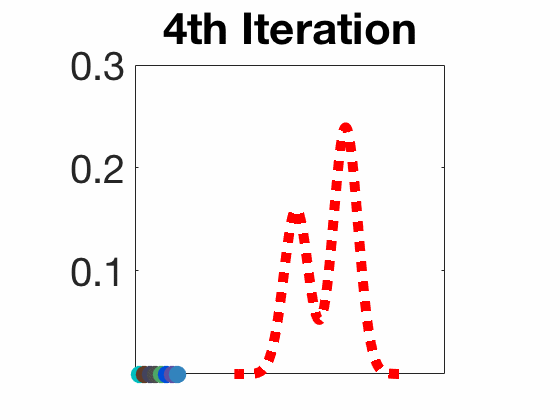

本文提出了一个算法，用于学习连续空间下基于能量的策略：SQL，不是数据库的SQL，而是soft Q-Learning。该算法应用了最大熵理论，并且使用能量模型（EBM，Energy-Based Model）作为决策模型。

推荐阅读该论文：

- 公式复杂，但详尽吃透可以学习到SVGD、EBM等概念与算法
- 文章充实，可以继续阅读后续算法SAC
- 拓展在强化学习与熵进行结合方面的知识

<!--more-->

# 简介

论文地址：[https://arxiv.org/abs/1702.08165](https://arxiv.org/abs/1702.08165)

源代码：[https://github.com/rail-berkeley/softlearning](https://github.com/rail-berkeley/softlearning)

该论文与2017年发于第34次ICML会议上，本文对v2版本进行分析。该论文作者为Tuomas Haarnoja，是伯克利大学BAIR实验室的博士生，SAC算法也是他的杰作。

传统的RL方法主要是用分布拟合单峰分布，即


也有许多算法想要根据Q函数的值拟合出多峰分布，即


本文中就是针对拟合多峰分布提出了算法SQL。

为什么要拟合多峰分布呢？当我们考虑最优控制和概率推理之间的联系时，随机策略才是最优解。

> As discussed in prior work, a stochastic policy emerges as the optimal answer when we consider the connection between optimal control and probabilistic inference.

随机策略有一些优点：

- 如果可以全面地学习给定任务中的目标策略，那么结果策略可以作为很好的初始化策略，微调后以学习更高级的策略
- 这种随机的探索机制，可以更好地寻求多峰任务中的最佳决策模型
- 更好的鲁棒性，环境有干扰或者噪音时，有多种完成目标的行动可以选择，可以从干扰中“脱身”

## 算法效果

> The applications of training such stochastic policies include improved exploration in the case of multimodal objectives and compositionality via pretraining general-purpose stochastic policies that can then be efficiently finetuned into task-specific behaviors. 

在多峰目标任务中训练随机策略可以提升探索，也可以预训练出通用目的的随机策略以微调后运用至指定任务中进行训练（迁移学习、元学习）。

# 文中精要

## 标准强化学习的最优策略

$$
\pi_{\mathrm{std}}^{*}=\arg \max _{\pi} \sum_{t} \mathbb{E}_{\left(\mathbf{s}_{t}, \mathbf{a}_{t}\right) \sim \rho_{\pi}}\left[r\left(\mathbf{s}_{t}, \mathbf{a}_{t}\right)\right] \tag{1}
$$

- `std`下标代表标准的意思：standard，星号$\ast$代表最优

- $\rho_{\pi}$代表策略$\pi\left(\mathbf{a}_{t} | \mathbf{s}_{t}\right)$下的迹分布，$\rho_{\pi}\left(\mathbf{s}_{t}, \mathbf{a}_{t}\right)$代表状态-行动对的边缘分布。

> We will also use $\rho_{\pi}\left(\mathbf{s}_{t}\right)$ and $\rho_{\pi}\left(\mathbf{s}_{t}, \mathbf{a}_{t}\right)$ to denote the state and state-action marginals of the trajectory distribution induced by a policy $\pi\left(\mathbf{a}_{t} | \mathbf{s}_{t}\right)$. 

## 最大熵强化学习的最优策略

最大熵强化学习在标准RL的目标函数上加入了一个关于状态下可选动作分布熵的项，这种目标希望智能体不仅能以获得最大奖励的方式完成目标，而且能够决策地尽可能随机。因为通过这种目标函数学到的策略**更具鲁棒性**，可以更好适用于环境的突然变化，或者从前没有遇到过得场景。
$$
\pi_{\mathrm{MaxEnt}}^{*}=\arg \max _{\pi} \sum_{t} \mathbb{E}_{\left(\mathbf{s}_{t}, \mathbf{a}_{t}\right) \sim \rho_{\pi}}\left[r\left(\mathbf{s}_{t}, \mathbf{a}_{t}\right)+\color{red}{\alpha \mathcal{H}\left(\pi\left(\cdot | \mathbf{s}_{t}\right)\right)}\right]
\tag{2}
$$

- `MaxEnt`下标代表最大熵的意思：Maximum entropy
- 式中的系数$\alpha$可以用来调节奖励项与熵值项的重要性比率。**一般将$\alpha$表示为奖励范围（reward scale）的倒数，但在实际中通常将其作为超参数手动调节。**SAC算法中有介绍在训练过程中自动调节该系数的方法。
- 本文中的SQL算法也是为了优化该目标函数

## 最大熵目标的优点

- 在多峰（即一个状态下有多个最优动作选择）问题中提升探索能力
- 可以用于迁移学习，因为其“预训练”模型更好地适应之后的任务

## soft 值函数

文中，***定义***了最大熵RL下的Q函数与V函数，注意，是定义，不是推导出来的。

soft Q函数定义如下：
$$
{Q_{\text { soft }}^{*}\left(\mathbf{s}_{t}, \mathbf{a}_{t}\right)=r_{t}+}  {\mathbb{E}_{\left(\mathbf{s}_{t+1}, \ldots\right) \sim \rho_{\pi}}\left[\sum_{l=1}^{\infty} \gamma^{l}\left(r_{t+l}+\alpha \mathcal{H}\left(\pi_{\text { MaxEnt }}^{*}\left(\cdot | \mathbf{s}_{t+l}\right)\right)\right)\right]}
\tag{3}
$$
soft V函数定义如下：
$$
V_{\mathrm{soft}}^{*}\left(\mathbf{s}_{t}\right)=\alpha \log \int_{\mathcal{A}} \exp \left(\frac{1}{\alpha} Q_{\mathrm{soft}}^{*}\left(\mathbf{s}_{t}, \mathbf{a}^{\prime}\right)\right) d \mathbf{a}^{\prime}
\tag{4}
$$
乍一看这个值函数$V_{\mathrm{soft}}^{*}\left(\mathbf{s}_{t}\right)$的形式定义的很奇怪，的确很奇怪，严格来说，它的真实意义并不是为了构造状态值函数，而是构造一个配分函数使得后面推导最优策略时可以化简过程。当然，算法中也不需要用它的值去衡量状态的价值，只是作为计算的中间过程。

作者说，值函数满足soft 贝尔曼方程，即
$$
Q_{\mathrm{soft}}^{*}\left(\mathbf{s}_{t}, \mathbf{a}_{t}\right)=r_{t}+\gamma \mathbb{E}_{\mathbf{s}_{t+1} \sim p_{\mathbf{s}}}\left[V_{\mathrm{soft}}^{*}\left(\mathbf{s}_{t+1}\right)\right]
\tag{5}
$$

## 能量模型与策略

文中提出能量模型（Energy-Based Models）的初衷是之前很多人在研究中使用了多项式分布（discrete multinomial distributions）、高斯分布（Gaussian distributions）来表示策略，这样的分布通常用来表示动作价值分布是单峰（unimodal）的情况，而且最终收敛结果往往是接近确定性（near-deterministic）的。即使拓展出多峰的形式，也各自有或多或少的不足。基于此，作者想使用更广泛、通用的分布用来表示复杂、多峰的动作选择。

所以，作者选择使用基于能量的通用策略：
$$
\pi\left(\mathbf{a}_{t} | \mathbf{s}_{t}\right) \propto \exp \left(-\mathcal{E}\left(\mathbf{s}_{t}, \mathbf{a}_{t}\right)\right)
\tag{6}
$$

- $\mathcal{E}$是字母E的花体形式，代表能量函数，其可以被深度神经网络表示，如果使用通用值函数近似来表示能量函数，那么可以表示任意策略$\pi\left(\boldsymbol{a}_{t} | \mathbf{s}_{t}\right)$

- > where $\mathcal{E}$ is an energy function that could be represented, for example, by a deep neural network. If we use a universal function approximator for $\mathcal{E}$, we can represent any distribution $\pi\left(\boldsymbol{a}_{t} | \mathbf{s}_{t}\right)$. 

- 文中将该能量函数设置为
  $$
  \mathcal{E}\left(\mathbf{s}_{t}, \mathbf{a}_{t}\right)=-\frac{1}{\alpha} Q_{\operatorname{soft}}\left(\mathbf{s}_{t}, \mathbf{a}_{t}\right)
  \tag{7}
  $$
  其实也很容易就能理解，将负号抵消掉之后，Q值大的动作能量高嘛，指数分布又能更好的放大较大的值，使Q值大的动作更为突出，这样完全可以作为选择动作的策略

但是有一个问题是，不能使能量无限大呀，假如超过了计算能力那就不好了，当然这种情况几乎不会发生。于是，可以将能量给归一化，即
$$
\begin{aligned} 
\pi_{\text { MaxEnt }}^{*}\left(a_{t} | s_{t}\right) 
&=\frac{\exp \left(\frac{1}{\alpha} Q_{\text { soft }}^{*}\left(s_{t}, a_{t}\right)\right)}{\int_{\mathcal{A}} \exp \left(\frac{1}{\alpha} Q_{\text { soft }}^{*}\left(s_{t}, a_{t}\right)\right) \mathrm{d} a^{\prime}} \\ 
&=\frac{\exp \left(\frac{1}{\alpha} Q_{\text { soft }}^{*}\left(s_{t}, a_{t}\right)\right)}{\exp \left(\frac{1}{\alpha} V_{\text { soft }}^{*}\left(s_{t}\right)\right)} \\
&=\frac{\exp \left(\frac{1}{\alpha} Q_{\text { soft }}^{*}\left(s_{t}, a_{t}\right)\right)}{\color{blue}{\exp \log} \exp \left(\frac{1}{\alpha} V_{\text { soft }}^{*}\left(s_{t}\right)\right)} \\
&=\color{red}{\exp \left(\frac{1}{\alpha}\left(Q_{\text { soft }}^{*}\left(s_{t}, a_{t}\right)-V_{\text { soft }}^{*}\left(s_{t}\right)\right)\right)}
\end{aligned}
\tag{8}
$$

<p align="center" style="color:blue" ><a href="https://bluefisher.github.io/2018/11/13/Reinforcement-Learning-with-Deep-Energy-Based-Policies/">BlueFisher's Blog</a></p>
论文中只给出了红色字体的部分，其实这才是作者想要表达的意思，文中就是基于此定义了状态值函数$V_{\mathrm{soft}}^{*}\left(\mathbf{s}_{t}\right)$的形式。

在这个公式中就可以看出，策略是对动作值函数Q进行了一个softmax操作，这也是文中soft的含义。

## 使用SQL优化目标函数

像使用Q-Learning对网格世界问题进行优化求解一样，我们也可以使用迭代的方式进行优化，交互计算两个值函数，使其各自收敛，就可以导出最优策略。

于是，作者定义了soft Q-Iteration。

### Soft Q-Iteration

先要假设值函数$Q_{\mathrm{soft}}(\cdot, \cdot)$、$V_{\text { soft }}(\cdot)$有界，
$$
\int_{\mathcal{A}} \exp \left(\frac{1}{\alpha} Q_{\mathrm{soft}}\left(\cdot, \mathbf{a}^{\prime}\right)\right) d \mathbf{a}^{\prime}<\infty \ ，\ Q_{\mathrm{soft}}^{*}<\infty
\tag{9}
$$
文中定义的交互迭代至收敛的方式其实跟SARSA算法比较像：
$$
\begin{array}{c}
{Q_{\text { soft }}\left(\mathbf{s}_{t}, \mathbf{a}_{t}\right) \leftarrow r_{t}+\gamma \mathbb{E}_{\mathbf{s}_{t+1} \sim p_{\mathbf{s}}}\left[V_{\text { soft }}\left(\mathbf{s}_{t+1}\right)\right], \forall \mathbf{s}_{t}, \mathbf{a}_{t}} \\ 
{V_{\text { soft }}\left(\mathbf{s}_{t}\right) \leftarrow \alpha \log \int_{\mathcal{A}} \exp \left(\frac{1}{\alpha} Q_{\text { soft }}\left(\mathbf{s}_{t}, \mathbf{a}^{\prime}\right)\right) d \mathbf{a}^{\prime}, \forall \mathbf{s}_{t}}
\end{array}
\tag{10}
$$
这种优化方式在理论上是可行的，但是在实际应用中存在两个问题：

1. 连续空间无法求期望，或者计算不准确。**解决方案是重要性采样，使用采样多次后计算来代替积分，在初期进行随机均匀采样，后期根据policy来采样。**
2. 迭代过程需要不断选择动作，问题是式（8）的分布形式无法进行采样。**解决方案是使用SVGD算法拟合后验分布，并输出采样的动作。**

### Soft Q-Learning

文中在这一部分引用了重要性采样，解决了上面提到的第一个问题，即，使用分布$q_{\mathrm{a}^{\prime}}$来代替真实策略分布
$$
\exp \left(\frac{1}{\alpha}\left(Q_{\text { soft }}^{*}\left(s_{t}, a_{t}\right)-V_{\text { soft }}^{*}\left(s_{t}\right)\right)\right
)
$$
进行采样。
$$
V_{\mathrm{soft}}^{\theta}\left(\mathbf{s}_{t}\right)=\alpha \log \mathbb{E}_{\color{red}{q_{\mathrm{a}^{\prime}}}}\left[\frac{\exp \left(\frac{1}{\alpha} Q_{\mathrm{soft}}^{\theta}\left(\mathbf{s}_{t}, \mathbf{a}^{\prime}\right)\right)}{q_{\mathrm{a}^{\prime}}\left(\mathbf{a}^{\prime}\right)}\right]
\tag{11}
$$
采样分布$q_{\mathrm{a}^{\prime}}$可以使用任意的分布，但是由于重要性采样的性质，采样分布与原分布越接近，效果越好。式子中的$\theta$为Q神经网络的参数。

因为在训练初期，我们估计的真实分布是偏差很大的，几乎可以说是错误的，因此在训练初期将采样分布设置为均匀分布比较合理，在训练一段时间之后，可以将采样分布设置为接近原分布，甚至是原分布（如果原分布可以采样，如，使用神经网络等“黑匣子”进行表示）

由此，可以定义Q神经网络的损失函数为：
$$
J_{Q}(\theta)=\mathbb{E}_{\mathbf{s}_{t} \sim q_{\mathbf{s}_{t}}, \mathbf{a}_{t} \sim q_{\mathbf{a}_{t}}}\left[\frac{1}{2}\left(\hat{Q}_{\mathrm{soft}}^{\overline{\theta}}\left(\mathbf{s}_{t}, \mathbf{a}_{t}\right)-Q_{\mathrm{soft}}^{\theta}\left(\mathbf{s}_{t}, \mathbf{a}_{t}\right)\right)^{2}\right]
\tag{12}
$$
上式中期望的下标为环境和真实策略分布，$\overline{\theta}$代表target网络的参数，目标是最小化这个损失函数，其中，
$$
\hat{Q}_{\mathrm{soft}}^{\overline{\theta}}\left(\mathbf{s}_{t}, \mathbf{a}_{t}\right)=r_{t}+\gamma \mathbb{E}_{\mathbf{s}_{t+1} \sim p_{\mathbf{s}}}\left[V_{\mathrm{soft}}^{\overline{\theta}}\left(\mathbf{s}_{t+1}\right)\right]
\tag{13}
$$
### 近似采样与SVGD

SVGD：Stein Vairational Gradient Descent，SVGD是一种确定性的、基于梯度的近似推理采样算法。

文中在这一部分引用了SVGD的优化算法，并且使用SVGD近似策略的后验分布以进行采样，解决了上文提到的第二个问题。在百度上完全搜不到关于SVGD算法的信息，但是了解了这个算法之后，感觉它的能力还是很强的，最终，搜集了Google、Bing的检索结果，发现了原作者在SVGD方法上的一些资源分享，[Stein’s Method for Practical Machine Learning](https://www.cs.utexas.edu/~lqiang/stein.html)

对于基于能量的模型、分布，有两类采样方式：

1. MCMC采样，即马尔科夫链蒙特卡洛采样
2. 学习一个采样网络去近似采样出符合目标分布的样本

在需要不断更新策略的在线学习任务中，使用MCMC采样是不可行的，于是作者使用了基于SVGD和Amortized SVGD的采样网络。

SVGD论文：[https://arxiv.org/abs/1608.04471](https://arxiv.org/abs/1608.04471)

Amortized SVGD论文：[https://arxiv.org/abs/1707.06626](https://arxiv.org/abs/1707.06626)




Amortized SVGD有一些有趣的性质：

- 可以训练随机采样网络非常快地采样
- 可以准确收敛至EBM能量模型的后验估计分布
- 文中结合了Amortized SVGD后，算法形式很像A-C模式

SVGD算法的更新形式是这样的，
$$
x_{i} \leftarrow x_{i}+\frac{\epsilon}{n} \sum_{j=1}^{n}\left[k\left(x_{j}, x_{i}\right) \nabla_{x_{j}} \log p\left(x_{j}\right)+\nabla_{x_{j}} k\left(x_{j}, x_{i}\right)\right], \qquad \forall i=1, \ldots, n
\tag{14}
$$
- $\epsilon$代表学习率
- $k\left(x_{j}, x_{i}\right)$代表正定核，如径向基（RBF，Radial Basis Function）函数$k\left(x, x^{\prime}\right)=\exp \left(-\frac{1}{h}\left\|x-x^{\prime}\right\|_{2}^{2}\right)$，它可以被认为是变量之间的相似性度量
- 包含对数项$\log p\left(x_{j}\right)$的梯度驱使采样器朝着$p(x)$分布中高概率区域进行采样
- 第二项核函数梯度驱使样本点之间产生间隙，相当于用一个排斥力使样本点尽可能分散开
- 对数项梯度不依赖分布$p(x)$的归一化常数，使SVGD易于应用于图模型、贝叶斯推理和深层生成模型中出现的难以处理的分布。

先定义我们采样网络（其实就是Actor）的目标函数：
$$
J_{\pi}\left(\phi ; \mathbf{s}_{t}\right)=D_{\mathrm{KL}}\left(\pi^{\phi}\left(\cdot | \mathbf{s}_{t}\right) \| \exp \left(\frac{1}{\alpha}\left(Q_{\mathrm{soft}}^{\theta}\left(\mathbf{s}_{t}, \cdot\right)-V_{\mathrm{soft}}^{\theta}\right)\right)\right)
\tag{15}
$$
- $\phi$表示采样网络中的参数
- 将产生动作的函数简写成$\mathbf{a}_{t}^{(i)}=f^{\phi}\left(\xi^{(i)} ; \mathbf{s}_{t}\right)$，也就是说神经网络的输入分为两部分，一部分是状态$s$，一部分是噪声扰乱“perturb”$\xi$，一般从标准正态分布中采样，而且最好使噪声的维度与动作的维度一致

计算梯度方向：
$$
\begin{aligned}
\Delta f^{\phi}\left(\cdot ; \mathbf{s}_{t}\right)=& \mathbb{E}_{\mathbf{a}_{t} \sim \pi^{\phi}}\left[\kappa\left(\mathbf{a}_{t}, f^{\phi}\left(\cdot ; \mathbf{s}_{t}\right)\right) \nabla_{\mathbf{a}^{\prime}} Q_{\mathrm{soft}}^{\theta}\left.\left(\mathbf{s}_{t}, \mathbf{a}^{\prime}\right)\right|_{\mathbf{a}^{\prime}=\mathbf{a}_{t}}\right.\\ &+\alpha \nabla_{\mathbf{a}^{\prime}} \kappa\left.\left(\mathbf{a}^{\prime}, f^{\phi}\left(\cdot ; \mathbf{s}_{t}\right)\right)\right|_{\mathbf{a}^{\prime}=\mathbf{a}_{t}} ] \end{aligned}
\tag{16}
$$
- 严格来说，$\Delta f^{\phi}$是希尔伯特空间的最优梯度方向，并不是Actor目标函数$J_{\pi}$的梯度

- > To be precise, $\Delta f^{\phi}$ is the optimal direction in the reproducing kernel Hilbert space of $\kappa$, and is thus not strictly speaking the gradient of $J_{\pi}\left(\phi ; \mathbf{s}_{t}\right)$ 

根据链式法则，Stein变分梯度SVG为
$$
\frac{\partial J_{\pi}\left(\phi ; \mathbf{s}_{t}\right)}{\partial \phi} \propto \mathbb{E}_{\xi}\left[\Delta f^{\phi}\left(\xi ; \mathbf{s}_{t}\right) \frac{\partial f^{\phi}\left(\xi ; \mathbf{s}_{t}\right)}{\partial \phi}\right]
\tag{17}
$$
## 伪代码


解析：

算法中更新Actor网络时，其实是使用了如下梯度公式：
$$
\hat{\nabla}_{\phi} J_{\pi}\left(\phi ; \mathbf{s}_{t}\right)=\frac{1}{K M} \sum_{j=1}^{K} \sum_{i=1}^{M}\left(\kappa\left(\mathbf{a}_{t}^{(i)}, \tilde{\mathbf{a}}_{t}^{(j)}\right) \nabla_{\mathbf{a}^{\prime}} Q_{\mathrm{soft}}\left.\left(\mathbf{s}_{t}, \mathbf{a}^{\prime}\right)\right|_{\mathbf{a}^{\prime}=\mathbf{a}_{i}^{(i)}}+\nabla_{\mathbf{a}^{\prime}} \kappa\left.\left(\mathbf{a}^{\prime}, \tilde{\mathbf{a}}_{t}^{(j)}\right)\right|_{\mathbf{a}^{\prime}=\mathbf{a}_{i}^{(i)}}\right) \nabla_{\phi} f^{\phi}\left(\tilde{\xi}^{(j)} ; \mathbf{s}_{t}\right)
\tag{18}
$$
更新方向为mini-batch经验的梯度平均值，而不是累加和

- 伪代码中定义了Actor的target网络，参数为$\overline{\theta}$。但是伪代码中并没有显示出其在何处使用，我**猜测**该网络代表采样分布$q_{\mathbf{a}^{\prime}}$
  - $q_{\mathbf{a}^{\prime}}$在训练初期使用均匀分布
  - $q_{\mathbf{a}^{\prime}}$在一段时间之后使用Actor真实分布，我猜测这里使用的就是Actor目标网络
- 噪音$\xi$从多维标准正态分布中采样，维度最好与动作空间维度一致
- $\left\{\mathbf{a}^{(i, j)}\right\}_{j=0}^{M} \sim q_{\mathbf{a}^{\prime}}$其中的M用于设置采样多少个样本，以使用公式（11）计算V值，使用的网络为Q目标网络
- 在更新Q网络时，使用了从经验池采样到的真实执行过的动作
- $\left\{\xi^{(i, j)}\right\}_{j=0}^{M} \sim \mathcal{N}(\mathbf{0}, \boldsymbol{I})$中其实少写了一个参数$K$，但实际上$K=M$，在这一步中需要采样两组噪音，当然也可以采样一组，使用两次。
- 在更新Actor网络时，没有使用经验池中采样到的动作，而模拟采样了两组动作，即根据两组噪音生成的动作，用它们来计算梯度并更新。
- Q网络的输入为状态与动作的连接，$(s||a)$，输出为Q值
- Actor网络的输入为状态与噪音的连接，$(s||\xi)$，输出为动作$a$
- 伪代码中的式(10)、(11)、(13)、(14)分别代表本文中的式(11)、(12)、(16)、(17)

# 实验

## 实验设置

- 比较算法：DDPG vs SQL
- Actor和Q网络使用Adam优化器
- Actor学习率为0.0001，Q网络学习率为0.001
- 经验池大小为100W
- 经验池填充1W条经验后开始训练
- batch_size=64
- Actor和Q网络都是2层隐藏层，每层200个隐藏节点，激活函数为ReLU
- DDPG和SQL都使用了Ornstein-Uhlenbeck随机过程产生噪音来增加探索，它是一种序贯相关的随机过程，$\theta=0.15 \ , \ \sigma=0.3$
  - OU随机过程可以在序贯模型中添加与时间相关的随机噪音，而且噪音也满足强马尔可夫性
  
  - 形式为$d x_{t}=\theta\left(\mu-x_{t}\right) d t+\sigma d W_{t}$，是一个具有均值恢复属性的随机过程
  
  - $\theta$表示变量$x$以多大幅度、多块恢复到平均值，$\mu$代表平均值，$\sigma$代表波动程度，$d W_{t}$代表维纳过程，一般通过高斯分布实现
  
  - OU随机过程产生的噪音只与上一次产生的噪音相关，它可以用于增加探索，也能够柔顺控制。比如在相邻的两个决策动作，一个为10，一个为-10，反复如此，智能体会产生震荡。在此使用OU过程可以使智能体在一个方向保持一定时间，不会瞬间过大地改变智能体的状态，相当于增加了时滞性。
  
  - 代码
  
    ```
    x = 10
    dx = theta * (mu - x) + sigma * numpy.random.randn(len(x))
    x = x + dx
    ```
  
  - 参考：
  
    - [https://www.quora.com/Why-do-we-use-the-Ornstein-Uhlenbeck-Process-in-the-exploration-of-DDPG](https://www.quora.com/Why-do-we-use-the-Ornstein-Uhlenbeck-Process-in-the-exploration-of-DDPG)
    - [https://github.com/floodsung/DDPG-tensorflow/blob/master/ou_noise.py](https://github.com/floodsung/DDPG-tensorflow/blob/master/ou_noise.py)
    - [https://zhuanlan.zhihu.com/p/51333694](https://zhuanlan.zhihu.com/p/51333694)
- 核函数使用了径向基函数RBF，$\kappa\left(\mathbf{a}, \mathbf{a}^{\prime}\right)=\exp \left(-\frac{1}{h}\left\|\mathbf{a}-\mathbf{a}^{\prime}\right\|_{2}^{2}\right)$，其中，$h=\frac{d}{2 \log (M+1)}$，$d$为各变量对之间距离的中位数
- 目标网络的更新采样硬覆盖的模式
- 超参数$\alpha$根据任务设置为10，0.1等等
- 训练的epoch、步长、系数$\alpha$，采样动作的数量$K 和 M$根据任务（多目标，单目标，微调）的不同而不同，具体请看原论文附录D部分

## 实验结果

未完待续

# 个人感想

虽然文中用大量公式、篇幅结合最大熵进行介绍、推理，但是在伪代码以及目标函数中似乎并没有看到关于熵的影子，包含熵项的Q值也是通过Q网络的输出将熵的值包含在内，并没有显式地计算它。

虽然算法的名字为soft Q-Learning，但其实它跟传统的Q-Learning算法思想并不相同，如果说有一点相同，那也是都是想使Q值收敛以推导出最优策略，但是这个优化过程也跟SARSA算法比较像，并没有使用传统Q-Learning中贪婪的选择最有价值下一个动作以自举的方法。