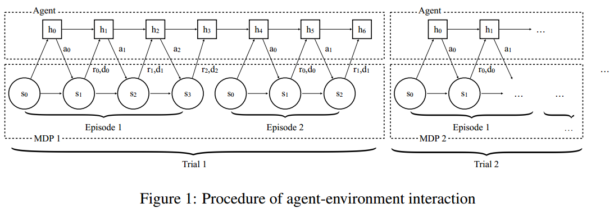

本文引用了元学习在深度学习领域的思想，在多任务中训练一个通用模型——slow，用这个通用模型拓展到其他任务进行训练就会快很多，得到新模型——fast。本文中的模型使用RNN作为训练模型。

推荐程度：中等偏下

- 可以拓宽知识面，了解众家思想
- 我个人认为，这样的元学习并没有达到让机器”学会如何学习的学习方法“的目的，即“learning to learn”

<!--more-->

# 简介

论文地址：[https://arxiv.org/pdf/1611.02779.pdf](https://arxiv.org/pdf/1611.02779.pdf)

深度强化学习被成功运用在许多复杂行为学习当中，但是需要很多很多很多试错才能得出一个较好的模型，但是动物学习知识只需要一小会儿，就像骑自行车和骑电瓶车，人可能学会骑自行车后5分钟就可以学会骑电瓶车，但是机器却要重头学起，1小时也未必学得会、学得好，这就是因为动物具有先验知识指导，而且可以利用先验知识，机器却不可以。

把先验知识融入到强化学习算法中过去已经被探索了很多次，而且也有几种不同的形式：

- 自动调超参数，学习率等
- 使用分层贝叶斯方法在动力学模型上保持后验，并根据后验应用Thompson采样
- 许多分层强化学习的工作都提出从以前的任务中提取可重用的技能，以加快对新任务的探索

本文中的RNN即充当智能体的元学习者，也充当决策者，即生成策略

以往强化学习算法把学习一个策略当成要解决的问题，本文却把学习强化学习算法当成要解决的问题。很绕对吧，其实本质上就是使用RNN表示策略，加了点深度学习中元学习的思想。

本文提出的方法是：

>we view the learning process of the agent itself as an objective, which can be optimized using standard reinforcement learning algorithms. The objective is averaged across all possible MDPs according to a specific distribution, which reflects the prior that we would like to distill into the agent.  

即，智能体的学习过程看做目标，用标准强化学习算法进行优化。然后使用RNN处理多个MDP问题，提取先验知识到智能体。

*注：我个人觉得这根本不能算是真正意义上的元学习，机器还是个傻子。*

# 正文

训练的流程图如下：

解析：

- 在这种训练方式下，需要来回切换任务，即切换MDP过程
- 每个trail代表一个MDP过程
- MDP需要从MDPs分布$\rho_{\mathcal{M}} : \mathcal{M} \rightarrow \mathbb{R}_{+}$中采样，至于$\mathbb{R}_{+}$是什么，我不知道
- 在每个trial中训练多个episode，个数用$n$表示，图示表示$n=2$
- $h$代表RNN网络中的知识参数
- 同一个trial中$h$可以传承，**但是**，当切换MDP问题，即进行下一个trail时，参数$h$需要重新初始化
- 输入不是单纯的状态$s$，而是$\left ( s_{t+1},a_{t},r_{t},d_{t} \right )$，其中，$d_{t}$代表episode结束的标志，输出为动作$a_{t+1}$。（输入往往需要embed为$\phi(s, a, r, d)$）
- 训练过程的目标**不是最大化一个episode的累计奖励，而是最大化一个trial的累计奖励**

深度学习中元学习有K-shot N-class问题，即N个类，每类K个样本，（本文）强化学习中元学习可以表示为N-episode M-MDPs问题，即共有M个trial，每个trial训练N个episode

---

策略表示：

- RNN使用GRUs（Gated Recurrent Units）
- 输入为$\phi(s, a, r, d)$

策略优化：

- TRPO，原因：性能出色，不需要大量调参
- 使用baseline减小方差
- 考虑使用了GAE

测试结果：

- MDP问题：在多臂老虎机和网格MDPs任务中，与理论上合理的算法（没有指出是哪些算法）性能相当
- POMDP问题：图像输入的导航任务中，实验表明，智能体能够有效地利用学习到的视觉信息和以往情景中获得的短期信息。实验结果视频：[https://goo.gl/rDDBpb](https://goo.gl/rDDBpb)

# 个人见解

我认为这样的元强化学习根本不能达到提出元学习的初衷。说到底，这种方式只是让一个一面白纸的模型可以学习成多种任务的通用基础模型（slow），然后在使用这个基础模型对其他任务进行训练时可以快速训练出结果（fast）。这种方式可以加速学习，但是却并不能使机器学会去学习，学会如何进行学习的方法，虽然意义上说让智能体学到了强化学习算法的过程，其实本质上是使智能体学到了多种MDP任务中的经验，并把它转换为“记忆
，而没有教会机器”记忆“这个过程。

（WTF？RNN训练智能体+多任务切换+更改网络输入+任务级目标函数 这就是元强化学习啦？？？）

