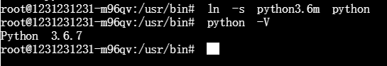

本文记录了一些在Docker中比较难以安装、频繁报错的库，如cuda、cudnn。

<!--more-->

# 前言
在配置镜像时, **强烈建议将源更改为国内镜像站**, 因为国外有些镜像站链接速度很慢, 更新也很慢, 很多库无法正确安装

我所使用的镜像站为`sources.list`:

```
deb-src http://archive.ubuntu.com/ubuntu xenial main restricted #Added by software-properties
deb http://mirrors.aliyun.com/ubuntu/ xenial main restricted
deb-src http://mirrors.aliyun.com/ubuntu/ xenial main restricted multiverse universe #Added by software-properties
deb http://mirrors.aliyun.com/ubuntu/ xenial-updates main restricted
deb-src http://mirrors.aliyun.com/ubuntu/ xenial-updates main restricted multiverse universe #Added by software-properties
deb http://mirrors.aliyun.com/ubuntu/ xenial universe
deb http://mirrors.aliyun.com/ubuntu/ xenial-updates universe
deb http://mirrors.aliyun.com/ubuntu/ xenial multiverse
deb http://mirrors.aliyun.com/ubuntu/ xenial-updates multiverse
deb http://mirrors.aliyun.com/ubuntu/ xenial-backports main restricted universe multiverse
deb-src http://mirrors.aliyun.com/ubuntu/ xenial-backports main restricted universe multiverse #Added by software-properties
deb http://archive.canonical.com/ubuntu xenial partner
deb-src http://archive.canonical.com/ubuntu xenial partner
deb http://mirrors.aliyun.com/ubuntu/ xenial-security main restricted
deb-src http://mirrors.aliyun.com/ubuntu/ xenial-security main restricted multiverse universe #Added by software-properties
deb http://mirrors.aliyun.com/ubuntu/ xenial-security universe
deb http://mirrors.aliyun.com/ubuntu/ xenial-security multiverse
```
在`Dockerfile`或者在容器内使用命令
```
RUN cp /etc/apt/sources.list /etc/apt/sources.list.bak
COPY sources.list /etc/apt/sources.list
```
将源替换.

# CUDA 9.0 开发者版
`dockerfile`如下:
```
FROM nvidia/cuda:9.0-runtime-ubuntu16.04
LABEL maintainer "Keavnn <https://stepneverstop.github.io>"

RUN apt-get update && apt-get install -y --allow-unauthenticated --no-install-recommends \
        cuda-libraries-dev-$CUDA_PKG_VERSION \
        cuda-nvml-dev-$CUDA_PKG_VERSION \
        cuda-minimal-build-$CUDA_PKG_VERSION \
        cuda-command-line-tools-$CUDA_PKG_VERSION \
        cuda-core-9-0=9.0.176.3-1 \
        cuda-cublas-dev-9-0=9.0.176.4-1 \
        libnccl-dev=$NCCL_VERSION-1+cuda9.0 && \
    rm -rf /var/lib/apt/lists/*

ENV LIBRARY_PATH /usr/local/cuda/lib64/stubs
```
**--allow-unauthenticated** 这句命令很重要, 不使用的话很有可能安装失败

# cudnn 7.0.5
- [https://developer.nvidia.com/rdp/cudnn-archive](https://developer.nvidia.com/rdp/cudnn-archive) 下载cuDNN Libraries for Linux,不要下载 Power 8
- 把下载好的包上传到FTP服务器, 或者传输到容器内, 或者直接在容器中下载好
- `cd`到包位置
- `cp cudnn-9.0-linux-x64-v7.solitairetheme8 cudnn-9.0-linux-x64-v7.tgz`
- `tar -xvf cudnn-9.0-linux-x64-v7.tgz`
- `cp include/* /usr/local/cuda-9.0/include`
- `cp lib64/* /usr/local/cuda-9.0/lib64`
- `chmod a+r /usr/local/cuda-9.0/include/cudnn.h /usr/local/cuda-9.0/lib64/libcudnn*` **这一步如果cuda是base版本,则没有include文件夹,需要手动创建后再执行**
- `export PATH=/usr/local/cuda-9.0/bin:$PATH`
- `cd`到`/usr/local/cuda-9.0/lib64`
- `nano ~/.bashrc`,关联环境变量
- 在最后一行加入`export LD_LIBRARY_PATH=/home/cuda/lib64:$LD_LIBRARY_PATH`
- `source ~/.bashrc`
- `ldconfig -v`
- 使用`cat /usr/local/cuda-9.0/include/cudnn.h | grep CUDNN_MAJOR -A 2` 查看cudnn版本


# jemalloc
选择安装`jemalloc`,这个工具可以加速编译,碎片整理,具体请自行谷歌
- `apt-get install autoconf`
- `apt-get install automake`
- `apt-get install libtool`
- `git clone https://github.com/jemalloc/jemalloc.git`
- `cd jemalloc`
- `git checkout 4.5.0`安装4.5.0版本的jemalloc,5.x版本的有坑,深坑
- `./autogen.sh`
- `make`
- `make install_bin install_include install_lib`,之所以不使用`make install`是因为会报错,如下: 

# Python3.6
记得`sudo`
- `apt-get install software-properties-common`
- `add-apt-repository ppa:jonathonf/python-3.6`, 按`ENTER`
- `apt-get update && apt-get install python3.6 -y`
- 修改系统默认的`python`版本为3.6
- `cd /usr/bin`, 保险起见,建议分两步
- `rm python`
- `ln -s python3.6m python`
- 如需更新,`pip3 install --upgrade pip`, 8.1.1->19.0.3
- `python -V`


