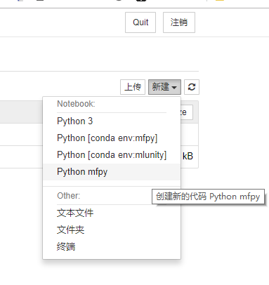
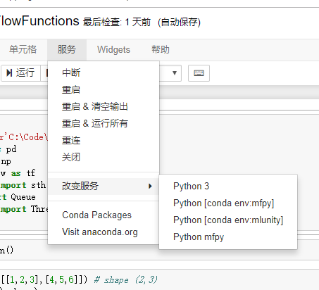

本文介绍了如何在Jupyter Notebook中使用本机的conda环境进行开发

<!--more-->

# Jupyter下conda多环境管理

## 1. 手撸命令

1. 在`base`环境下安装内核管理工具
`pip install ipykernel`
2. 将环境内核添加到`jupyter kernel`中
`python -m ipykernel install --user --name [env_name] --display-name "[show name in jupyter]"`
3. 查看已在`jupyter`中创建的虚拟环境内核
`jupyter kernelspec list`
4. 删除内核
`jupyter kernelspec uninstall [env_name]`

## 2. 使用插件

简单粗暴, 在`base`环境下使用命令
`conda install nb_conda`

接下来, 看看jupyter中能不能显示`conda`环境
`jupyter notebook`

在文件内部也可以很方便的切换环境

