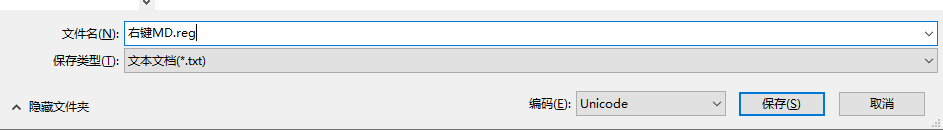

原本创建.md文件需要首先打开markdown文本编辑器，如Typora，或者新建.txt文件然后修改后缀名，本文介绍了如何在Windows操作系统中添加右键创建.md文件的方法。

<!--more-->

# 环境

windows10操作系统
Typora编辑器

# 效果图


# 步骤

## 1. 打开注册表
1. `CMD+R`，打开运行对话框
2. 输入`regedit`，打开注册表编辑器

## 2. 修改注册表
1. 在`计算机>HKEY_CLASSES_ROOT`右键查找，输入`Typora`，勾选项，取消勾选值和数据


2. 确认运行的程序名字，我的电脑如图所示，运行文件是`Typora.exe`


如果使用的是markdownpad或者其他编辑器，同理

3. 在磁盘任意位置新建一个文件，后缀为`.reg`
4. 打开编辑刚刚创建好的注册表文件，写入以下内容：
```
Windows Registry Editor Version 5.00
[HKEY_CLASSES_ROOT\.md]
@="Typora.exe"
[HKEY_CLASSES_ROOT\.md\ShellNew]
"NullFile"=""
[HKEY_CLASSES_ROOT\Typora.exe]
@="Markdown"
```

`@="Typora.exe"` 代表的是指定.md文件的运行程序
`@="Markdown"` 代表的是右键时默认的文件名字，这样写新建为`新建Markdown.md`文件，而且右键菜单中显示`MarkDown`
5. 编辑好之后,另存为,设置如图所示:



文件名可以随便设置，但是后缀必须是`.reg`文件,保存类型一定要是`文本文档(*.txt)`,编码选择`Unicode`,非常重要!!!!!
6. 保存文件后,双击运行,修改注册表即可,现在右键即可达到预期效果,如果不行,请重启一下.

## 3. 编辑新建图标(非必须)
1. 以`Typora`为例,在注册表`Typora.exe`下点击项`DefaultIcon`,右键修改
2. 将属性修改为想要设置的Markdown文件图标


文档有错或转载请联系邮箱`stepneverstop@qq.com`