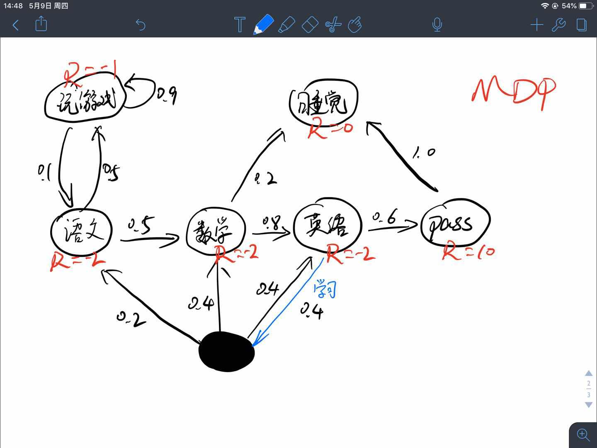
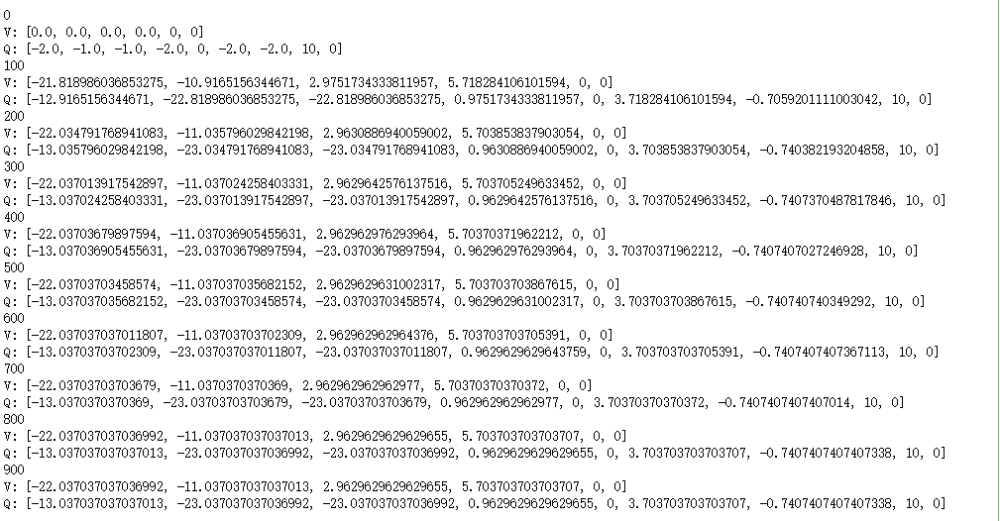
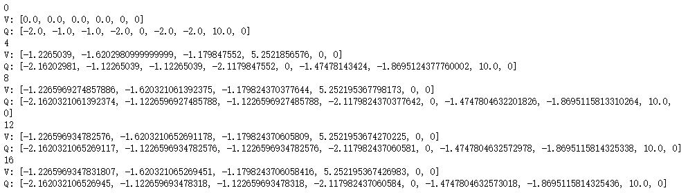
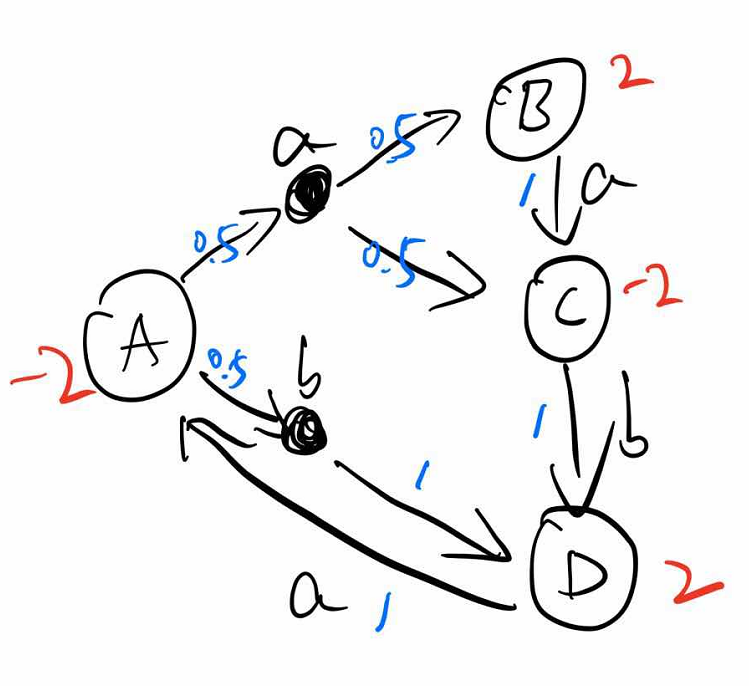
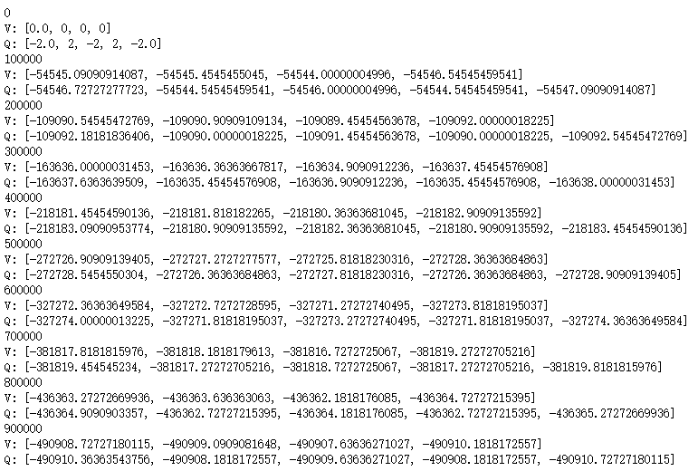

# 价值与贝尔曼方程

我们人在做决策的时候往往会判断做这件事的价值和后果，就像失恋了去喝不喝闷酒一样，不同的人有不同的选择，但是选择前肯定会判断这么做能给自己带来什么。

选择去喝酒的人觉得这可以缓解自己的痛苦，这就是判断喝酒这个动作的价值。因为身体原因不选择去喝酒的人觉得喝醉之后身体很不舒服，还会说胡话、闹事，这就是衡量后果、判断喝酒后状态的价值。

在乎过程的会根据动作的价值进行抉择，在乎结果的会根据状态的价值进行抉择。总之，衡量价值，毫无疑问是我们做决策的重要评判标准。

机器也一样，我们想教会机器学会自主决策，必然得让它们有一个价值导向，毕竟它可不会、也决不能像人一样"没有原因呀，就随便选择了一个而已"。

本文介绍了**绝大部分强化学习问题及算法**中值函数与贝尔曼方程的定义。因为有一些研究探索的，如好奇心、信息熵等方向的算法对值函数的定义有稍许不同。

<!--more-->

---

注：以下公式及推导过程可能与其他博客、论文、书本上有稍许不同，不过都是经过细细分析，一步步推导的，或许有些公式难以理解，但都是尽可能细化每一处细节。使读者可以更清楚地了解每一个值的来龙去脉。

---

## 值函数

值函数分为状态值函数与动作值函数，分别用来表示状态和状态下执行某动作的好坏程度、优劣程度。

回顾一下回报：
$$
\begin{align*}
G_{t} &\doteq R_{t+1}+\gamma R_{t+2}+\gamma^{2}R_{t+3}+\gamma^{3}R_{t+4}+...\\
&=R_{t+1}+\gamma (R_{t+2}+\gamma R_{t+3}+\gamma^{2}R_{t+4}+...)\\
&=R_{t+1}+\gamma (R_{t+2}+\gamma (R_{t+3}+\gamma R_{t+4}+...))\\
&=R_{t+1}+\gamma G_{t+1}
\end{align*}
$$

$$
G_{t}\doteq R_{t+1}+\gamma R_{t+2}+\gamma^{2}R_{t+3}+...=\begin{cases}
\sum_{k=0}^{\infty}\gamma^{k}R_{t+k+1}\\
\sum_{k=t+1}^{T}\gamma^{k-t-1}R_{k}
\end{cases}
$$

回顾一下之前的MDP例子：

将状态用符号表示为
$$
\begin{bmatrix}
玩游戏 & A\\ 
语文 & B\\ 
数学 & C\\ 
英语 & D\\ 
\mathcal{Pass} & E\\ 
睡觉 & F
\end{bmatrix}
$$
将转移概率矩阵$\mathcal{P}$写成如下形式

|        |  A   |  B   |  C   |  D   |  E   |  F   |
| :----: | :--: | :--: | :--: | :--: | :--: | :--: |
| Reward |  -1  |  -2  |  -2  |  -2  |  10  |  0   |
|   A    | 0.9  | 0.1  |      |      |      |      |
|   B    | 0.5  |      | 0.5  |      |      |      |
|   C    |      |      |      | 0.8  |      | 0.2  |
| D,0.4  |      | 0.2  | 0.4  | 0.4  |      |      |
| D,0.6  |      |      |      |      | 0.6  |      |
|   E    |      |      |      |      |      | 1.0  |

其中，D状态有两个动作，但是其0.4概率选到的动作并不一定确定地转移到另一个状态，所以将两个动作分开写，其实除了Reward的每一行都是一个$(s,a)$的状态-动作对，但是除了D状态有特殊外，其他状态的转移都是确定的，于是省略了动作。后续将会看到如果根据$(D,0.4)$这个状态-动作对去进行相应的计算。

### 状态值函数$V(s)$

$\pi$策略下$s$状态的价值函数可以表示为$v_{\pi}(s)$，由**期望回报**表示

$$
v_{\pi}(s) \doteq \mathbb{E}_{\pi}[G_{t}|S_{t}=s] = \mathbb{E}_{\pi}\left [ \sum_{k=0}^{\infty}\gamma^{k}R_{t+k+1}\mid S_{t}=s \right ], \ for \ all \ s\in S
$$

有了这个公式，我们能根据上述表格计算出每个状态的价值吗？当然可以，只是很麻烦，如果对于连续状态空间的问题就不只是麻烦的问题，而是不能计算。

为什么呢？因为要求期望需要遍历所有可能性的episode，连续状态空间根本无法遍历所有的情况。

### 动作值函数$Q(s,a)$

动作值函数与状态值函数在公式表示上差别不大，$\pi$策略$s$状态下执行a动作的价值函数可以表示为$Q_{\pi}(s，a)$，由**期望回报**表示
$$
Q_{\pi}(s,a) \doteq \mathbb{E}_{\pi}[G_{t}|S_{t}=s,A_{t}=a] = \mathbb{E}_{\pi}\left [ \sum_{k=0}^{\infty}\gamma^{k}R_{t+k+1}\mid S_{t}=s,A_{t}=a \right ]
$$

## 贝尔曼方程

> [贝尔曼方程（Bellman Equation）(百度百科)](https://baike.baidu.com/item/贝尔曼方程/5500990?fr=aladdin)也被称作动态规划方程（Dynamic Programming Equation），由理查·贝尔曼（Richard Bellman）发现。
>
> 贝尔曼方程是动态规划（Dynamic Programming）这些数学最佳化方法能够达到最佳化的必要条件。此方程把“决策问题在特定时间怎么的值”以“来自初始选择的报酬比从初始选择衍生的决策问题的值”的形式表示。借此这个方式把动态最佳化问题变成简单的子问题，而这些子问题遵守从贝尔曼所提出来的“最佳化还原理”。

**贝尔曼方程将状态值函数$V(s)$与动作值函数$Q(s,a)$、将当前的值函数与之后状态$V(s‘)$或动作的值函数$Q(s’,a‘)$联系起来。**

### 状态值函数$V(s)$与动作值函数$Q(s,a)$的关系

$$
v_{\pi}(s)=\sum_{a}\pi(a\mid s) q_{\pi}(s,a)
$$

$$
q_{\pi}(s,a) = \sum_{s',r}p(s',r \mid s,a)\left[r+\gamma v_{\pi}(s')\right]
$$

### 贝尔曼期望方程

状态值函数$V(s)$可以写成如下形式：
$$
\begin{align*}
v_{\pi}(s) & \doteq \mathbb{E}_{\pi}\left [ G_{t}\mid S_{t}=s \right ]\\
&=\mathbb{E}_{t} \left [R_{t+1}+\gamma G_{t+1} \mid S_{t}=s \right]\\
&=\sum_{a}\pi(a\mid s)\sum_{s'}\sum_{r}p(s',r\mid s,a)\left[r+\gamma \mathbb{E}\left[G_{t+1}\mid S_{t+1}=s' \right]\right]\\
&=\sum_{a}\pi(a\mid s)\sum_{s',r}p(s',r \mid s,a)\left[r+\gamma v_{\pi}(s')\right]\\
&=\sum_{a}\pi(a\mid s) q_{\pi}(s,a)
\end{align*},
for \ all \ s\in S
$$

看到没有，此时可以将当前状态的状态值$v_{\pi}(s)$与下一个可到达状态的状态值$v_{\pi}(s')$联系起来！

动作值函数$Q_{\pi}(s,a)$也可以进行类似推导：
$$
\begin{align*}
q_{\pi}(s,a) & \doteq \mathbb{E}_{\pi}\left [ G_{t}\mid S_{t}=s,A_{t}=a \right ]\\
&=\mathbb{E}_{t} \left [R_{t+1}+\gamma G_{t+1} \mid S_{t}=s,A_{t}=a \right]\\
&=\sum_{s',r}p(s',r\mid s,a)\left[r+\gamma \sum_{a'}\pi(a'\mid s') \mathbb{E}\left[G_{t+1}\mid S_{t+1}=s',A_{t+1}=a' \right]\right]\\
&=\sum_{s',r}p(s',r \mid s,a)\left[r+\gamma \sum_{a'}\pi(a'\mid s') q_{\pi}(s',a')\right]\\
&=\sum_{s',r}p(s',r \mid s,a)\left[r+\gamma v_{\pi}(s')\right]
\end{align*}
$$

### 最优值函数

解决一个强化学习问题也就是意味着找到一种选择动作的策略能够获得足够多的回报。如果执行每个动作所产生的转移都是确定的（有限MDP），那么能够定义出一个最优策略，如果一个策略$\pi'$的所有状态值函数都大于$\pi$，那么就说策略$\pi'$更好，但不一定是最好的，我们把最优策略用$\pi_{*}$表示。

最优状态值函数：

$$
v_{*}(s)=\max_{\pi} v_{\pi}(s)
$$

最优动作值函数：

$$
q_{*}(s,a)=\max_{\pi} q_{\pi}(s,a)
$$

### 贝尔曼最优方程

$$
\begin{align*}
v_{*}(s) &= \max_{a} q_{*}(s,a)\\
&=\max_{a}\mathbb{E}\left[r+\gamma v_{*}(s')\mid s,a\right]\\
&=\max_{a}\sum_{s',r}p(s',r\mid s,a)\left[r+\gamma v_{*}(s')\right]
\end{align*}
$$

$$
\begin{align*}
q_{*}(s,a) &= \mathbb{E}\left[r+\gamma v_{*}(s')\mid s,a\right]\\
&=\mathbb{E}\left[r+\gamma \max_{a'} q_{*}(s',a')\mid s,a\right]\\
&=\sum_{s',r}p(s',r\mid s,a)\left[r+\gamma \max_{a'}q_{*}(s',a')\right]
\end{align*}
$$

虽然我们已经定义出了最优值函数和最优策略，而且理论上也可以直接计算出来。但是通常情况下我们没法得到这么多的计算资源。与此同时内存溢出也是一个很大的问题，因为很多问题的状态数量太多超过存储范围。对于这些情况我们就不能够使用直接存储每个状态的值函数而是必须使用一种更精简的参数型函数表示的方法。

强化学习的框架迫使我们进行近似求解，而且这个框架同时也很容易进行近似，比如对于很多小概率出现的状态，选择最优解和次优解区别不大。

### 最优策略

定义策略之间的偏序关系
$$
\pi \geq \pi' \ if \ v_{\pi}(s) \geq v_{\pi'}(s) \ , \ \forall s
$$
那么有如下定理成立：

对任意MDP：

- 存在最优策略$\pi_{\ast}$，满足$\pi_{\ast} \geq \pi,\forall \pi$
- 所有最优策略的状态值函数都等于最优状态值函数$v_{\pi_{\ast}}(s)=v_{\ast}(s)$
- 所有最优策略的动作值函数都等于最优动作值函数$q_{\pi_{\ast}}(s,a)=q_{\ast}(s,a)$

## 例子

对于上述例子和表格，我们来试着计算一下$V(S)、Q(S,A)$。

第一个问题，怎么计算这些值？初始化终态的状态值为0，然后从后向前递归？我们来试一下！

### 只初始化终态

根据上述公式，设$\gamma =1$：
$$
\begin{align*}
&v(F)=r=0\\
&q(E，)=1\times (0+v(F))=0\\
&1表示选择这个动作转移至另一个状态的概率\\
&v(E)=1\times q(E,)=0\\
&q(D,0.6)=1\times (10+v(E))=10\\
&q(D,0.4)=0.2\times(-2+v(B))+0.4\times(-2+v(C))+0.4\times(-2+v(D))=\\
&v(D)=0.4\times q(D,0.4)+0.6\times q(D,0.6)=\\
&q(C,0.8)=1\times (-2+v(D))=\\
&q(C,0.2)=1\times (0+v(F))=0\\
&v(C)=0.2\times q(C,0.2)+0.8\times q(C,0.8)=\\
&q(B,0.5_{C})=1\times (-2+v(C))=\\
&q(B,0.5_{A})=1\times (-1+v(A))=\\
&v(B)=0.5\times q(B,0.5_{C})+0.5 \times q(B,0.5_{A})=\\
&q(A,0.9)=1\times (-1+v(A))=\\
&q(A,0.1)=1\times(-2+v(B))=\\
&v(A)=0.1\times q(A,0.1)+0.9\times q(A,0.9)=
\end{align*}
$$
哎呀，卡住了，解不出来，$v(D)、v(A)、v(B)$互相依赖，解不出来，看来这样计算是行不通了。其实，很多问题中终态都很难定义，更别说使用这种方法了。

### 初始化全部状态值

初始化所有状态的值函数为0，即
$$
v(s)=0,\ for\ all\ s\in S
$$

先试验一下$\gamma =0.5$，

|                     V和Q，$\gamma =0.5$                      | 初始化V计算Q | 迭代→V→Q | 第46轮完全收敛 |
| :----------------------------------------------------------: | :----------: | :------: | -------------- |
|                              A                               |      0       |    ……    | -2.171         |
|                              B                               |      0       |    ……    | -1.880         |
|                              C                               |      0       |    ……    | 0.651          |
|                              D                               |      0       |    ……    | 5.627          |
|                              E                               |      0       |    ……    | 0              |
|                              F                               |      0       |    ……    | 0              |
|                    $(A,0.1)\rightarrow B$                    |      0       |    ……    | -2.940         |
|                    $(A,0.9)\rightarrow A$                    |      0       |    ……    | -2.085         |
|                  $(B,0.5_{A})\rightarrow A$                  |      0       |    ……    | -2.085         |
|                  $(B,0.5_{C})\rightarrow C$                  |      0       |    ……    | -1.675         |
|                    $(C,0.2)\rightarrow F$                    |      0       |    ……    | 0              |
|                    $(C,0.8)\rightarrow D$                    |      0       |    ……    | 0.814          |
| $(D,0.4)\rightarrow \begin{cases}B,0.2\\C,0.4\\D,0.4\end{cases}$ |      0       |    ……    | -0.932         |
|                    $(D,0.6)\rightarrow E$                    |      0       |    ……    | 10             |
|                    $(E,1.0)\rightarrow F$                    |      0       |    ……    | 0              |

这是代码计算的结果，接下来我使$\gamma =1$，计算结果如下，每迭代100次输出一下：

可以发现，在700至800次迭代后值函数最终收敛。

如果我将$\gamma $设置为0.1呢？来看一下结果：

仅仅需要十几次就可以迭代至收敛。

如果设置为0呢？会怎么样？看结果：

仅需一次迭代就可以收敛，而且就是转移状态的立即奖励值，这下可以理解$\gamma$为什么表示对未来的看重程度了吧。

一般我们是不会将$\gamma$设置为0的，从这个例子的直观感受也可以得到，就拿$\gamma =0$与$\gamma =0.5来比较$：

- $\gamma =0$状态值最高的是$v(D)=5.2$，这很容易理解，D状态距离最大奖励值10最近，理应最好，这点与$\gamma =0.5$时相同。

- 但是对于状态C，$\gamma =0$时认为这个状态最差，$v(C)=-1.6$，$\gamma =0$时认为这个状态次优，$v(C)=0.651$，其实这就是目光短浅与目光长远的不同，$\gamma =0$并没有考虑到其附近状态的临近状态的价值，导致其主观的认为最接近我的都是负的，于是状态肯定差。

- 对于动作值也是一样，一个认为次优，一个认为最差。

  

**注意：并不是说$\gamma$越接近于1越好，因为在有些问题上，$\gamma=1$时其值函数永远不收敛，必须设置$0 \leq \gamma \lt 1$，值函数才能收敛。为什么呢？试着计算一下$\gamma^{n}$，看看对不同的$\gamma$值，$n$取什么值时结果接近0。**

试着计算一下这个例子，红色代表立即奖励，蓝色代表选择动作的概率以及状态转移的概率，小写字母代表动作，大写字母代表状态。

$\gamma =1$时，迭代100W次也不收敛：

$\gamma =0.5$时，迭代50多次即可收敛：

