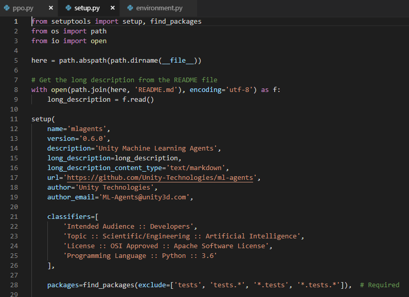
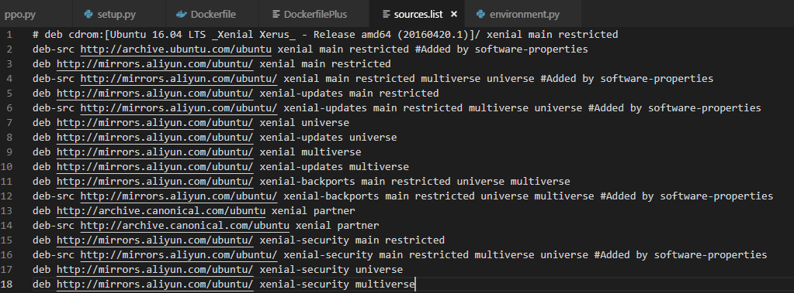
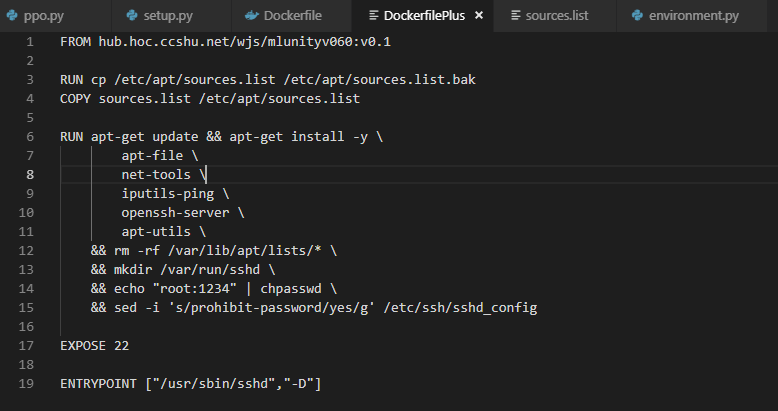
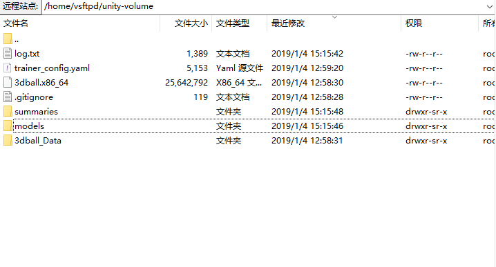
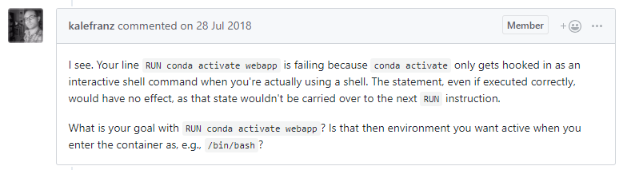

# 创建ML-Agents的Docker镜像

<!--more-->

## 前言

  如果需要在镜像中使用GPU训练,可以将Nvidia的官方镜像作为基础镜像,`Dockerfile`如下:
```
FROM nvidia/cuda:9.0-base-ubuntu16.04
LABEL maintainer "NVIDIA CORPORATION <cudatools@nvidia.com>"

ENV NCCL_VERSION 2.3.7

RUN apt-get update && apt-get install -y --no-install-recommends \
	apt-utils \
        cuda-libraries-$CUDA_PKG_VERSION \
        cuda-cublas-9-0=9.0.176.4-1 \
        libnccl2=$NCCL_VERSION-1+cuda9.0 && \
    apt-mark hold libnccl2 && \
    rm -rf /var/lib/apt/lists/*

RUN apt-get update && apt-get install -y openssh-server

RUN apt-get install -y nano

RUN mkdir /var/run/sshd

RUN echo "root:1234" | chpasswd

RUN sed -i 's/prohibit-password/yes/g' /etc/ssh/sshd_config

EXPOSE 22

ENTRYPOINT ["/usr/sbin/sshd","-D"]
```

## ML-Agents v0.6.0



### 环境

本机环境

- ML-Agents 0.6.0
- Windows 10 专业版
- docker client version 18.09.0
- docker server version 18.09.0

平台
- [机器学习平台](http://10.0.4.228)

### 创建镜像

1. 打开`~/ml-agents-0.6.0/`目录,看到有一个官方给定的`Dockerfile`

2. 直接`Build`,在该目录下运行`docker build -t [name]:[tag] .`,一定要注意最后的`.`,很**重要**

3. 新建一个`sources.list`文件,为镜像内换源,因为将来有可能需要在容器内安装某些包,有一些国外的资源往往会下载失败,所以需要**换源**
- 新建一个`sources.list`
- 用文本编辑器打开,写入以下内容

```
# deb cdrom:[Ubuntu 16.04 LTS _Xenial Xerus_ - Release amd64 (20160420.1)]/ xenial main restricted
deb-src http://archive.ubuntu.com/ubuntu xenial main restricted #Added by software-properties
deb http://mirrors.aliyun.com/ubuntu/ xenial main restricted
deb-src http://mirrors.aliyun.com/ubuntu/ xenial main restricted multiverse universe #Added by software-properties
deb http://mirrors.aliyun.com/ubuntu/ xenial-updates main restricted
deb-src http://mirrors.aliyun.com/ubuntu/ xenial-updates main restricted multiverse universe #Added by software-properties
deb http://mirrors.aliyun.com/ubuntu/ xenial universe
deb http://mirrors.aliyun.com/ubuntu/ xenial-updates universe
deb http://mirrors.aliyun.com/ubuntu/ xenial multiverse
deb http://mirrors.aliyun.com/ubuntu/ xenial-updates multiverse
deb http://mirrors.aliyun.com/ubuntu/ xenial-backports main restricted universe multiverse
deb-src http://mirrors.aliyun.com/ubuntu/ xenial-backports main restricted universe multiverse #Added by software-properties
deb http://archive.canonical.com/ubuntu xenial partner
deb-src http://archive.canonical.com/ubuntu xenial partner
deb http://mirrors.aliyun.com/ubuntu/ xenial-security main restricted
deb-src http://mirrors.aliyun.com/ubuntu/ xenial-security main restricted multiverse universe #Added by software-properties
deb http://mirrors.aliyun.com/ubuntu/ xenial-security universe
deb http://mirrors.aliyun.com/ubuntu/ xenial-security multiverse
```
- 保存退出
4. 新建一个`DockerfilePlus`,在官方生成的基础镜像上安装一些可以在平台上运行的包,`openssh-server`,联网工具`net-tools`,心爱的`apt-file`等等
- 新建一个`DockerfilePlus`
- 用文本编辑器打开,输入以下内容

```
FROM hub.hoc.ccshu.net/wjs/mlunityv060:v0.1

RUN cp /etc/apt/sources.list /etc/apt/sources.list.bak
COPY sources.list /etc/apt/sources.list

ENV PYTHONPATH /ml-agents:$PYTHONPATH

RUN apt-get update && apt-get install -y \
        apt-file \
        nano \
        net-tools \
        iputils-ping \
        openssh-server \
        apt-utils \
    && rm -rf /var/lib/apt/lists/* \
    && mkdir /var/run/sshd \
    && echo "root:1234" | chpasswd \
    && sed -i 's/prohibit-password/yes/g' /etc/ssh/sshd_config

EXPOSE 22

ENTRYPOINT ["/usr/sbin/sshd","-D"]
```
5. 在`DockerfilePlus`所在文件夹下,执行`build -t [name]:[tag] -f DockerfilePlus .`

**为了使用GPU.改写完的Dockerfile如下(不需要看):**
```
FROM nvidia/cuda:9.0-base-ubuntu16.04
LABEL maintainer "Keavnn <https://stepneverstop.github.io>"

ENV NCCL_VERSION 2.3.7

RUN apt-get update && apt-get install -y --no-install-recommends \
	apt-utils \
        cuda-libraries-$CUDA_PKG_VERSION \
        cuda-cublas-9-0=9.0.176.4-1 \
        libnccl2=$NCCL_VERSION-1+cuda9.0 && \
    apt-mark hold libnccl2 && \
    rm -rf /var/lib/apt/lists/*


# ensure local python is preferred over distribution python
ENV PATH /usr/local/bin:$PATH

# http://bugs.python.org/issue19846
# > At the moment, setting "LANG=C" on a Linux system *fundamentally breaks Python 3*, and that's not OK.
ENV LANG C.UTF-8

# runtime dependencies
RUN apt-get update && apt-get install -y --no-install-recommends \
		ca-certificates \
		libexpat1 \
		libffi6 \
		libgdbm3 \
		libreadline6 \
		libsqlite3-0 \
		libssl1.0.0 \
	&& rm -rf /var/lib/apt/lists/*

ENV GPG_KEY 0D96DF4D4110E5C43FBFB17F2D347EA6AA65421D
ENV PYTHON_VERSION 3.6.4

RUN set -ex \
	&& buildDeps=" \
		dpkg-dev \
		gcc \
		libbz2-dev \
		libc6-dev \
		libexpat1-dev \
		libffi-dev \
		libgdbm-dev \
		liblzma-dev \
		libncursesw5-dev \
		libreadline-dev \
		libsqlite3-dev \
		libssl-dev \
		make \
		tcl-dev \
		tk-dev \
		wget \
		xz-utils \
		zlib1g-dev \
# as of Stretch, "gpg" is no longer included by default
		$(command -v gpg > /dev/null || echo 'gnupg dirmngr') \
	" \
	&& apt-get update && apt-get install -y $buildDeps --no-install-recommends && rm -rf /var/lib/apt/lists/* \
	\
	&& wget -O python.tar.xz "https://www.python.org/ftp/python/${PYTHON_VERSION%%[a-z]*}/Python-$PYTHON_VERSION.tar.xz" \
	&& wget -O python.tar.xz.asc "https://www.python.org/ftp/python/${PYTHON_VERSION%%[a-z]*}/Python-$PYTHON_VERSION.tar.xz.asc" \
	&& export GNUPGHOME="$(mktemp -d)" \
	&& gpg --keyserver ha.pool.sks-keyservers.net --recv-keys "$GPG_KEY" \
	&& gpg --batch --verify python.tar.xz.asc python.tar.xz \
	&& rm -rf "$GNUPGHOME" python.tar.xz.asc \
	&& mkdir -p /usr/src/python \
	&& tar -xJC /usr/src/python --strip-components=1 -f python.tar.xz \
	&& rm python.tar.xz \
	\
	&& cd /usr/src/python \
	&& gnuArch="$(dpkg-architecture --query DEB_BUILD_GNU_TYPE)" \
	&& ./configure \
		--build="$gnuArch" \
		--enable-loadable-sqlite-extensions \
		--enable-shared \
		--with-system-expat \
		--with-system-ffi \
		--without-ensurepip \
	&& make -j "$(nproc)" \
	&& make install \
	&& ldconfig \
	\
	&& apt-get purge -y --auto-remove $buildDeps \
	\
	&& find /usr/local -depth \
		\( \
			\( -type d -a \( -name test -o -name tests \) \) \
			-o \
			\( -type f -a \( -name '*.pyc' -o -name '*.pyo' \) \) \
		\) -exec rm -rf '{}' + \
	&& rm -rf /usr/src/python

# make some useful symlinks that are expected to exist
RUN cd /usr/local/bin \
	&& ln -s idle3 idle \
	&& ln -s pydoc3 pydoc \
	&& ln -s python3 python \
	&& ln -s python3-config python-config

# if this is called "PIP_VERSION", pip explodes with "ValueError: invalid truth value '<VERSION>'"
ENV PYTHON_PIP_VERSION 9.0.3

RUN set -ex; \
	\
	apt-get update; \
	apt-get install -y --no-install-recommends wget; \
	rm -rf /var/lib/apt/lists/*; \
	\
	wget -O get-pip.py 'https://bootstrap.pypa.io/get-pip.py'; \
	\
	apt-get purge -y --auto-remove wget; \
	\
	python get-pip.py \
		--disable-pip-version-check \
		--no-cache-dir \
		"pip==$PYTHON_PIP_VERSION" \
	; \
	pip --version; \
	\
	find /usr/local -depth \
		\( \
			\( -type d -a \( -name test -o -name tests \) \) \
			-o \
			\( -type f -a \( -name '*.pyc' -o -name '*.pyo' \) \) \
		\) -exec rm -rf '{}' +; \
	rm -f get-pip.py


RUN apt-get update && apt-get -y upgrade

# xvfb is used to do CPU based rendering of Unity
RUN apt-get install -y xvfb

COPY ml-agents /ml-agents
WORKDIR /ml-agents
RUN pip install .

# port 5005 is the port used in in Editor training.
EXPOSE 5005

RUN cp /etc/apt/sources.list /etc/apt/sources.list.bak
COPY sources.list /etc/apt/sources.list

ENV PYTHONPATH /ml-agents:$PYTHONPATH

RUN apt-get update && apt-get install -y \
        apt-file \
        nano \
        net-tools \
        iputils-ping \
        openssh-server \
        apt-utils \
    && rm -rf /var/lib/apt/lists/* \
    && mkdir /var/run/sshd \
    && echo "root:1234" | chpasswd \
    && sed -i 's/prohibit-password/yes/g' /etc/ssh/sshd_config

EXPOSE 22

ENTRYPOINT ["/usr/sbin/sshd","-D"]
```

### PUSH镜像

`docker push [name]:[tag]`


### 测试镜像

- 登录[机器学习平台](http://10.0.4.228),没有使用平台的可以在本地使用`docker run`直接开启容器
- 先测试使用容器的方式
  - 创建容器
  
  将要运行和储存的文件夹放在数据卷`data`下,这个目录要在运行时由`--docker-target-name`指定
  - 等待容器创建成功
  
  - 容器创建成功后进入容器
  
  - 执行`mlagents-learn trainer_config.yaml --docker-target-name=data/unity-volume --env=3dball --train --run-id=test --save-freq=5000 | tee /data/unity-volume/log.txt`,如果不想在屏幕输出,可以在后边加上`>/dev/null`
  
  
  
---

## 安装Miniconda

确保你的安装包放在了data文件夹下
`apt-get update && apt-get install bzip2 -y && cd /data && bash Miniconda3-latest-Linux-x86_64.sh`

一路按回车、yes等等就成功了.如果需要安装到指定目录,在安装过程中会有提示告诉你让你指定安装路径

*注意*

在[学校机器学习平台](http://10.0.4.228/)上使用时,如果是使用容器的方式,那么新开的容器就可以使用`conda`命令,不存在`conda:command not found`的错误信息.

但是,如果在平台上以**提交任务**的形式来使用带conda的镜像所产生的容器时,就算是在镜像中配置了`echo 'export PATH="~/anaconda3/bin:$PATH"' >> ~/.bashrc`,当提交任务时环境变量中仍然没有`~/anaconda3/bin`,这个问题目前没有找到比较方便的解决办法,目前所采用的方式是:

在提交任务时, 首先加上命令`export PATH="~/anaconda3/bin:$PATH" && `


接着又实验了一下`echo 'export PATH="~/anaconda3/bin:$PATH"' >> /etc/profile`, 正常来说, 如果在容器中这样设置环境变量, 等待下次从镜像创建容器时, 这个环境变量一般并不会生效, 但是不知道这样设置对于提交任务方式来说有没有效, 索性试了一下


根据输出日志来看, 这种方式也并没有奏效


当然, 如果觉得上述配置比较麻烦的话,可以使用`Dockerfile`的`ENV`命令来设置环境变量, 这样设置99%是不会有问题的

```
FROM hub.hoc.ccshu.net/wjs/mlunityv060:v1.4.5
ENV PATH /usr/miniconda3/bin:$PATH
```
实验了一下,
结果如下:


表示可以使用`conda`命令, 但是不能使用`conda activate`命令激活环境

根据错误信息, 在`Dockerfile`中写入以下代码也不可行:

`RUN ln -s /usr/miniconda3/etc/profile.d/conda.sh /etc/profile.d/conda.sh`

查了一下相关资料,发现在4.5版本的conda是无解的
[https://github.com/ContinuumIO/docker-images/issues/89](https://github.com/ContinuumIO/docker-images/issues/89)



希望4.6版本可以解决吧

**更新2019年1月14日14:26:01**
**已解决**

4.6版本的确可以解决以提交任务模式运行时的问题, 需要使用命令`conda run -n [环境名字] [要执行的命令]`, 而不是使用`conda activate [环境名字]`先激活一个环境.

不过, 更新至4.6版本需要相关配置
```
conda config --add channels conda-canary
conda update conda
```

我使用Dockerfile来生成镜像, 代码如下:
```
FROM hub.hoc.ccshu.net/wjs/mlunityv060:v1.4.6

ENV PATH /usr/miniconda3/bin:$PATH
RUN conda config --add channels conda-canary && conda update conda -y
```
原因是, 使用Dockerfile比较容易设置环境变量, 减少出错
