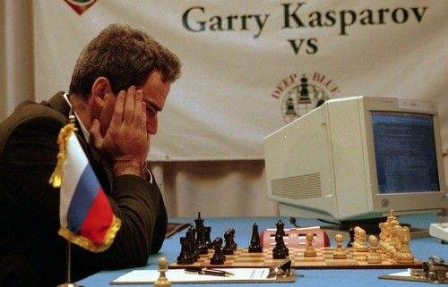

# 强化学习的里程碑

<!--more-->

## Alpha Go

> 阿尔法围棋（AlphaGo）是第一个击败人类职业围棋选手、第一个战胜围棋世界冠军的人工智能机器人，由谷歌（Google）旗下**DeepMind**公司戴密斯·哈萨比斯领衔的团队开发。其主要工作原理是“深度学习”。

>> 2016年3月，阿尔法围棋与围棋世界冠军、职业九段棋手李世石进行围棋人机大战，以4比1的总比分获胜；

>> 

>> 2016年末2017年初，该程序在中国棋类网站上以“大师”（Master）为注册账号与中日韩数十位围棋高手进行快棋对决，连续60局无一败绩；

>> 2017年5月，在中国乌镇围棋峰会上，它与排名世界第一的世界围棋冠军柯洁对战，以3比0的总比分获胜。围棋界公认阿尔法围棋的棋力已经超过人类职业围棋顶尖水平，在GoRatings网站公布的世界职业围棋排名中，其等级分曾超过排名人类第一的棋手柯洁。

>> 

>> 2017年5月27日，在柯洁与阿尔法围棋的人机大战之后，阿尔法围棋团队宣布阿尔法围棋将不再参加围棋比赛。

>> 2017年10月18日，DeepMind团队公布了最强版阿尔法围棋，代号AlphaGo Zero。

2016年3月机器学习一个重要的时间就是：名为AlphaGo的计算机程序打败了围棋世界冠军李世石，比分4：1。按理来说我们对机器在某项比赛、某些运动中击败人类顶尖选手不会感到大惊小怪，最著名的就是97年IBM的“深蓝（Deep Blue）”计算机程序打败了世界象棋冠军Garry Kasparov。

机器同样是使用强大的算力以数倍、数十倍、数百倍的训练时间去击败人类（通常人类训练十年的时间，机器可以模拟训练几百年），为什么Alpha Go的取胜这么重要、这么引人关注（世界各地媒体疯狂报道，一股狂潮如炒作一般）呢？

原因有两个：

1. AlphaGo解决的围棋问题比之前的都要复杂，西洋双陆棋只有$10^{20}$种不同的“棋位”空间配置，深蓝打败人类的国际象棋有$10^{43}$种不同的“棋位”空间配置，而围棋却有$10^{170}$种不同的“棋位”空间配置，这种量级的数字人类已经无法处理（意思是对于这么多种不同的状态，就是目前算力最强的计算机也无能为力）。举个例子，$10^{170}$这个数字比宇宙中存在的原子数还多。为什么AlphaGo可以在围棋上击败人类就如此重要呢？因为机器如果可以解决这个大的状态空间的问题，那么在机器学习也应该能解决很复杂的现实世界中的问题。这意味着机器真正融入我们的劳动力市场，为我们的日常生活提供便利的日子已经不远啦（真的吗？）！
2. AlphaGo解决的围棋问题不可能通过纯粹的、暴力计算的方式来学习出很好的模型，这就需要为AlphaGo设计一个更加“智能、聪明”的算法。AlphaGo引起热潮的另一个原因就是，其训练算法是一个通用算法，而不是一个专门为解决某项任务特别设计的算法，这与97年IBM的深蓝计算机程序完全不同，因为深蓝只能用于学习下国际象棋，在中国象棋中就不适于训练。此前，AlphaGo的前身已经能够在Atari 49个不同规则、不同游戏模式中使用相同的通用训练算法训练出比人类还厉害的模型，AlphaGo的成功意味着不仅在虚拟环境可以使用这一套学习方法训练模型，而且可以在不同的现实世界问题中使用这一套学习方法、代码结构。

**有能力解决状态空间非常大的问题**和**通用学习算法**是使AlphaGo警报一时的两个主要原因，这也解释了为什么这场比赛在媒体上引起了轰动。有些人认为李世石的失败是机器占据人类劳动力市场的先兆，也有些人认为这预示着人工智能迎来了黄金时代，实际上我们距离真正的人工智能还有很长的路要走，就算机器可以在某项非常复杂的任务中超过人类的表现能力，其也没有真正的思维方式，不会进行思考，说到底也只是曲线的拟合罢了，但是，只有基础做好了，才能向上研究人工智能。

构建AlphaGo和其前身（应用于Atari游戏）的学习算法的设计思路、计算架构在一系列论文和视频中都可以获得，而没有被Google（收购了英国公司DeepMind）私藏。为什么他不私藏呢？这么厉害的代码、设计思路没必要公开出来嘛，因为Google想把自己打造为基于云的机器学习和大数据的领导者，而它在2016年是全球第三大云服务提供商，排在微软和亚马逊之后，它需要把客户从其他平台引流到自己的平台上。由此可见，大公司们之间的竞争反而可以使我们平民获益。

> [The Algorithm Behind the Curtain: How DeepMind Built a Machine that Beat a Go Master (1 of 5)](https://randomant.net/the-algorithm-behind-the-curtain/)